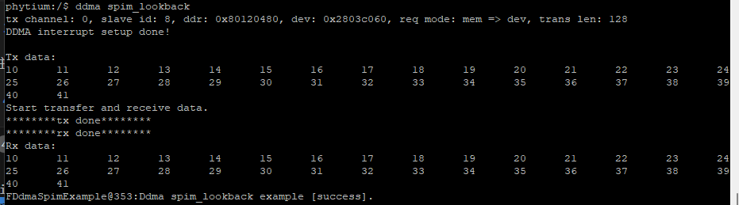

# DDMA 测试

## 1\. 例程介绍

> 介绍例程的用途，使用场景，相关基本概念，描述用户可以使用例程完成哪些工作

本例程示范了使用DDMA进行spi外设数据传输。

- 此例程在E2000D\\Q DEMO板和Phytiumpi上均通过测试。

- 该例程支持测试模式（无需接线，数据内部换回）和接线模式（数据外部环回）。通过修改宏定义SPIM_TEST_MODE_ENABLE进行模式切换（TRUE：测试模式；FALSE：接线模式）

- 支持软件配置数据传输量。

SPI DMA模式环回测试（ddma_spim_lookback_example.c）

- spi外设传输数据时使用DMA模式。

- DDMA发送通道将数据从内存传输到外设；DDMA接收通道将数据从外设传输到内存。

- 对比发送数据和接收数据是否相同，以此确认DDMA模式的环回测试是否成功。

## 2\. 如何使用例程

> 描述开发平台准备，使用例程配置，构建和下载镜像的过程

本例程需要以下硬件：

- E2000D\\Q Demo板或Phytiun pi

- 串口线和串口上位机

- 杜邦线（接线模式下需要）

### 2\.1 硬件配置方法

> 哪些硬件平台是支持的，需要哪些外设，例程与开发板哪些IO口相关等（建议附录开发板照片，展示哪些IO口被引出）

- E2000D\\Q接线方法：测试使用SPI2。若使用接线模式测试，测试前需按照下图，通过杜邦线连接SPI的TX口（9号引脚）和RX口（5号引脚）。

  

- Phytium Pi接线方法：杜邦线连接下图所示得19号引脚和21号引脚。
<div align="center">

</div>

### 2\.2 SDK配置方法

打开第三方库：

- Use letter shell

打开驱动配置项：

- Use FSPIM

- Use FDDMA

- Use sata

- Use IOMux

本例子已经提供好具体的编译指令，以下进行介绍：

- make 将目录下的工程进行编译

- make clean  将目录下的工程进行清理

- make image   将目录下的工程进行编译，并将生成的elf 复制到目标地址

- make list_kconfig 当前工程支持哪些配置文件

- make load_kconfig LOAD_CONFIG_NAME=  将预设配置加载至工程中

- make menuconfig   配置目录下的参数变量

- make backup_kconfig 将目录下的sdkconfig 备份到./configs下

具体使用方法为：

- 在当前目录下

- 执行以上指令

### 2\.3 构建和下载

> 描述构建、烧录下载镜像的过程，列出相关的命令

- 在host侧完成配置

> 配置成E2000D，对于其它平台，使用对应的默认配置，如E2000d 32位:

```csharp
$ make load_kconfig LOAD_CONFIG_NAME=e2000d_aarch32_demo_ddma_spim
```

- 在host侧完成配置

```csharp
$ make image
```

- host侧设置重启host侧tftp服务器

```csharp
sudo service tftpd-hpa restart
```

- 开发板侧使用bootelf命令跳转

```csharp
setenv ipaddr 192.168.4.20  
setenv serverip 192.168.4.50 
setenv gatewayip 192.168.4.1 
tftpboot 0x90100000 baremetal.elf
bootelf -p 0x90100000
```

### 2\.4 输出与实验现象

> 描述输入输出情况，列出存在哪些输出，对应的输出是什么（建议附录相关现象图片）

#### 2\.4.1 ddma spim环回测试

```csharp
$ ddma spim_lookback
```


## 3\. 如何解决问题

> 主要记录使用例程中可能会遇到的问题，给出相应的解决方案

## 4\. 修改历史记录

> 记录例程的重大修改记录，标明修改发生的版本号