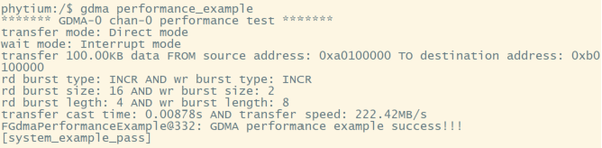

# GDMA 测试

## 1. 例程介绍

><font size="1">介绍例程的用途，使用场景，相关基本概念，描述用户可以使用例程完成哪些工作</font><br />

本例程示范了example中的PIN功能使用:

- 此例程已在E2000 TESTA 板上完成测试

- E2000最多支持 16 个独立通道，共享一组对外总线，各通道支持独立时钟关断
- 每个通道读写支持 16 个 Outstanding，全局读写支持 16 个 Outstanding
- 支持任意地址和任意数据量的读写，软件配置报文 size 和 lenth，读写独立
### 1.1 GDMA Direct 模式传输测试例程 (gdma_direct_transfer_example.c)
- 支持直接操作模式

### 1.2 GDMA BDL 模式传输测试例程 (gdma_bdl_transfer_example.c)
- 支持链表 BDL 模式，链表模式支持单次/循环操作，各通道独立
- 链表模式多应用于处理离散的数据的情况

### 1.3 GDMA 性能对比测试 (gdma_performance_example.c)
- 对于不同数据量大小，GDMA的读写速度可能存在差异
- 对于不同的burst size与burst length配置，GDMA读写速度可能存在差异

### 1.4 GDMA abort测试 (gdma_abort_example.c)
- 通道支持abort操作，可以暂停正在进行的传输
- abort后，可以选择不复位继续进行剩下的传输
- abort后，也可以选择进行通道软复位，此前没有传输的数据将不能继续传输
- abort的验证方法：暂停通道后，通道busy位是否置为0，且数据是否真的停止传输

### 1.5 GDMA 多通道测试 (gdma_multi_channel_example.c)
- 控制器支持多个通道同时开始传输

## 2. 如何使用例程

><font size="1">描述开发平台准备，使用例程配置，构建和下载镜像的过程</font><br />

本例程需要以下硬件，

- E2000D/Q TESTA 或 D2000 D/Q DEMO 板 
- 串口线和串口上位机

### 2.1 硬件配置方法

><font size="1">哪些硬件平台是支持的，需要哪些外设，例程与开发板哪些IO口相关等（建议附录开发板照片，展示哪些IO口被引出）</font><br />

保障串口正常工作后，不需要额外配置硬件

### 2.2 SDK配置方法

><font size="1">依赖哪些驱动、库和第三方组件，如何完成配置（列出需要使能的关键配置项）</font><br />

本例程需要的配置包括，
- FGDMA组件，用于控制 GDMA 控制器，依赖 USE_DMA 和 ENABLE_FGDMA
- SHELL组件, 依赖 USE_LETTER_SHELL

- 本例子已经提供好具体的编译指令，以下进行介绍：
    1. make 将目录下的工程进行编译
    2. make clean  将目录下的工程进行清理
    3. make image   将目录下的工程进行编译，并将生成的elf 复制到目标地址
    4. make list_kconfig 当前工程支持哪些配置文件
    5. make load_kconfig LOAD_CONFIG_NAME=<kconfig configuration files>  将预设配置加载至工程中
    6. make menuconfig   配置目录下的参数变量
    7. make backup_kconfig 将目录下的sdkconfig 备份到./configs下

### 2.3 构建和下载

><font size="1">描述构建、烧录下载镜像的过程，列出相关的命令</font><br />

- 在host侧完成配置

>配置成E2000D，对于其它平台，使用对应的默认配置，如E2000d 32位:
```
$ make load_kconfig LOAD_CONFIG_NAME=e2000d_aarch32_demo_gdma
```

- 在host侧完成构建

```
$ make image
```

- host侧设置重启host侧tftp服务器

```
sudo service tftpd-hpa restart
```

- 开发板侧使用bootelf命令跳转

```
setenv ipaddr 192.168.4.20  
setenv serverip 192.168.4.50 
setenv gatewayip 192.168.4.1 
tftpboot 0x90100000 baremetal.elf
bootelf -p 0x90100000
```


### 2.4 输出与实验现象

><font size="1">描述输入输出情况，列出存在哪些输出，对应的输出是什么（建议附录相关现象图片）</font><br />

- 所有用例均提供一系列可变配置，可在例程全局变量中修改
#### 2.4.1 GDMA Direct 模式传输测试例程
```
gdma direct_transfer_example
```


#### 2.4.2 GDMA BDL 模式传输测试例程
```
gdma bdl_transfer_example_example
```


#### 2.4.3 GDMA 性能对比测试
```
gdma performance_example
```


#### 2.4.4 GDMA abort测试
```
gdma abort_example
```


#### 2.4.5 GDMA 多通道测试
```
gdma multi_channel_example
```


## 3. 如何解决问题

><font size="1">主要记录使用例程中可能会遇到的问题，给出相应的解决方案</font><br />

- 在设置传输源地址与目标地址以及传输数据时，请留意注释中给出的对齐要求；
- 在设置BDL描述符时，请注意需要128字节对齐；
- E2000上SRAM的起始位置为0x30C00000，总大小为512KB；如果有测试SRAM的需要，可以将用例中传输起始地址修改为SRAM的地址；
- 如果需要测试超大规模的数据传输，请不要在SRAM段上进行，并提前预留好空间；
- 某些配置下，进行多轮大规模测试时，BDL模式或多通道传输会出现timeout报错，通过修改传输配置、关闭编译优化、删除fsleep相关API可以解决这个问题, 不使用间断函数作等待的情况下，确保timeout参数足够大以稳定接收中断；
- 对于从第二次传输出现timeout的情况，可能是由于固件版本不正确导致，请确保您的固件更新到了合适的版本；
- BDL描述中ioc特性需要数据量达到一定程度才能稳定触发中断（单个描述符1024KB以上），否则传输时间过短会导致无法捕获中断；
- 图片所给数据仅供参考，具体参数配置、开发板型号、内存条读写性能等因素都会影响到传输速率；

## 4. 修改历史记录

><font size="1">记录例程的重大修改记录，标明修改发生的版本号 </font><br />


