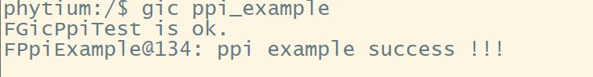

# GIC测试

## 1. 例程介绍

> `<font size="1">`介绍例程的用途，使用场景，相关基本概念，描述用户可以使用例程完成哪些工作 `</font><br />`

本例程基于GIC中断控制器，验证了中断接口中的以下的特性：

1. 基于通用时钟测试私有外设中断(PPI)
2. 利用软件产生中断(SGI)与从核测试中断抢占与核间中断
3. 利用串口中断测试共享外设中断（SPI）中的亲和路由的特性

### 1.1 PPI中断测试例程 (ppi_example.c)

- E2000 支持 PPI中断，PPI中断的中断号是16到31号
- PPI类型的中断只发送给单个或者特定的PE，对于不同的PE能够使用同样的中断号响应此中断，PPI 中断具有以下特征：
  1. PPI 能够作为Group 0 中断，Secure Group 1 中断，Non-Secure Group 1 中断
  2. PPI 能够支持边缘触发与电平触发的特性
  3. PPI 永远不能使用ITS 进行路由
  4. PPI 拥有激活（active）状态 ，所以需要deactivation

### 1.2 SGI中断测试例程 (sgi_example.c)

- E2000 支持SGI中断，SGI中断的中断号是0到15号
- SGI 中断被用于核间通信，向SGI相关寄存器中写入信息进行触发 。此中断类型具有以下特性：
  1. SGI 能够作为Group 0 中断，Secure Group 1 中断，Non-Secure Group 1 中断
  2. SGI 能支持边缘触发与电平触发的特性
  3. SGI 永远不能使用ITS 进行路由
  4. SGI 拥有激活（active）状态 ，所以需要deactivation

### 1.3 SPI中断测试例程 (spi_example.c)

- E2000 支持 SPI中断，SPI中断的中断号是32到266号
- SPI类型的外设中断，能够被路由给特定PE 或者某一组PE，此中断类型具有以下特性：
  1. SPI 能够作为Group 0 中断，Secure Group 1 中断，Non-Secure Group 1 中断
  2. SPI 能支持边缘触发与电平触发的特性
  3. SPI 永远不能使用ITS 进行路由
  4. SPI 拥有激活（active）状态 ，所以需要deactivation

## 2. 如何使用例程

> `<font size="1">`描述开发平台准备，使用例程配置，构建和下载镜像的过程 `</font><br />`

本例程需要以下硬件，

- E2000D/Q Demo板，FT2000/4开发板，D2000开发板
- 串口线和串口上位机

### 2.1 硬件配置方法

> `<font size="1">`哪些硬件平台是支持的，需要哪些外设，例程与开发板哪些IO口相关等（建议附录开发板照片，展示哪些IO口被引出）`</font><br />`
> 无需进行额外配置

### 2.2 SDK配置方法

> `<font size="1">`依赖哪些驱动、库和第三方组件，如何完成配置（列出需要使能的关键配置项）`</font><br />`

项目相关配置参数如下：

- CONFIG_SPIN_MEM（Spin-lock shared memory）： 多核打印时自选锁检查的地址
- CONFIG_SHARE_BUFFER_BASE（Destination CPU communication mask）：主核与从核共享内存地址
- CONFIG_SLAVE_ELF_ADDRESS（Wake up the function address from the core）：从核ELF 执行问价加载地址
- CONFIG_SLAVE_CORE_ID（Slave target core）：从核ID
- CONFIG_MASTER_CORE_ID（Master target core）：主核ID
- CONFIG_FGIC_SPI_UART_INSTANCE_ADDRESS（Share buffer address uart address）：串口寄存器基地址

本例程需要的配置包括：

- GIC控制器组件，依赖 USE_GIC
- 多核设置组件，依赖 USE_AMP
- SHELL组件, 依赖 USE_LETTER_SHELL

本例程提供独特的编译指令，具体如下：

- make config_e2000d_aarch64 将预设64bit E2000D 下的配置加载至主核与从核的工程中
- make config_e2000d_aarch32 将预设32bit E2000D 下的配置加载至主核与从核的工程中
- make config_e2000q_aarch64 将预设64bit E2000Q 下的配置加载至主核与从核的工程中
- make config_e2000q_aarch32 将预设32bit E2000Q 下的配置加载至主核与从核的工程中
- make config_phytiumpi_aarch64 将预设64bit phytiumpi 下的配置加载至主核与从核的工程中
- make config_phytiumpi_aarch32 将预设32bit phytiumpi 下的配置加载至主核与从核的工程中
- make image 根据预设的参数，生成的ELF 执行文件拷贝至对应的TFTP目录下
- make menuconfig_master 配置主核中的相关参数
- make menuconfig_slave 配置从核中的相关参数
- make backupconfig 将配置的主核与从核参数保存

### 2.3 构建和下载

> `<font size="1">`描述构建、烧录下载镜像的过程，列出相关的命令 `</font><br />`

- 网口烧录请参考：
  [SDK 使用说明](https://gitee.com/phytium_embedded/phytium-standalone-sdk/blob/release/doc/reference/usr/usage.md)
- 利用串口终端工具,烧录镜像

```
setenv ipaddr 192.168.4.20;
setenv serverip 192.168.4.50;
setenv gatewayip 192.168.4.1;
tftpboot f0000000 baremetal_package.elf;
bootelf -p f0000000
```

### 2.4 输出与实验现象

> `<font size="1">`描述输入输出情况，列出存在哪些输出，对应的输出是什么（建议附录相关现象图片）`</font><br />`

#### 2.4.1 PPI中断测试例程 (ppi_example.c)

- 基于通用定时器中断，针对预设优先级与中断触发频率，测试PPI中断

```
gic ppi_example
```



#### 2.4.2 SGI中断测试例程 (sgi_example.c)

- 基于sgi 中断测试，中断抢占与核间中断

```
gic sgi_example
```


#### 2.4.3 SPI中断测试例程 (spi_example.c)

- 基于串口驱动测试SPI 中断亲和度路由功能

```
gic spi_example
```


## 3 如何解决问题

> `<font size="1">`主要记录使用例程中可能会遇到的问题，给出相应的解决方案 `</font><br />`

## 4 修改历史记录

> `<font size="1">`记录例程的重大修改记录，标明修改发生的版本号 `</font><br />`
