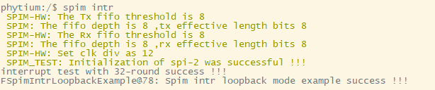

# SPI 测试例程

## 1. 例程介绍

><font size="1">介绍例程的用途，使用场景，相关基本概念，描述用户可以使用例程完成哪些工作</font><br />

注：参考例程在E2000D/Q Demo开发板上实现，该开发板引出了SPI-2引脚，若开发板没有引出SPI接口，可以采用SPI测试模式进行测试，不需要进行连线操作。通过修改宏定义 SPIM_TEST_MODE_ENABLE 进行模式切换

spim 轮询模式回环测试例程 (spim_polled_loopback_mode_example.c)
- 初始化spi基本配置，配置单次收发数据宽度为1字节(8bit)
- 配置传输数据长度为32，开始回环数据收发
- 对比收发数据是否相同
- 去初始化spi

spim 中断模式回环测试例程 (spim_intr_loopback_mode_example.c)
- 初始化spi基本配置，配置单次收发数据宽度为2字节(16bit)
- 配置传输数据长度为32，开始回环数据收发
- 对比收发数据是否相同
- 去初始化spi

## 2. 如何使用例程

><font size="1">描述开发平台准备，使用例程配置，构建和下载镜像的过程</font><br />

本例程需要以下硬件，
- E2000D/Q Demo，FT2000/4，D2000
- 串口线和串口上位机

### 2.1 硬件配置方法

><font size="1">哪些硬件平台是支持的，需要哪些外设，例程与开发板哪些IO口相关等（建议附录开发板照片，展示哪些IO口被引出）</font><br />
- 本例程在 E2000 Q Demo 板上完成测试，测试使用 SPI-2，测试前需要按照下图连接SPI-2的RX脚和TX脚
- CPU_IO(J30),SPI-2的RX对应5号引脚，TX对应9号引脚

        

### 2.2 SDK配置方法

><font size="1">依赖哪些驱动、库和第三方组件，如何完成配置（列出需要使能的关键配置项）</font><br />
使能例程所需的配置
- Letter Shell组件，依赖 USE_LETTER_SHELL
- SPI组件，依赖CONFIG_USE_SATA

对应的配置项是，
- Use FSPIM

- 本例子已经提供好具体的编译指令，以下进行介绍：
    1. make 将目录下的工程进行编译
    2. make clean  将目录下的工程进行清理
    3. make image   将目录下的工程进行编译，并将生成的elf 复制到目标地址
    4. make list_kconfig 当前工程支持哪些配置文件
    5. make load_kconfig LOAD_CONFIG_NAME=<kconfig configuration files>  将预设配置加载至工程中
    6. make menuconfig   配置目录下的参数变量
    7. make backup_kconfig 将目录下的sdkconfig 备份到./configs下

- 具体使用方法为：
    - 在当前目录下
    - 执行以上指令

### 2.3 构建和下载

><font size="1">描述构建、烧录下载镜像的过程，列出相关的命令</font><br />

- 在host侧完成配置

>配置成E2000D，对于其它平台，使用对应的默认配置，如E2000d 32位:
```
$ make load_kconfig LOAD_CONFIG_NAME=e2000d_aarch32_demo_spi
```

- 在host侧完成构建

```
$ make image
```

- host侧设置重启host侧tftp服务器

```
sudo service tftpd-hpa restart
```

- 开发板侧使用bootelf命令跳转

```
setenv ipaddr 192.168.4.20  
setenv serverip 192.168.4.50 
setenv gatewayip 192.168.4.1 
tftpboot 0x90100000 baremetal.elf
bootelf -p 0x90100000
```

### 2.4 输出与实验现象

><font size="1">描述输入输出情况，列出存在哪些输出，对应的输出是什么（建议附录相关现象图片）</font><br />

#### 2.4.1 spim 轮询模式回环测试例程
```
$ spim polled
```


#### 2.4.2 spim 中断模式回环测试例程
```
$ spim intr
```


## 3. 如何解决问题

><font size="1">主要记录使用例程中可能会遇到的问题，给出相应的解决方案</font><br />

## 4. 修改历史记录

><font size="1">记录例程的重大修改记录，标明修改发生的版本号 </font><br />


