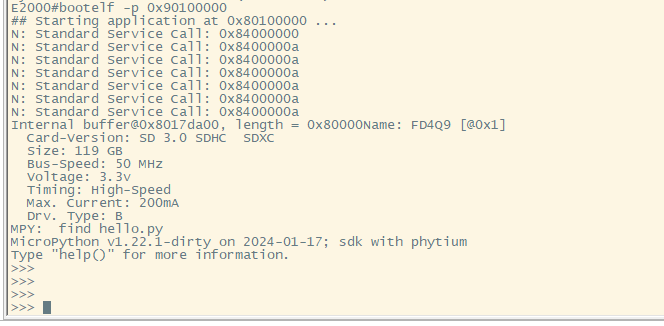
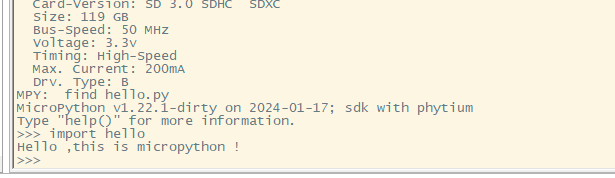

# MicroPython base on standalone

## 1. 例程介绍

> `<font size="1">`介绍例程的用途，使用场景，相关基本概念，描述用户可以使用例程完成哪些工作 `</font><br />`

本例程示范了standalone环境下的工程模板。

### 1.1 MicroPython介绍

- MicroPython是python的一个精简版本，它是为了运行在单片机等性能有限的微控制器中，最小体积仅256K，运行时仅需16K内存。
- MicroPython基于python3.4的语法标准，相比于标准python标准库，为了适应嵌入式微控制器，裁剪了大部分标准库，仅保留部分模块，如math,sys的部分函数和类。
- MicroPython提供了以下关键特性：

1.支持多种架构，例如：x86, x86-64, ARM, ARM Thumb, Xtensa等；
2.核心代码覆盖率为98.4%，核心加扩展模块为96.3%；
3.支持标记清除垃圾收集器，可用于堆内存管理；
4.支持thread操作；
5.直接针对机器代码而不是字节码虚拟机的本机发射器；

### 1.2 MicroPython组件

- MicroPython库

1.MicroPython 提供了反映 Python 标准库功能的内置模块（例如os, time），以及 MicroPython 特定的模块（例如bluetooth, machine)。

2.大多数标准库模块实现了等效 Python 模块的功能子集，并在少数情况下提供了一些特定于 MicroPython 的扩展（例如array, os)

当前MicroPython支持以下标准库：

| Micropython支持特性名 | 当前SDK支持情况 | 功能说明               |
| --------------------- | --------------- | ---------------------- |
| array                 | 支持            | 数字数据的数组         |
| binascii              | 支持            | 二进制/ASCII 转换      |
| cmath                 | 不支持          | 复数的数学函数         |
| collections           | 支持            | 集合和容器类型         |
| errno                 | 支持            | 系统错误代码           |
| gc                    | 支持            | 控制垃圾收集器         |
| hashlib               | 支持            | 散列算法               |
| heapq                 | 支持            | 堆队列算法             |
| io                    | 支持            | 输入/输出流            |
| json                  | 支持            | JSON 编码和解码        |
| math                  | 支持            | 数学函数               |
| os                    | 支持            | 基本的“操作系统”服务 |
| random                | 支持            | 生成随机数             |
| re                    | 支持            | 简单的正则表达式       |
| select                | 支持            | 等待一组流上的事件     |
| socket                | 不支持          | 网络插座模块           |
| ssl                   | 不支持          | SSL/TLS 模块           |
| struct                | 支持            | 打包和解包原始数据类型 |
| sys                   | 支持            | 系统特定的功能         |
| time                  | 不支持          | 时间相关函数           |
| uasyncio              | 不支持          | 异步 I/O 调度程序      |
| zlib                  | 不支持          | zlib 解压              |
| _thread               | 不支持          | 多线程支持             |
| builtins              | 不支持          | 内置函数和异常         |

特定于MicroPython实现的功能：

| Micropython支持特性名 | 当前SDK支持情况 | 功能说明                        |
| --------------------- | --------------- | ------------------------------- |
| bluetooth             | 不支持          | 低级蓝牙                        |
| btree                 | 不支持          | 简单的 BTree 数据库             |
| cryptolib             | 不支持          | 密码                            |
| framebuff             | 不支持          | 帧缓冲区操作                    |
| machine               | 不支持          | 与硬件相关的功能                |
| micropython           | 不支持          | 访问和控制 MicroPython 内部结构 |
| neopixel              | 不支持          | WS2812 / NeoPixel LED 的控制    |
| network               | 不支持          | 网络配置                        |
| uctypes               | 不支持          | 以结构化的方式访问二进制数据    |

- 本例程基于开源MicroPython项目 ： https://github.com/micropython

### 1.3 MicroPython例程结构介绍

- 本例程在在Phytium 系列 CPU，即E2000 D/Q和FT2000/4 与 D2000环境下，实现在终端中进入MicroPython repl控制台的功能，并通过文件系统访问板载SD卡，可利用import或open等接口访问各类格式文件。
- 在repl交互环境中，可进行基本MicroPython语法操作及调用MicroPython内置组件，实现MicroPython编程。
- Micropython裸机环境运行初始图：

- Micropython进入后，可使用import函数导入相关模块，并利用help函数查看模块相关功能及定义
help函数查看内置可使用模块：

import导入相关模块，并查看函数及功能：

若访问SD卡文件内容，可使用open等文件操作函数或利用import函数访问.py文件，例如：
open函数打开txt文件

import .py文件并运行


- 模块具体使用请查阅Micropython官方文档：
https://docs.micropython.org/en/latest/


## 2. 如何使用例程

> `<font size="1">`描述开发平台准备，使用例程配置，构建和下载镜像的过程 `</font><br />`

本例程需要以下硬件，

- E2000 D/Q Demo
- FT2000/4板或D2000板

注：micropython文件系统依赖于裸机SD卡驱动，如遇到无法正常驱动问题，请查看example\peripherals\sd\README.md相关说明。

### 2.1 硬件配置方法

> `<font size="1">`哪些硬件平台是支持的，需要哪些外设，例程与开发板哪些IO口相关等（建议附录开发板照片，展示哪些IO口被引出）`</font><br />`

### 2.2 SDK配置方法

> `<font size="1">`依赖哪些驱动、库和第三方组件，如何完成配置（列出需要使能的关键配置项）`</font><br />`

使能例程所需的配置

- 本例子已经提供好具体的编译指令，以下进行介绍：

  1. make 将目录下的工程进行编译
  2. make clean  将目录下的工程进行清理
  3. make image   将目录下的工程进行编译，并将生成的elf 复制到目标地址
  4. make list_kconfig 当前工程支持哪些配置文件
  5. make load_kconfig LOAD_CONFIG_NAME=`<kconfig configuration files>`  将预设配置加载至工程中
  6. make menuconfig   配置目录下的参数变量
  7. make backup_kconfig 将目录下的sdkconfig 备份到./configs下
- 具体使用方法为：

  - 在当前目录下
  - 执行以上指令

### 2.3 构建和下载

> `<font size="1">`描述构建、烧录下载镜像的过程，列出相关的命令 `</font><br />`

- 在host侧完成配置

> 配置成E2000D，对于其它平台，使用对应的默认配置，如E2000d 32位:

```
$ make load_kconfig LOAD_CONFIG_NAME=e2000d_aarch32_demo_micropython
```

- 在host侧完成构建

```
$ make image
```

- host侧设置重启host侧tftp服务器

```
sudo service tftpd-hpa restart
```

- 开发板侧使用bootelf命令跳转

```
setenv ipaddr 192.168.4.20  
setenv serverip 192.168.4.50 
setenv gatewayip 192.168.4.1 
tftpboot 0x90100000 baremetal.elf
bootelf -p 0x90100000
```

### 2.4 输出与实验现象

> `<font size="1">`描述输入输出情况，列出存在哪些输出，对应的输出是什么（建议附录相关现象图片）`</font><br />`

- 启动后串口可以直接使用shell


## 3. 如何解决问题

> `<font size="1">`主要记录使用例程中可能会遇到的问题，给出相应的解决方案 `</font><br />`

## 4. 修改历史记录

> `<font size="1">`记录例程的重大修改记录，标明修改发生的版本号 `</font><br />`
