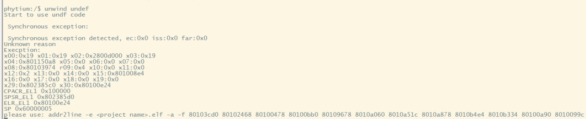

# unwind

# 1. 例程介绍

> `<font size="1">`介绍例程的用途，使用场景，相关基本概念，描述用户可以使用例程完成哪些工作 `</font><br />`

    Stack unwind（栈回溯）技术是一种在软件开发中广泛使用的机制，旨在优化和管理程序的异常处理和调用栈展开。该技术的核心是提供一套有效的方法来追踪和还原程序在执行时的调用栈状态，特别是在异常或错误发生时。

本例程主要展示了以下三种场景的应用例子：

    1. 中断中使用unwind 功能(目前仅支持aarch64) --- irq_test.c

    2.  在业务中使用unwind 功能 --- loop_test.c

    3. 在错误指令下触发 unwind 功能 --- undef_test.c

## 2. 如何使用例程

> `<font size="1">`描述开发平台准备，使用例程配置，构建和下载镜像的过程 `</font><br />`

本例程需要以下硬件，

- E2000D/Q Demo，D2000，FT2000/4，PhytiumPi

### 2.1 硬件配置方法

> `<font size="1">`哪些硬件平台是支持的，需要哪些外设，例程与开发板哪些IO口相关等（建议附录开发板照片，展示哪些IO口被引出）`</font><br />`
>
> 支持 E2000D/Q Demo，D2000，FT2000/4，PhytiumPi 系列所有板子

### 2.2 SDK配置方法

> `<font size="1">`依赖哪些驱动、库和第三方组件，如何完成配置（列出需要使能的关键配置项）`</font><br />`

使能例程所需的配置

- 本例子已经提供好具体的编译指令，以下进行介绍：

  1. make 将目录下的工程进行编译
  2. make clean  将目录下的工程进行清理
  3. make image   将目录下的工程进行编译，并将生成的elf 复制到目标地址
  4. make list_kconfig 当前工程支持哪些配置文件
  5. make load_kconfig LOAD_CONFIG_NAME=`<kconfig configuration files>`  将预设配置加载至工程中
  6. make menuconfig   配置目录下的参数变量
  7. make backup_kconfig 将目录下的sdkconfig 备份到./configs下
- 具体使用方法为：

  - 在当前目录下
  - 执行以上指令

### 2.3 构建和下载

> `<font size="1">`描述构建、烧录下载镜像的过程，列出相关的命令 `</font><br />`

- 在host侧完成配置

> 配置成E2000D，对于其它平台，使用对应的默认配置，如E2000d 32位:

```
$ make load_kconfig LOAD_CONFIG_NAME=e2000d_aarch32_demo_unwind
```

- 在host侧完成构建

```
$ make image
```

- host侧设置重启host侧tftp服务器

```
sudo service tftpd-hpa restart
```

- 开发板侧使用bootelf命令跳转

```
setenv ipaddr 192.168.4.20  
setenv serverip 192.168.4.50 
setenv gatewayip 192.168.4.1 
tftpboot 0x90100000 baremetal.elf
bootelf -p 0x90100000
```

### 2.4 输出与实验现象

> `<font size="1">`描述输入输出情况，列出存在哪些输出，对应的输出是什么（建议附录相关现象图片）`</font><br />`

#### 2.4.1 中断中使用unwind 功能(aarch32 暂不支持此特性)

```
unwind irq
```


如上图所示，其中提示语为：

```
addr2line -e <project name>.elf -a -f 80103cd0 80100c50 801025cc 80100504 80100b58 80109678 8010a060 8010a51c 8010a878 8010b4e4 8010b334 80100a90 8010099c 
Physical Timer count: 1, interval ticks: 1367639372

```

在编译目录下，将 `<project name> 替换为当前目录下elf 文件的名称 如"e2000q_aarch64_demo_unwind",可以看见以下现象`


#### 2.4.2 函数调用中使用unwind 功能

```
unwind loop
```


如上图所示，其中提示语为：

```
addr2line -e <project name>.elf -a -f 80103cd0 80100e00 80100de4 80100dcc 80100b84 80109678 8010a060 8010a51c 8010a878 8010b4e4 8010b334 80100a90 8010099c
```

在编译目录下，将 `<project name> 替换为当前目录下elf 文件的名称 如"e2000q_aarch64_demo_unwind"`

#### 2.4.3 当出现指令未定义时使用unwind 功能

- 注意此指令使用之后，程序将会陷入异常中，只能通过复位之后才能使用

```
unwind undef
```



如上图所示，其中提示语为：

```
addr2line -e <project name>.elf -a -f 80103cd0 80102468 80100478 80100bb0 80109678 8010a060 8010a51c 8010a878 8010b4e4 8010b334 80100a90 8010099c 
```

在编译目录下，将 `<project name> 替换为当前目录下elf 文件的名称 如"e2000q_aarch64_demo_unwind"`

## 3. 如何解决问题

> `<font size="1">`主要记录使用例程中可能会遇到的问题，给出相应的解决方案 `</font><br />`

## 4. 修改历史记录

> `<font size="1">`记录例程的重大修改记录，标明修改发生的版本号 `</font><br />`
>
> v1.1.1 版本首次引入
