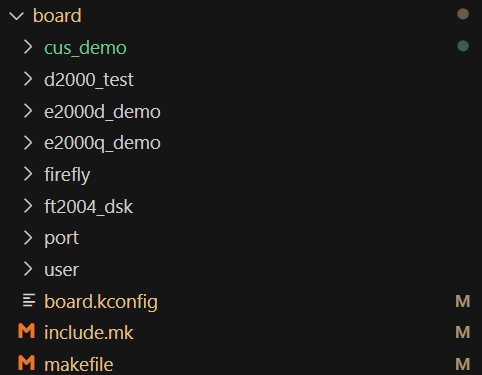
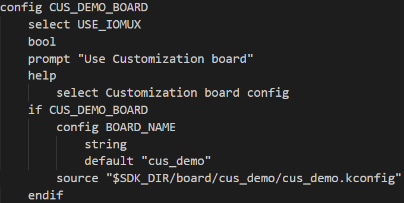
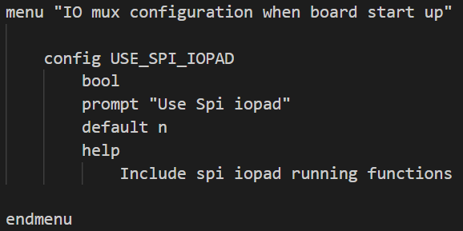
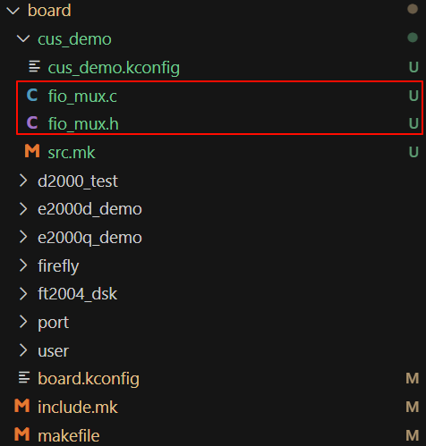
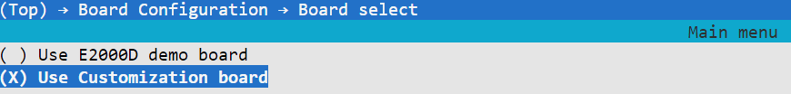
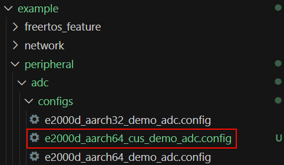

# FreeRTOS SDK
## 添加board的步骤

1. 通过git拉取Phytium FreeRTOS SDK的代码，如

```
git clone https://gitee.com/phytium_embedded/phytium-free-rtos-sdk.git ./phytium-free-rtos-sdk
```

2. 根据自己的环境按照[Linux aarch64](https://gitee.com/phytium_embedded/phytium-free-rtos-sdk/blob/master/docs/reference/usr/install_linux_aarch64.md)/[Linux x86_64](https://gitee.com/phytium_embedded/phytium-free-rtos-sdk/blob/master/docs/reference/usr/install_linux_x86_64.md)/[windows x86_64](https://gitee.com/phytium_embedded/phytium-free-rtos-sdk/blob/master/docs/reference/usr/install_windows.md)进行SDK安装，环境变量打印正确无误，表示安装成功
```
echo $PHYTIUM_DEV_PATH $AARCH32_CROSS_PATH $AARCH64_CROSS_PATH 
```
   

3. 在Phytium-FreeRTOS-SDK目录下的standalone文件夹中按照[添加board的步骤](https://gitee.com/phytium_embedded/phytium-standalone-sdk/blob/master/doc/reference/usr/how_to_add_board.md)进行操作
   - 在board目录下添加以board命名的目录，以cus_demo为例   
   
   - 在board/board.kconfig文件下添加board相关信息，如CUS_DEMO_BOARD   
   
   - 在cus_demo目录下，新建cus_demo.kconfig文件，此文件用于配置默认board启动的项目，您可以配合fboard_init.c与fboard_init.h使用，用来程序启动时main.c来调用。以添加SPI默认启动项为例：   
   
   - 在cus_demo目录，添加fio_mux.c和fio_mux.h文件，可以参照已经写好的soc板fio_mux.c和fio_mux.h来配置您cus_board io复用配置(主要由于自行制作的soc板与我们例程使用的io接口存在差异)   
   
   - 在cus_demo目录下添加src.mk文件
   ```
   BOARD_CSRC += cus_demo/fio_mux.c
   ```
   - 在board目录下添加include.mk文件，使cus_demo目录下的*.h文件加入编译
   ```
   ifdef CONFIG_CUS_DEMO_BOARD
      BUILD_INC_PATH_DIR += $(SDK_DIR)/board/cus_demo
   endif
   ```
   - 在board目录下添加makefile文件，使cus_demo目录下的*.c文件加入编译
   ```
   # Use cus demo board
   ifdef CONFIG_CUS_DEMO_BOARD
   include cus_emo/src.mk
   CSRCS_RELATIVE_FILES := $(BOARD_CSRC) 
   endif
   ```
4. 修改Phytium-FreeRTOS-SDK下example中的配置，使其能够选择到对应板子配置，在终端中执行以下操作：
   - make menuconfig
   - 选择Board Configuration -> Board Configuration -> Use Customization Board   
   
   - 保存退出
   - make backup_kconfig
   - 检查configs目录下是否生成新板卡的配置文件   
   
