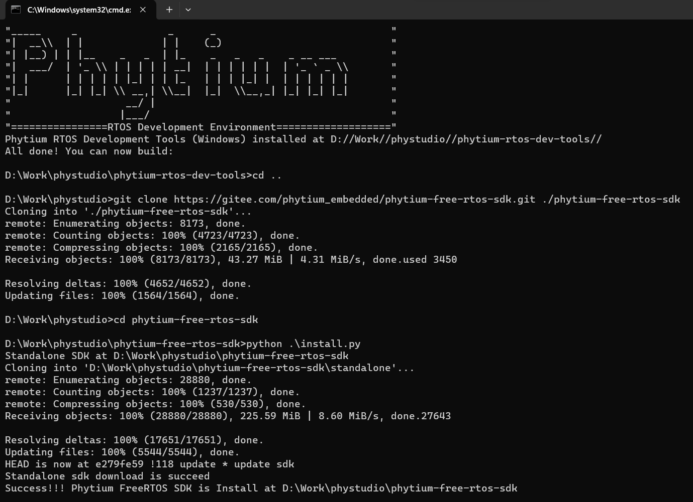
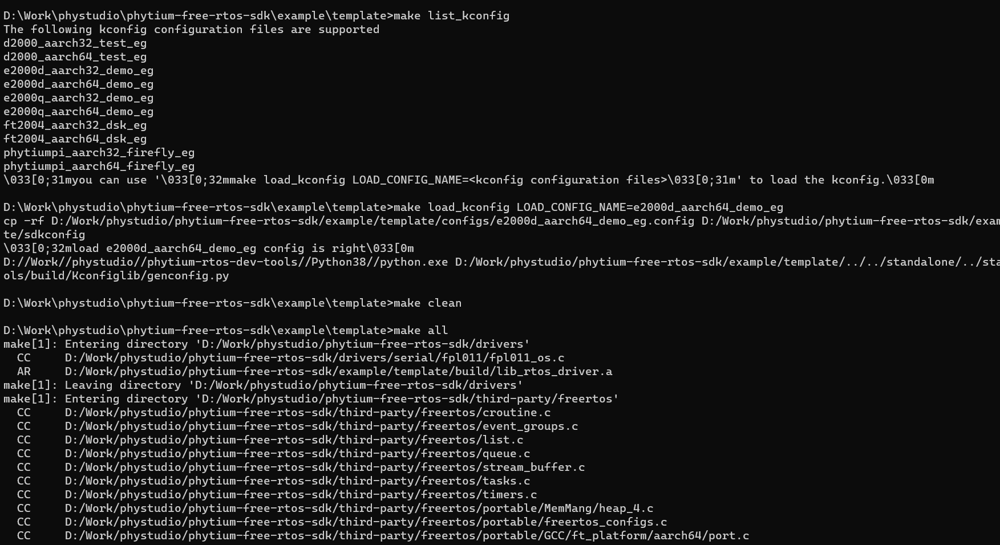

# Windows 环境下的 FreeRTOS SDK 开发方法

- 参考 Phytium Standalone SDK [安装 Winodws 下的开发环境](https://gitee.com/phytium_embedded/phytium-standalone-sdk/blob/master/doc/reference/usr/install_windows.md)，支持 Windows 10/11 64 位环境


- (1) 通过git拉取Phytium FreeRTOS SDK的代码，如

```
git clone https://gitee.com/phytium_embedded/phytium-free-rtos-sdk.git ./phytium-free-rtos-sdk
cd phytium-free-rtos-sdk
python .\install.py
```



- (2) 进入Phytium FreeRTOS SDK代码目录，选择一个 example 进行编译开发，例如使用 template 例程，目标平台为 E2000D Demo 板，首先加载默认配置

```
cd .\example\template
make list_kconfig
make load_kconfig LOAD_CONFIG_NAME=e2000d_aarch64_demo_eg
make menuconfig
make clean
make all
```



- (3) 编译成功后会输出一系列镜像文件


- (4) 参考 Phytium Standalone SDK [通过 TFTP 工具 上传镜像到开发板](https://gitee.com/phytium_embedded/phytium-standalone-sdk/blob/master/doc/reference/usr/install_windows.md)

- (5) 参考 Phytium Standalone SDK [使用 JTAG 适配器进行调试](https://gitee.com/phytium_embedded/phytium-standalone-sdk/blob/master/doc/reference/usr/install_windows.md)
