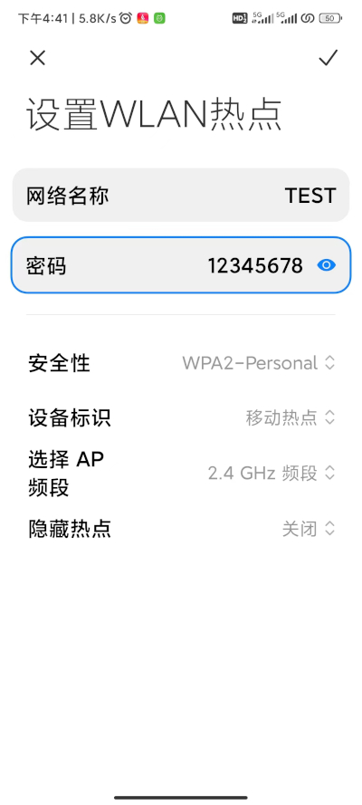
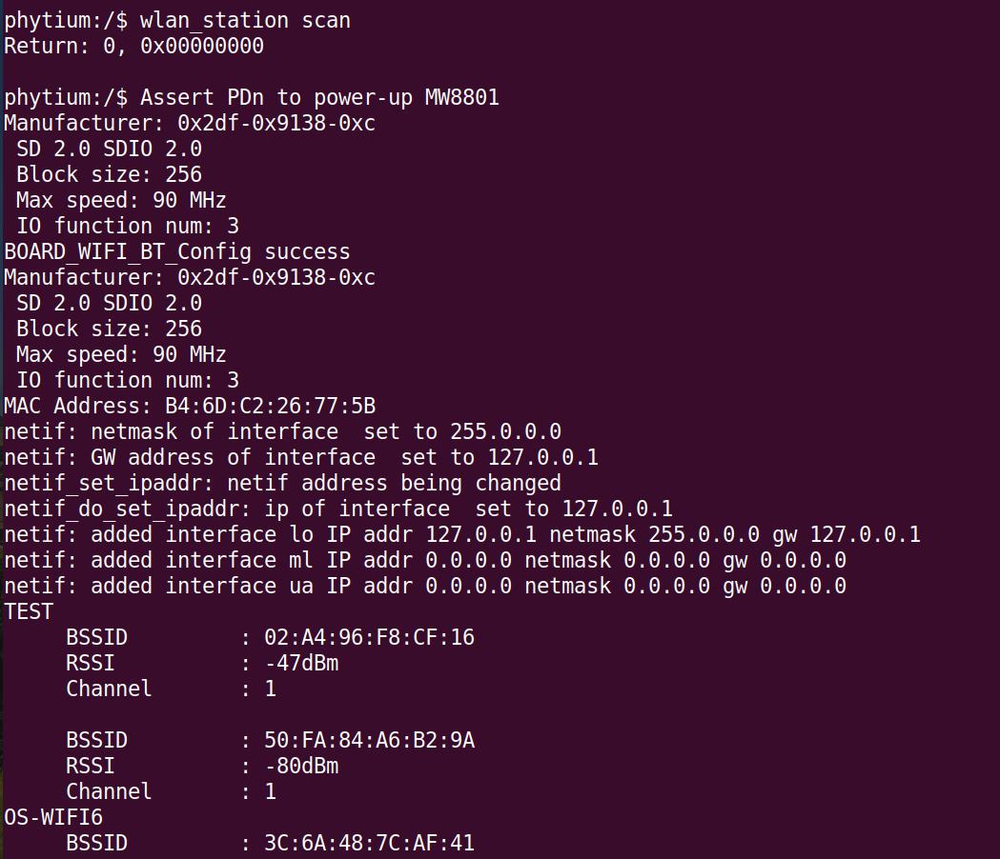
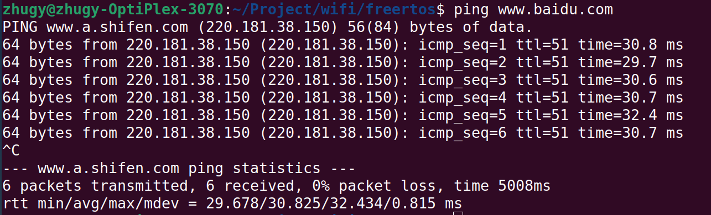
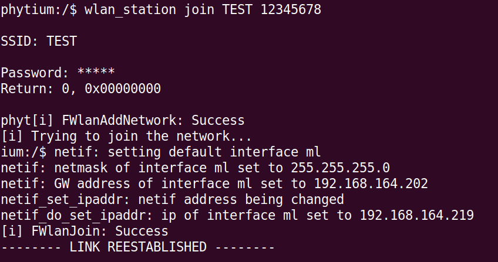
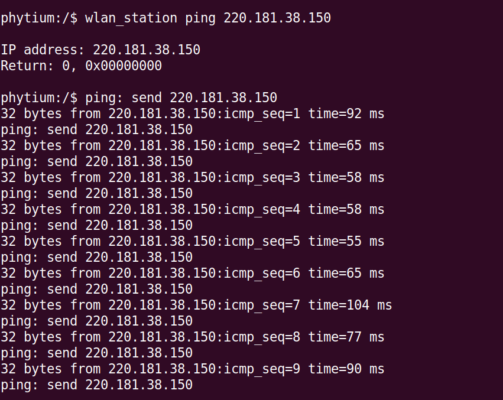
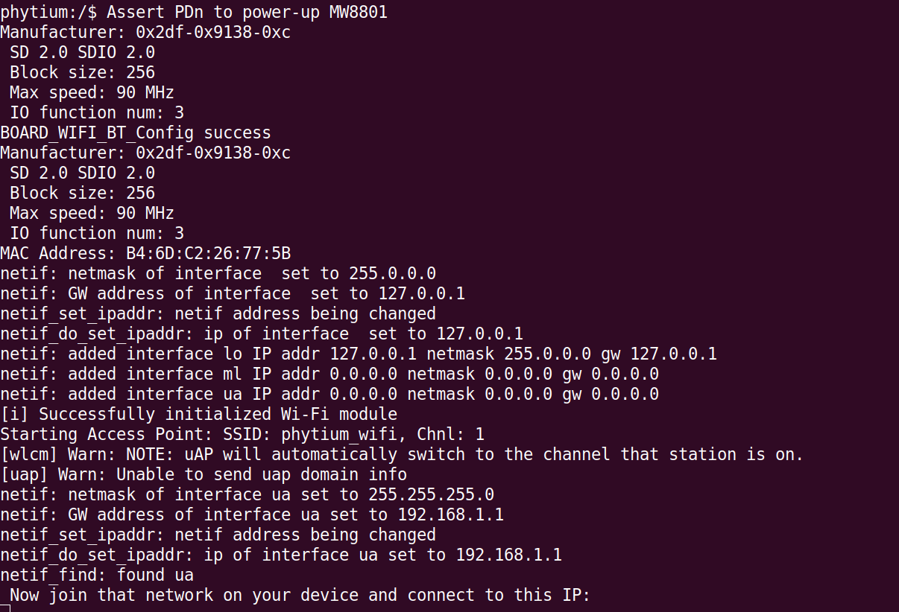
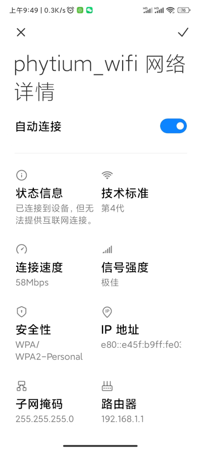

# WLAN 无线局域网测试

- 无线局域网 WLAN（Wireless Local Area Network）是一种无线计算机网络，使用无线信道代替有线传输介质连接两个或多个设备形成一个局域网LAN（Local Area Network）
- WLAN 的典型部署场景如家庭、学校、校园或企业办公楼等。WLAN是一个网络系统，而我们常见的Wi-Fi是这个网络系统中的一种技术。所以，WLAN和Wi-Fi之间是包含关系，WLAN包含了Wi-Fi
- 本例程中，使用 Marvell8801 SDIO Wifi 卡实现了 WLAN 的 Station 和 AP 两种模式
- 在 Station 模式中，外接 Marvell8801 的开发板通过热点（AP）连接和访问互联网
- 在 AP 模式中，开发板作为热点，支持其他 Station 模式设备连接此热点

> 本例程参考了 [mcu-sdk-examples](https://github.com/nxp-mcuxpresso/mcux-sdk-examples) 的 wifi_examples，进行了修改，Marvell 8801 Wifi 协议栈移植来自 [wifi_nxp](https://github.com/NXP/wifi_nxp)

## 1. 例程介绍

- Station 模式 (cmd_station.c), 演示了开发板扫描周围的热点信息，然后选择一个热点进行连接后，ping 一个外网 ip 地址的过程
- AP 模式 (cmd_ap.c), 演示了开发板作为一个热点，接受其他设备无线接入，为接入设备动态分配 ip 地址的过程

## 2. 如何使用例程

本例程需要用到

- Phytium开发板（E2000D/E2000Q）
- SD 扩展卡槽
- Marvell8801 SDIO Wifi 卡


- 杜邦线若干
- [Phytium FreeRTOS SDK](https://gitee.com/phytium_embedded/phytium-free-rtos-sdk)
- [Phytium Standalone SDK](https://gitee.com/phytium_embedded/phytium-standalone-sdk)

### 2.1 硬件配置方法

本例程支持的硬件平台包括

- E2000系列

对应的配置项是，

- CONFIG_TARGET_E2000D
- CONFIG_TARGET_E2000Q

通过 SD 扩展卡槽连接 Marvell8801 模块，88MW8801 上的 PDN 脚接 GPIO 1-4 脚，通过 GPIO 1-4 脚的上升沿控制 88MW8801 的重置


### 2.2 SDK配置方法

本例程需要，

- 使能Shell

对应的配置项是，

- CONFIG_USE_LETTER_SHELL
- CONFIG_USE_FSL_SDMMC
- CONFIG_USE_FSL_WIFI

本例子已经提供好具体的编译指令，以下进行介绍:
- make 将目录下的工程进行编译
- make clean  将目录下的工程进行清理
- make image   将目录下的工程进行编译，并将生成的elf 复制到目标地址
- make list_kconfig 当前工程支持哪些配置文件
- make load_kconfig LOAD_CONFIG_NAME=<kconfig configuration files>  将预设配置加载至工程中
- make menuconfig   配置目录下的参数变量
- make backup_kconfig 将目录下的sdkconfig 备份到./configs下

具体使用方法为:
- 在当前目录下
- 执行以上指令

### 2.3 构建和下载

#### 2.3.1 构建过程

><font size="1">描述构建、烧录下载镜像的过程，列出相关的命令</font><br />

[参考 freertos 使用说明](../../docs/reference/usr/usage.md)

#### 2.3.2 下载过程

- host侧设置重启host侧tftp服务器
```
sudo service tftpd-hpa restart
```

- 开发板侧使用bootelf命令跳转
```
setenv ipaddr 192.168.4.20  
setenv serverip 192.168.4.50 
setenv gatewayip 192.168.4.1 
tftpboot 0x90100000 freertos.elf
bootelf -p 0x90100000
```

### 2.4 输出与实验现象

#### 2.4.1 Station 模式连接 AP 热点

- 准备一个 AP 热点，例如路由器或者手机热点，本例程 中用小米手机产生一个 AP 热点供开发板连接
> 注意本例程只支持 Wifi4 的 2.4GHz 频率，确保 AP 热点设备兼容 Wifi4, 以 2.4GHz 发射无线信号 



- AP 热点（SSID = TEST, PASSWORD = 12345678, 加密方式为 WPA2）建立后，输入下列命令，初始化 Wifi 软件栈，同时扫描目标 AP

```
wlan_station scan
```

- 如图所示，`TEST` AP 已经被扫描到了



- 为了测试开发板是否与外网联通，我们可以先找一个公网 ip，找一台 Windows 或者 Linux 主机，ping 一个域名，可以看到一个目标公网 ip，如下图所示，是 220.181.38.150

```
ping www.baidu.com
```



- 然后输入下列命令，连接 `TEST` AP

```
wlan_station join TEST 12345678
```



```
wlan_station ping 220.181.38.150
```



- 上图可以看到，开发板 ping 公网 ip 是通的

#### 2.4.2 AP 模式接受其他设备接入

- 重启开发板，加载镜像后，输入下列命令启动一个 AP 热点

```
wlan_ap start
```

- 然后在手机或者笔记本电脑端搜索到 AP `phytium_wifi` 然后连接



- 连接成功后可以看到 AP 的信息，以及分配到的 ip 地址



> 目前 AP 模式演示了接入热点的功能，能够为接入的设备动态分配地址，但是 AP 组网通信可能是不通的，即连接同一个 AP 的不同设备间通信需要后续支持

## 3. 如何解决问题

## 4. 修改历史记录

><font size="1">记录例程的重大修改记录，标明修改发生的版本号 </font><br />

- v1.2.1 首次合入