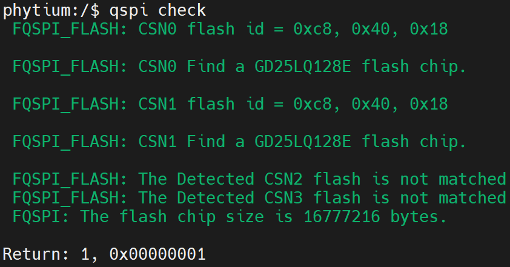
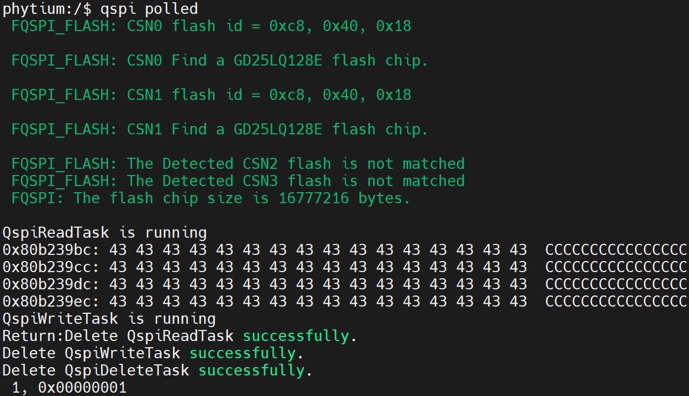
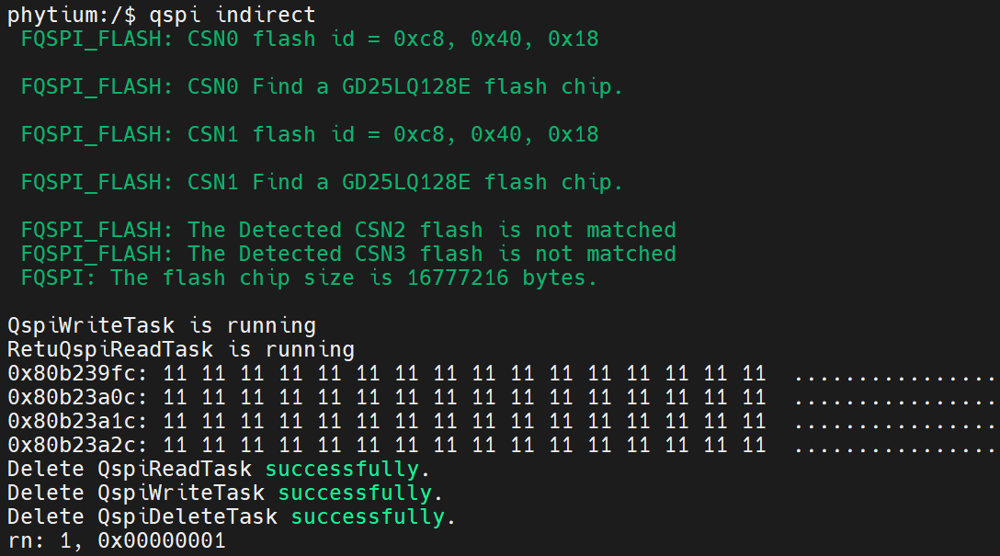
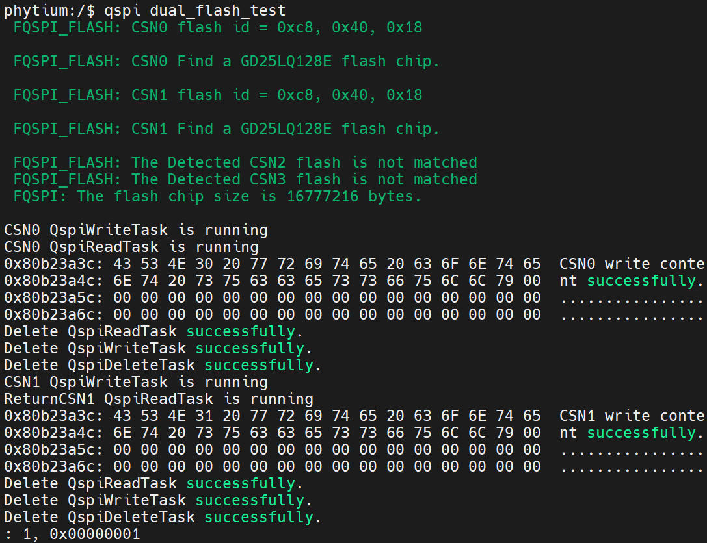

# qspi base on freertos

## 1. 例程介绍

本例程示范了freertos环境下的qspi的读写使用，包括qspi的初始化、读、写、读id和去初始化操作；

QSPI Flash芯片检测例程 (qspi_flash_connection_check_example.c)
- 初始化QSPI基本配置
- 依次检测并读取CSN0~CSN3已安装Flash芯片基本信息
- 若Flash芯片成功被检测，并且该Flash芯片已在驱动中适配，则会打印出该Flash芯片的安装位置，型号，存储空间大小
- 若Flash芯片未被检测到或在驱动中没有进行适配，则会打印未检测到Falsh芯片信息
- 检测结束后，去初始化QSPI，删除任务、删除信号量

QSPI Flash轮询模式读写测试例程 (qspi_flash_polled_example.c)
- 初始化QSPI基本配置，并检测已安装Flash的基本信息
- 使用0xDB指令(Sector Erase)擦除Flash芯片指定地址处内容
- 使用0x02指令(Page program)在Flash芯片内指定地址处写入字符串
- 写入成功后，使用0x03(normal read 1-1-1)指令在指定地址处读取字符串，对读写字符串的内容进行比较，验证读写操作成功
- 打印读出字符串内容，去初始化QSPI，删除任务、删除信号量

QSPI Flash间接模式读写测试例程 (qspi_flash_indirect_example.c)
- 初始化QSPI基本配置，并检测已安装Flash的基本信息
- 使用0xDB指令(Sector Erase)擦除Flash芯片指定地址处内容
- 使用0x02指令(Page program)间接模式在Flash芯片内指定地址处写入字符串
- 写入成功后，使用0x03(normal read 1-1-1)指令间接模式在指定地址处读取字符串，对读写字符串的内容进行比较，验证读写操作成功
- 打印读出字符串内容，去初始化QSPI，删除任务、删除信号量

QSPI 双Flash芯片读写测试例程 (qspi_dual_flash_stack_example.c)
- 该例程需要在CSN0，CSN1两个接口处安装两块型号和空间大小完全相同的Flash芯片
- 初始化QSPI基本配置，并检测已安装Flash的基本信息
- 使用0xDB指令(Sector Erase)擦除CSN0 Flash芯片指定地址处内容
- 使用0x02指令(Page program)在CSN0 Flash芯片内指定地址处写入字符串
- 写入成功后，使用0x02指令(Page program)在CSN0 Flash芯片指定地址处读取字符串，打印读出字符串内容
- 切换Flash选片至CSN1
- 使用0xDB指令(Sector Erase)擦除CSN1 Flash芯片指定地址处内容
- 使用0x02指令(Page program)在CSN1 Flash芯片内指定地址处写入字符串
- 写入成功后，使用0x02指令(Page program)在CSN1 Flash芯片指定地址处读取字符串，打印读出字符串内容
- 去初始化QSPI，删除任务、删除信号量

例程在FT2000/4上使用的Nor Flash介质型号是GD25Q256，容量为32MB;
E2000D上使用的Nor Flash介质型号是GD25Q128，容量为16MB;

## 2. 如何使用例程

本例程需要用到

- Phytium开发板:FT2000-4/D2000/E2000D/E2000Q/PhytiumPi(包含QSPI-FLASH芯片座)
- [Phytium freeRTOS SDK](https://gitee.com/phytium_embedded/phytium-free-rtos-sdk)
- [Phytium standalone SDK](https://gitee.com/phytium_embedded/phytium-standalone-sdk)

### 2.1 硬件配置方法

本例程支持的硬件平台包括

- FT2000/4、D2000、E2000D、E2000Q、PhytiumPi开发板

对应的配置项是

- CONFIG_TARGET_FT2004
- CONFIG_TARGET_D2000
- CONFIG_TARGET_E2000D
- CONFIG_TARGET_E2000Q
- CONFIG_TARGET_PHYTIUMPI


- 本例程适配了GD25、S25FS256、BOYA的Nor-Flash芯片，如使用其他型号，需自行参考适配

### 2.2 SDK配置方法

本例程需要，

- 使能Shell

对应的配置项是，

- CONFIG_USE_LETTER_SHELL

本例子已经提供好具体的编译指令，以下进行介绍:

- make 将目录下的工程进行编译
- make clean  将目录下的工程进行清理
- make image   将目录下的工程进行编译，并将生成的elf 复制到目标地址
- make list_kconfig 当前工程支持哪些配置文件
- make load_kconfig LOAD_CONFIG_NAME=`<kconfig configuration files>`  将预设配置加载至工程中
- make menuconfig   配置目录下的参数变量
- make backup_kconfig 将目录下的sdkconfig 备份到./configs下

具体使用方法为:

- 在当前目录下
- 执行以上指令

### 2.3 构建和下载

> `<font size="1">`描述构建、烧录下载镜像的过程，列出相关的命令`</font><br />`

[参考 freertos 使用说明](../../../docs/reference/usr/usage.md)

#### 2.3.1 下载过程

- host侧设置重启host侧tftp服务器

```
sudo service tftpd-hpa restart
```

- 开发板侧使用bootelf命令跳转

```
setenv ipaddr 192.168.4.20  
setenv serverip 192.168.4.50 
setenv gatewayip 192.168.4.1 
tftpboot 0x90100000 freertos.elf
bootelf -p 0x90100000
```

### 2.4 输出与实验现象

#### 2.4.1 QSPI Flash芯片检测测试例程
```
$ qspi check
```

#### 2.4.2 QSPI Flash轮询模式读写测试例程
```
$ qspi polled
```

#### 2.4.3 QSPI Flash间接模式读写测试例程
```
$ qspi indirect
```

#### 2.4.4 QSPI 双Flash轮询模式读写测试例程
```
$ qspi dual_flash_test
```


## 3. 如何解决问题

- 若出现读写异常，需确认Norflash型号是否已经适配；
- FLASH_ADDR需要根据实际的flash大小来确定；
- 由于开发板上的QSPI接口的NorFlash用于固件启动，因此不建议在不了解固件大小的情况下，使用qspi write写数据，因为这可能导致固件无法正常启动；

## 4. 修改历史记录
