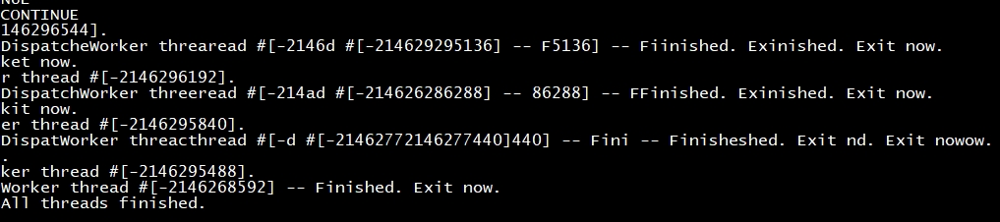

# posix base on freertos

## 1. 例程介绍

本例程示范了freertos环境下posix的使用方法。
POSIX (Portable Operating System Interface) 是定义了操作系统 API 的标准，主要用于通用操作系统，例如 Linux、UNIX 等。
通过在freertos上增加posix适配层，使得在 freertos 上开发的应用程序能够以 posix 的风格编写和移植。
- [FreeRTOS-Plus-POSIX](https://www.freertos.org/FreeRTOS-Plus/FreeRTOS_Plus_POSIX/index.html)

## 2. 如何使用例程

本例程需要用到

- Phytium开发板（FT2000-4/D2000/E2000D/E2000Q/PHYTIUMPI）
- [Phytium freeRTOS SDK](https://gitee.com/phytium_embedded/phytium-free-rtos-sdk)
- [Phytium standalone SDK](https://gitee.com/phytium_embedded/phytium-standalone-sdk)

### 2.1 硬件配置方法

本例程支持的硬件平台包括

- FT2000-4
- D2000
- E2000D
- E2000Q
- PHYTIUMPI

对应的配置项是，

- CONFIG_TARGET_FT2004
- CONFIG_TARGET_D2000
- CONFIG_TARGET_E2000D
- CONFIG_TARGET_E2000Q
- CONFIG_TARGET_PHYTIUMPI

### 2.2 SDK配置方法

本例程需要，

- 使能Shell

对应的配置项是，

- CONFIG_USE_LETTER_SHELL

本例子已经提供好具体的编译指令，以下进行介绍:

- make 将目录下的工程进行编译
- make clean  将目录下的工程进行清理
- make image   将目录下的工程进行编译，并将生成的elf 复制到目标地址
- make list_kconfig 当前工程支持哪些配置文件
- make menuconfig   配置目录下的参数变量
- make backup_kconfig 将目录下的sdkconfig 备份到./configs下

具体使用方法为:

- 在当前目录下
- 执行以上指令

### 2.3 构建和下载

#### 2.3.1 构建过程

- 在host侧完成配置

> 配置成E2000D，对于其它平台，使用对于的默认配置，如E2000Q `make load_kconfig LOAD_CONFIG_NAME=e2000q_aarch64_demo_posix`

- 选择目标平台

```
make load_kconfig LOAD_CONFIG_NAME=e2000d_aarch64_demo_posix
```

- 选择例程需要的配置

```
make menuconfig
```

- 编译并将编译出的镜像放置到tftp目录下

```
make image
```

#### 2.3.2 下载过程

- host侧设置重启host侧tftp服务器

```
sudo service tftpd-hpa restart
```

- 开发板侧使用bootelf命令跳转

```
setenv ipaddr 192.168.4.20  
setenv serverip 192.168.4.50 
setenv gatewayip 192.168.4.1 
tftpboot 0x90100000 freertos.elf
bootelf -p 0x90100000
```

### 2.4 输出与实验现象

- 系统进入后，输入 ``posix``查看指令说明

- 输入 ``posix thread``，启动线程的创建和等待测试


- 输入 ``posix demo``，启动线程间的数据收发测试



- 测试任务能够能正常创建运行，输入 ``ps``查看任务状态正常，即测试正常

## 3. 如何解决问题

- 需使用newlib c库进行编译支持


## 4. 修改历史记录

