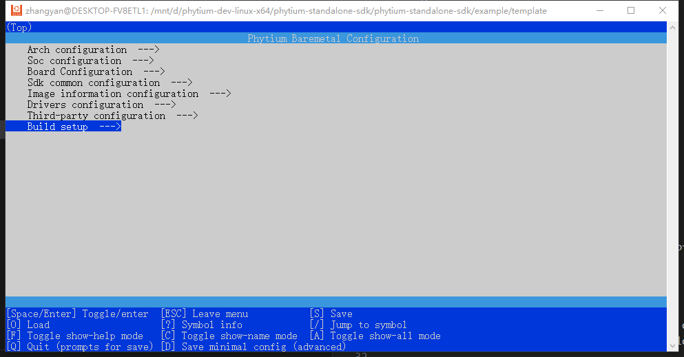
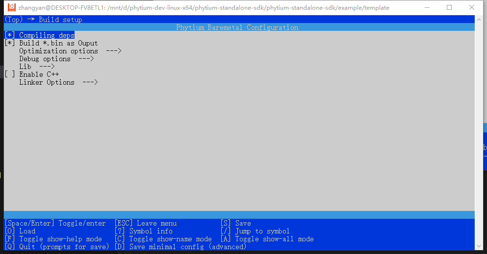
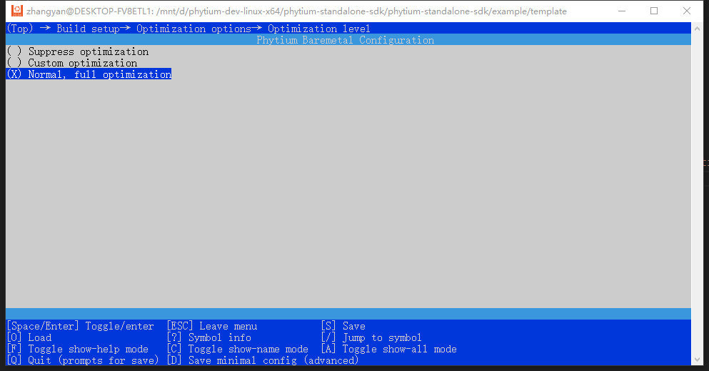
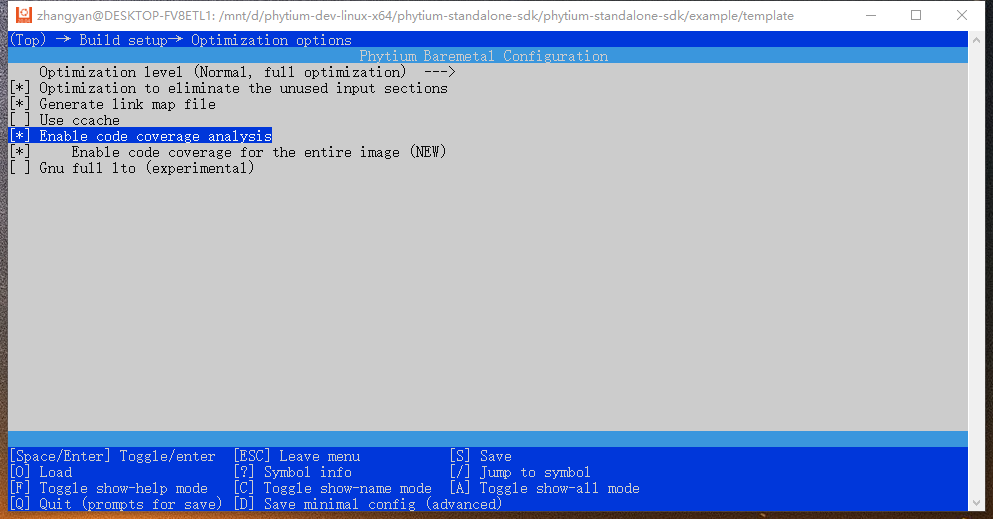
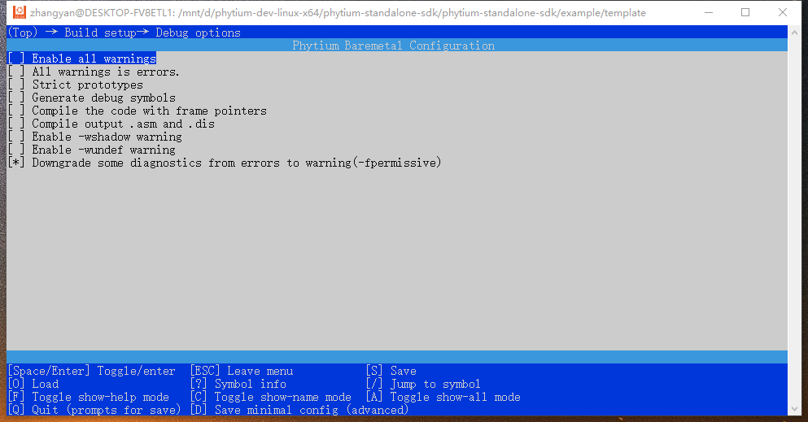
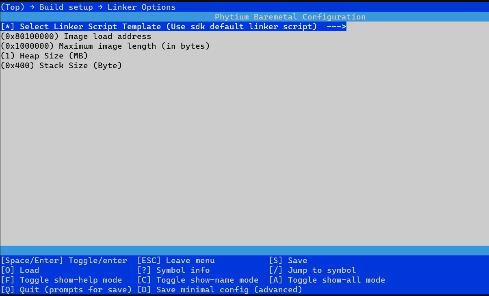
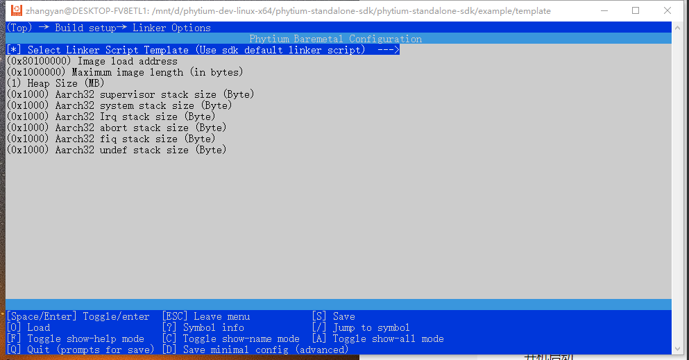

# 如何配置工程编译选项

## 用户可以通过menuconfig对编译选项进行如下配置

### 一，在工程下输入`make menuconfig`打开menuconfig菜单，进入`Build setup`菜单

### 二，配置方法

1. `Compiling deps`编译前是否对依赖关系进行检查

2. `Build *.bin as Output`编译后是否输出*.bin文件于当前工程目录下

3. `Optimization options`编译优化配置菜单，具体内容如下

- `Optimization level`编译优化级别配置，可以选择`Suppress optimization`(不进行优化)，`Custom optimization`(自定义优化)，
  `Normal，full optimization`(全局优化)，选择自定义优化后返回在上一级目录自定义优化等级

以下为可选优化等级
- `-O0`不进行优化；

  `-O1`编译器尝试减小代码大小并减少执行时间，但不执行需要大量编译时间的优化；
  
  `-O2`执行几乎所有支持的优化，而不涉及空间和速度的权衡。与‘-O’相比，此选项既增加了编译时间又提高了生成代码的性能；
  
  `-O3`打开'-O2'指定的所有优化，并且还打开一些特殊优化标志，具体可查阅相关手册；
  
  `-Ofast`启用所有 ‘-O3’ 优化。它还启用对于所有符合标准的程序并非都有效的优化

  `-Og`标准的编辑-编译-调试循环的优化级别选择，提供了合理的优化水平，同时保持了快速编译和良好的调试体验

- `Optimization to eliminate the unused input sections`是否启用链接器对未使用的输入段进行优化

- `Generate link map file`是否生成'.map'链接映射文件

- `Use ccache`构建过程中是否使用ccache(编译缓存工具)

- `Enable code coverage analysis`编译生成的可执行文件中是否包含代码覆盖率分析的相关信息

- `Gnu full ito(experimental)`是否启用GNU的全局链接时优化(Link Time Optimization)

4. `Debug options` Debug 选项

- `Enable all warnings`是否开启编译过程中的所有警告

- `All warnings is errors`是否将所有警告作为错误处理，启用后警告也会导致编译失败

- `Strict prototypes`是否在函数声明或定义没有指定参数类型时，产生警告。

- `Generate debug symbols`是否在编译时生成用于调试的符号信息，通常在使用调试器进行调试时需要启用此选项

- `Compile the code with frame pointers`是否在代码中保留帧指针。启用后，生成的镜像将会略微变大并变慢，但在出现错误时提供有用的调试信息。

- `Compile output .asm and .dis`是否编译输出'.asm'和'.dis'文件。在调试阶段，当需要对代码进行汇编时，可以启用此选项。

- `Enable -wshadow warning`是否在编译器发现本地变量覆盖另一个本地变量、参数或全局变量，或者遮蔽内联函数时产生警告。

- `Enable -wundef warning`是否在编译器发现在#if指令中评估的未定义标识符时产生警告。

- `Downgrade some diagnostics from errors to warning(-fpermissive)`是否将某些不符合标准的代码的诊断从error降级为warning。使用 '-fpermissive' 允许一些不符合标准的代码进行编译

5. `Lib`C标准库相关选项

- `Using compilation`使用默认编译链

- `Using newlib library`用户通过添加相关变量在SDK中使用newlib libc作为项目的库文件。

- `Using defined`用户通过添加相关变量在项目中使用外部libc作为库文件

6. `Enable C++`使能后可以编译C++文件

- `C++ Version`可选择C++版本，当前支持C++98(ANSI)，C++11，C++14

7. `Linker Options`配置链接器选项

- `Select Linker Script Template`选择链接脚本，可选择`Use sdk default linker scriptsdk`(SDK默认的链接脚本)从DDR启动，或`User defined link script`使用用户提供的链接脚本

注：以下配置在先择SDK默认链接脚本后，才可进行进一步配置
- `Image load address`镜像文件加载地址，配置为64位十六进制数，默认0x80100000

- `Maximum image length (in bytes)`镜像文件最大长度，以bytes为单位，默认0x1000000

- `Heap Size(MB)`堆栈大小，默认1MB

以下配置仅在开启aarch64时可配置

- `Stack Size(Byte)`在链接脚本中分配栈大小，默认0x400

以下配置仅在开启Aarch32时可配置

- `Aarch32 supervisor stack size (Byte)`在链接脚本中分配(Supervisor)监管栈大小，默认0x1000

- `Aarch32 system stack size (Byte)`在链接脚本中分配(System)系统栈大小，默认0x1000

- `Aarch32 Irq stack size (Byte)`在链接脚本中分配(IRQ)中断请求栈大小，默认0x1000

- `Aarch32 abort stack size (Byte)`在链接脚本中分配(Abort)中止模式栈大小，默认0x1000

- `Aarch32 fiq stack size (Byte)`在链接脚本中分配(FIQ)快速中断请求模式栈大小，默认0x1000

- `Aarch32 undef stack size (Byte)`在链接脚本中分配(Undefined)未定义模式栈大小，默认0x1000

    

