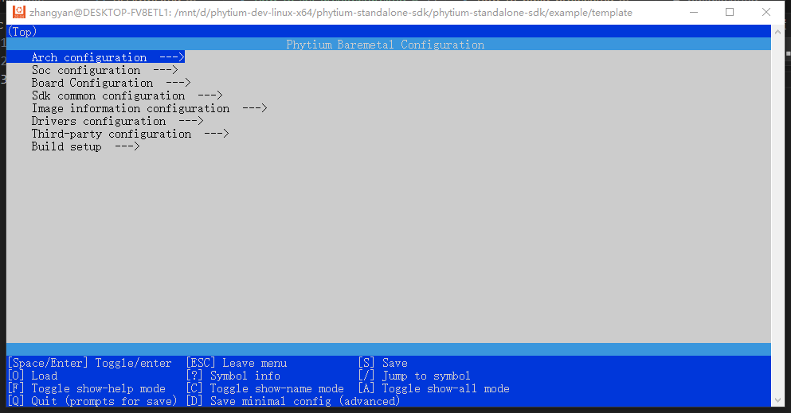
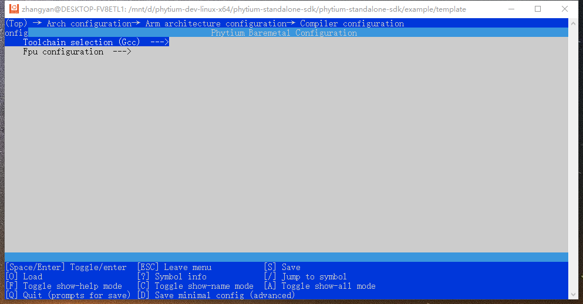

# 如何配置工程体系架构

## 用户可以通过menuconfig对体系架构进行如下配置

### 一，在工程下输入`make menuconfig`打开menuconfig菜单，进入`Arch configuration`菜单

### 二，配置方法

#### `Select target arch`选择体系架构，目前仅支持Armv8

#### `Arm architecture configuration`Arm体系架构相关配置

1. `Execution state`执行状态，可以选择AArch64(64-bit)，AArch32(32-bit)

2. `Compiler configuration`编译器配置

- `Toolchain selection`可选择使用gcc编译器或clang编译器，当前仅支持gcc编译器

以下选项仅在执行状态为AArch64(64-bit)时，可进行配置

- `Advanced SIMD (NEON) Extension`是否开启Advanced SIMD (NEON)，用于向量浮点运算。

- `Cyclic Redundancy Check (CRC) Extension`是否开启Cyclic Redundancy Check (CRC)，用于实现循环冗余校验。

- `Float Point (FP)`是否开启Float Point (FP)，用于支持浮点数运算。

- `Code Model (Small)`代码模型选择，用户可以选择Tiny、Small和Large 三种不同的代码模型

以下选项仅在执行状态为AArch32(32-bit)时，可进行配置

- `Fpu configuration`浮点数运算相关配置，详细如下

- `mfpu config`可以选择'crypto-neon-fp-armv8'启用 ARMv8 浮点数扩展指令、密码扩展和高级 SIMD 扩展指令
                'vfpv4'启用VFPv4浮点数扩展指令，'vfpv4-d16'启用VFPv4浮点数扩展指令，限制双精度浮点寄存器数量为16
                'vfpv3'启用VFPv3浮点数扩展指令，'vfpv3-d16'启用VFPv3浮点数扩展指令，限制双精度浮点寄存器数量为16。

- `mfloat-abi config`浮点数ABI(Application Binary Interface)选择，'hard'使用硬件实现的浮点数，'softfp'使用软件实现浮点数

3. `Use cache`是否开启cache，当开启`Use cache`时，通过`Use mmu`，选择是否使用平台默认的MMU配置

以下选项仅在执行状态为AArch64(64-bit)时，可进行配置

- `Flush cache when bootup`是否希望在启动时刷新缓存。这通常在 ootloader加载elf/bin文件时，没有缓存刷新时使用

- `MMU debug`是否启用MMU调试输出打印

