# Windows 环境下的 SDK 开发方法

- 本工具提供了 Phytium RTOS SDK 的 Windows 开发环境，在 64 位 Windows 10/11 上完成测试

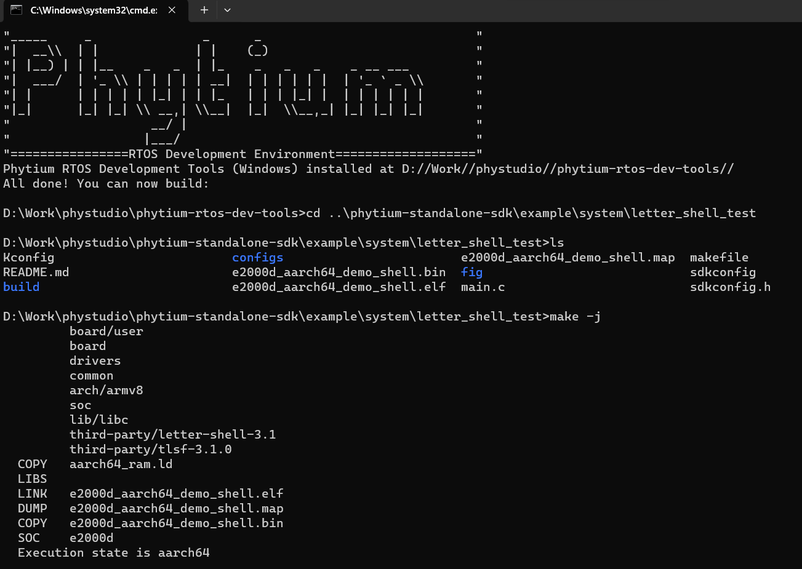

- 本工具支持
- 1. [Phytium Standalone SDK](https://gitee.com/phytium_embedded/phytium-standalone-sdk)
- 2. [Phytium FreeRTOS SDK](https://gitee.com/phytium_embedded/phytium-free-rtos-sdk)

- 本工具包集成了，
- 1. AARCH64 交叉编译链 xpack-aarch64-none-elf-gcc-11.3.1-1.2，来自 https://github.com/xpack-dev-tools/aarch64-none-elf-gcc-xpack/releases/
- 2. AARCH32 交叉编译链 xpack-arm-none-eabi-gcc-11.3.1-1.1，来自 https://github.com/xpack-dev-tools/arm-none-eabi-gcc-xpack/releases/
- 3. busybox 工具包 xpack-windows-build-tools-4.3.0-1，来自 https://github.com/xpack-dev-tools/windows-build-tools-xpack/releases/
- 4. CMake 工具 xpack-cmake-3.25.3-1，来自 https://github.com/xpack-dev-tools/cmake-xpack/releases/
- 5. Ninja 工具 xpack-ninja-build-1.11.1-2，来自 https://github.com/xpack-dev-tools/ninja-build-xpack/releases/
- 6. Git 工具 PortableGit，来自 https://github.com/git-for-windows/git/releases/download/v2.43.0.windows.1/PortableGit-2.43.0-32-bit.7z.exe
- 7. OpenOCD 工具，基于 OpenOCD 0.12.0 开发，支持 Phytium 系列 CPU 的调试
- 8. Python 3.8 工具，来自 https://www.python.org/ftp/python/3.8.0/python-3.8.0-embed-win32.zip，下载 [get-pip.py](https://bootstrap.pypa.io/get-pip.py) ，额外安装了 pip工具和 windows-curses 包

```
python get-pip.py
python -m pip install windows-curses
```

- 9. GDB-Multiarch 工具，来自 https://static.grumpycoder.net/pixel/gdb-multiarch-windows/
- 10. TFTP 工具，来自 https://bitbucket.org/phjounin/tftpd64/downloads/

## 使用方法

- （1）从百度网盘链接下载获取开发环境，下载完成后双击 phytium-rtos-dev-tools.exe 解压到指定目录

- [Windows 10/11 x64 环境下载链接](https://pan.baidu.com/s/1J7dndPqMtQD1RNmfdVHblQ)
>提取码：phyt

- （2）进入 phytium-rtos-dev-tools 目录，双击 terminal.cmd 打开控制台，后续的操作都在这个控制台中进行
- （3）通过git拉取Phytium Standalone SDK的代码，如

    ```
    git clone https://gitee.com/phytium_embedded/phytium-standalone-sdk.git ./phytium-standalone-sdk
    ```

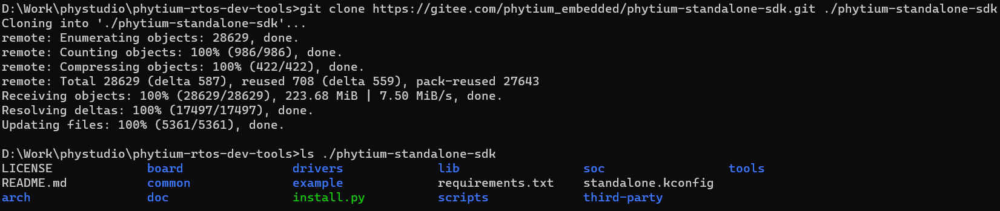

-  (4) 进入Phytium Standalone SDK代码目录，选择一个 example 进行编译开发，例如使用 letter shell 例程，目标平台为 E2000D Demo 板，首先加载默认配置

   ```
   cd phytium-standalone-sdk\example\system\letter_shell_test
   make list_kconfig
   make load_kconfig LOAD_CONFIG_NAME=e2000d_aarch64_demo_shell
   ```

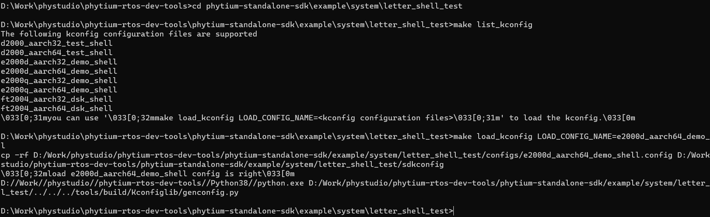

- （5）如果需要进行配置的话，可以进入 menuconfig 界面

    ```
    make menuconfig
    ```


-  (6) 配置完成之后进行编译

    ```
    make clean
    make all
    ```

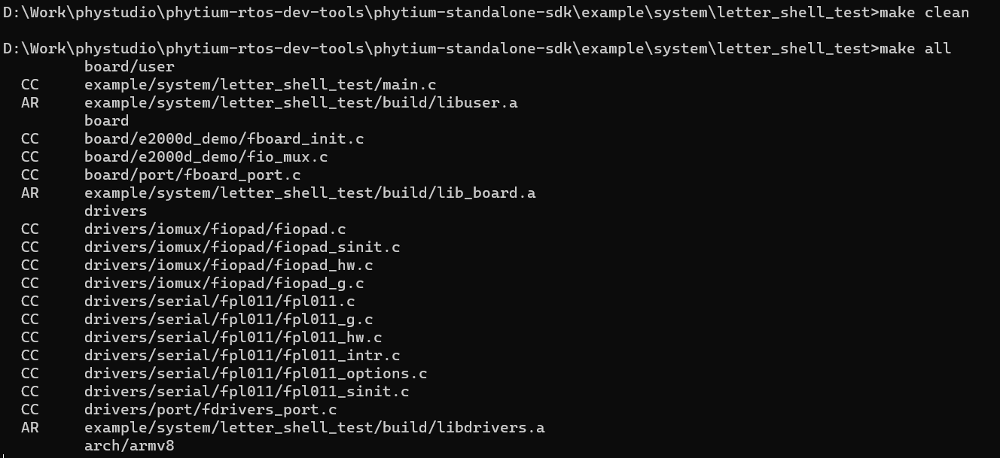

-  (7) 编译成功后可以看到生成的镜像，然后拷贝镜像到上传路径，如 d:\tftpboot

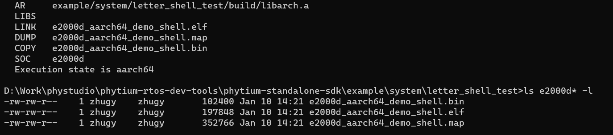

    > 上传路径可以在例程 makefile 中通过修改 USR_BOOT_DIR 变量指定
    ```
    make image
    ```

-  (8) 本环境中集成了 tftp 工具，可以支持通过网络将镜像下载到开发板，具体的使用方法是

```
1. 固定电脑端网卡的 ip 地址（如 192.168.4.30），手动设置电脑端网卡的 ip 地址，或者通过路由器设置绑定 ip
2. 通过网线连接开发板和设置了固定 ip 地址的电脑端网卡
3. 在电脑端运行 tftp64.exe，将 tftp 目录指向*.bin 或 *.elf 镜像 （baremetal.elf）所在的位置
4. 启动开发板停留在 u-boot 控制台界面，然后通过串口工具输入下列命令

setenv ipaddr 192.168.4.20  
setenv serverip 192.168.4.30 
setenv gatewayip 192.168.4.1 
tftpboot 0x90100000 baremetal.elf
bootelf -p 0x90100000
```

- 可以使用开源串口工具 [WindTerm](https://github.com/kingToolbox/WindTerm) 连接开发板

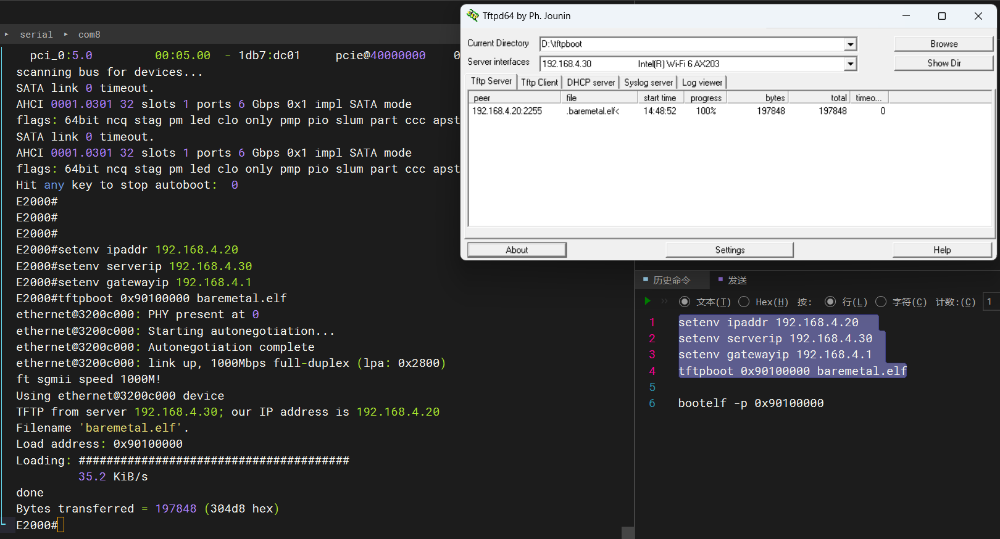

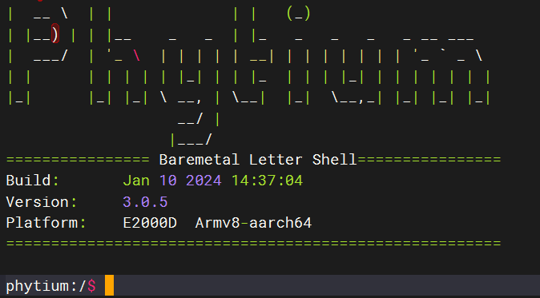

-  (9) 本环境中集成了 JTAG OpenOCD 调试工具，可以支持 AARCH64 和 AARCH32 调试，具体使用方法可以参考[JTAG 调试例程](https://gitee.com/phytium_embedded/phytium-standalone-sdk/tree/master/example/system/jtag_debugging)

- 首先使用 JTAG 适配器连接电脑端和开发板，我们这里使用的是 FireDAP，使用 OpenOCD 的话，需要参考原理图，连接 TDI TDO TMS 和 TCK 四根线

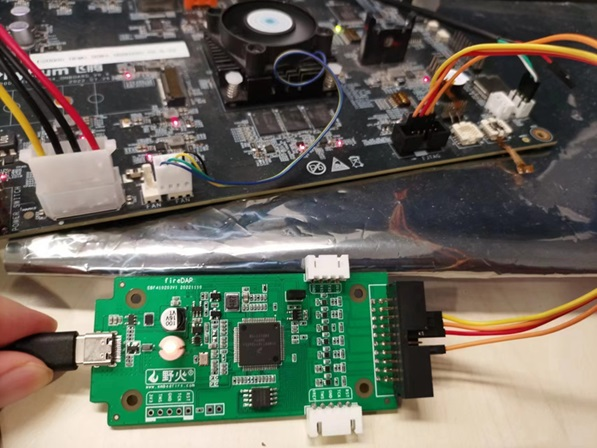

- 双击 terminal.cmd 两次创建两个窗口，一个窗口运行 OpenOCD，另一个窗口运行 GDB，其中，运行 OpenOCD 的窗口输入下列命令，启动 OpenOCD 进程

    ```
    cd phytium-standalone-sdk\example\system\jtag_debugging
    make run_openocd
    ```

- 等待 OpenOCD 进程启动完成后， 运行 GDB 的窗口输入下列命令，启动 GDB 调试进程，连接 OpenOCD 进程，后续的调试作业可以在这个窗口完成

    ```
    cd phytium-standalone-sdk\example\system\jtag_debugging
    make run_gdb    
    ```

> 调试适配器支持 Jlink 和 CMSIS DAP，可以在 example 的 makefile 中通过修改 OPENOCD_CMD 指定是使用 Jlink 还是 CMSIS DAP

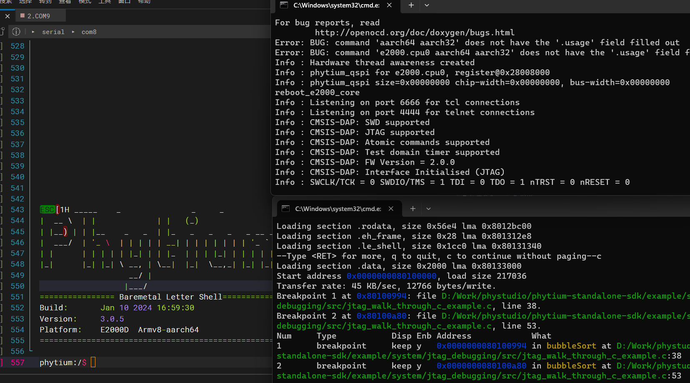

## 注意事项

- 1. 运行 terminal.cmd 会自动设置环境变量，后续的操作都必须在 terminal.cmd 弹出的控制台中进行，可以通过下列方法验证环境是否可以工作

```
aarch64-none-elf-gcc --version
arm-none-eabi-gcc --version
openocd --version
make --version
```

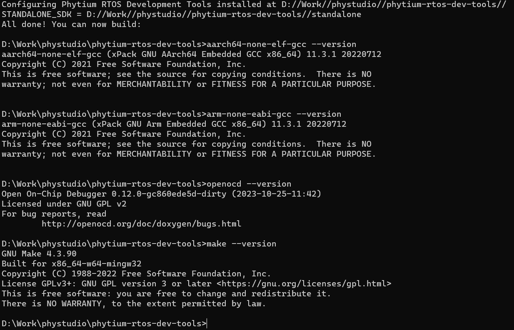

- 2. JTAG 适配器驱动问题，使用 Jlink 或者 FireDAP 要使用 WinUSB 的驱动不要使用官方的驱动，具体修改方法是在设备管理器里卸载官方驱动，然后用 Zadig 工具将设备驱动换成 WinUSB, OpenOCD 中会将 Jlink 当作一个普通的 USB Bulk 设备，将 CMSIS DAP 当成一个 USB Hid 设备进行通信

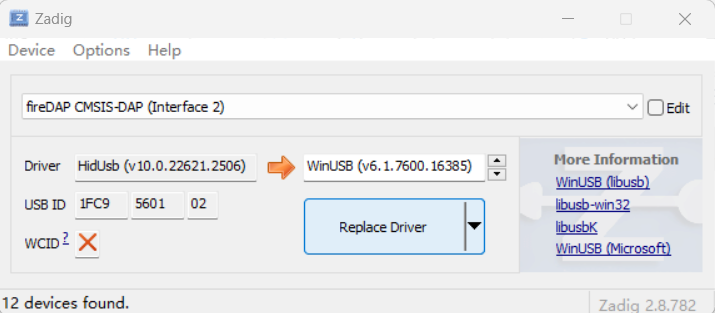

- 3. 部分 Windows 中存在环境问题，有些 Windows 环境中已经之前已经安装了 MINGW 或者 Cygwin 等工具，必须确保编译环境中使用的是 xpack-windows-build-tools 里提供的 busybox 工具

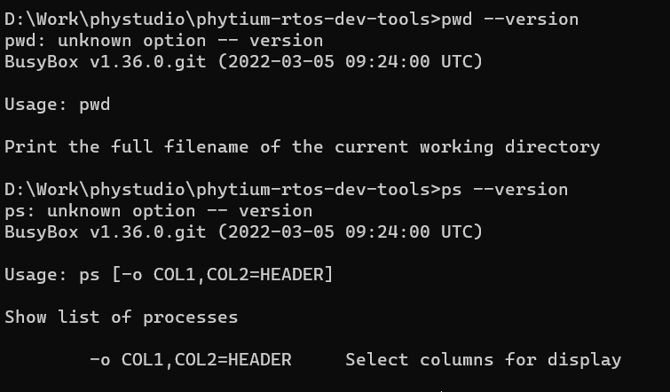