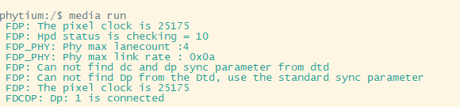

# media 点亮屏幕测试

## 1. 例程介绍

>介绍例程的用途，使用场景，相关基本概念，描述用户可以使用例程完成哪些工作

DC 是一个显示控制器，主要完成将 CPU/GPU/VPU 处理后的图像数据，按照 Display 协议处理后送给 DP PHY 接入显示器。

本司E2000系列型号芯片采用DisplayPort1.4协议，兼容 DisplayPort1.4/Embedded DisplayPort1.3 协议。
本例程主要展示本司E2000系列芯片DC显示驱动功能。

## 2. 如何使用例程

><font size="1">描述开发平台准备，使用例程配置，构建和下载镜像的过程</font><br />

本例程需要用到

- Phytium开发板（E2000Q）
- 显示器及连接线
- [Phytium Standalone SDK](https://gitee.com/phytium_embedded/phytium-standalone-sdk)

### 2.1 硬件配置方法

><font size="1">哪些硬件平台是支持的，需要哪些外设，例程与开发板哪些IO口相关等（建议附录开发板照片，展示哪些IO口被引出）</font><br />

本例程支持的硬件平台包括

- E2000Q AARCH32/AARCH64

本例程所需的硬件设备包括

- 通过DP线将显示器与E2000板卡连接
- 利用串口调试线连接板卡和调试电脑，波特率设为 115200-8-1-N

对应的配置项是，

- CONFIG_TARGET_E2000D

### 2.2 SDK配置方法

><font size="1">依赖哪些驱动、库和第三方组件，如何完成配置（列出需要使能的关键配置项）</font><br />

- 本例子已经提供好具体的编译指令，以下进行介绍：
    1. make 将目录下的工程进行编译
    2. make clean  将目录下的工程进行清理
    3. make image   将目录下的工程进行编译，并将生成的elf 复制到目标地址
    4. make list_kconfig 当前工程支持哪些配置文件
    5. make load_kconfig LOAD_CONFIG_NAME=<kconfig configuration files>  将预设配置加载至工程中
    6. make menuconfig   配置目录下的参数变量
    7. make backup_kconfig 将目录下的sdkconfig 备份到./configs下


- 具体使用方法为：
  - 在当前目录下
  - 执行以上指令

### 2.3 构建和下载

><font size="1">描述构建、烧录下载镜像的过程，列出相关的命令</font><br />

#### 2.3.1 构建过程

- 在host侧完成配置

>配置成E2000，对于其它平台，使用对应的默认配置
```
$ make load_kconfig LOAD_CONFIG_NAME=e2000d_aarch32_demo_media
```
- 在host侧完成构建

```
$ make image
```
#### 2.3.2 下载过程

- host侧设置重启host侧tftp服务器
```

sudo service tftpd-hpa restart

```

- 开发板侧使用bootelf命令跳转
```

setenv ipaddr 192.168.4.20  
setenv serverip 192.168.4.50
setenv gatewayip 192.168.4.1
tftpboot 0x90100000 baremetal.elf
bootelf -p 0x90100000

```

### 2.4 输出与实验现象

><font size="1">描述输入输出情况，列出存在哪些输出，对应的输出是什么（建议附录相关现象图片）</font><br />

- ### 2.4.1 查看命令

输入命令： 

media run

注：默认使能DP0 接口

默认参数  ：channel = 2;                   DP通道号
           width = 640;                   宽
           height = 480;                  高
           multi_mode = 0;                多屏模式选择
           color_depth = 32;              色深
           refresh_rate = 60;             刷新率




#### 2.4.2 试验现象


## 3. 如何解决问题

><font size="1">主要记录使用例程中可能会遇到的问题，给出相应的解决方案</font><br />


## 4. 修改历史记录

><font size="1">记录例程的重大修改记录，标明修改发生的版本号 </font><br />

- 2022-12-6 ：v0.1.0 添加example
- 2023-02-10 ：v0.1.1 添加多屏

