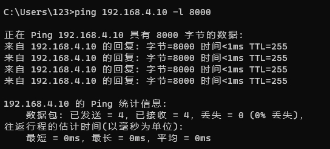

# LWIP JUMBO 测试

## 1. 例程介绍

><font size="1">介绍例程的用途，使用场景，相关基本概念，描述用户可以使用例程完成哪些工作</font><br />

本例程示范了MAC控制器在lwip ipv4模式下的初始化流程，同时通过mac巨帧模式使能操作，可以对网卡进行巨帧数据包收发测试。

### 1.1 网卡巨帧特性测试例程 (lwip_jumbo_example.c)
- ipv4模式下初始化开发板上所有网口以及对应网卡控制器
- 为每个网卡配置静态IPv4地址
- 可以通过主机端对相应网口进行巨帧数据ping通


## 2. 如何使用例程

><font size="1">描述开发平台准备，使用例程配置，构建和下载镜像的过程</font><br />

本例程需要以下硬件，

- E2000D/Q Demo板，FT2000/4开发板，D2000开发板，PhytiumPi
- 串口线和串口上位机

### 2.1 硬件配置方法

><font size="1">哪些硬件平台是支持的，需要哪些外设，例程与开发板哪些IO口相关等（建议附录开发板照片，展示哪些IO口被引出）</font><br />
- 请将主机与开发板上的网口直连,排除链路上其他节点的干扰
- 需要手动配置主机网卡，在设备管理器中将主机网卡的巨帧模式打开，使其具备发送接收巨帧的能力

### 2.2 SDK配置方法

><font size="1">依赖哪些驱动、库和第三方组件，如何完成配置（列出需要使能的关键配置项）</font><br />

本例程需要：
- LWIP组件，依赖 USE_LWIP
- Letter Shell组件，依赖 USE_LETTER_SHELL

对应的配置项是，

- CONFIG_USE_LWIP
- CONFIG_USE_LETTER_SHELL

- 本例子已经提供好具体的编译指令，以下进行介绍：

  1. make 将目录下的工程进行编译
  2. make clean  将目录下的工程进行清理
  3. make image   将目录下的工程进行编译，并将生成的elf 复制到目标地址
  4. make list_kconfig 当前工程支持哪些配置文件
  5. make load_kconfig LOAD_CONFIG_NAME=`<kconfig configuration files>`  将预设配置加载至工程中
  6. make menuconfig   配置目录下的参数变量
  7. make backup_kconfig 将目录下的sdkconfig 备份到./configs下
- 具体使用方法为：

  - 在当前目录下
  - 执行以上指令

### 2.3 构建和下载

><font size="1">描述构建、烧录下载镜像的过程，列出相关的命令</font><br />

本文档将以E2000demo开发板为例，对于其它平台，使用对应的默认配置

- 在host端完成配置
- 选择目标平台

```
make load_kconfig LOAD_CONFIG_NAME=e2000d_aarch64_demo_lwip_jumbo
```

- 选择例程需要的配置

```
make menuconfig
```

- 进行编译

```
make
```

- 将编译出的镜像放置到tftp目录下

```
make image
```

- host侧设置重启host侧tftp服务器

```
sudo service tftpd-hpa restart
```

- 开发板侧使用bootelf命令跳转

```
setenv ipaddr 192.168.4.20  
setenv serverip 192.168.4.50 
setenv gatewayip 192.168.4.1 
tftpboot 0x90100000 baremetal.elf
bootelf -p 0x90100000
```

### 2.4 输出与实验现象

><font size="1">描述输入输出情况，列出存在哪些输出，对应的输出是什么（建议附录相关现象图片）</font><br />

#### 2.4.1 网卡巨帧特性测试例程 (lwip_jumbo_example.c)

```
lwip jumbo
```


- 主机端进行巨帧ping操作，可以看到以下结果

## 3. 如何解决问题

><font size="1">主要记录使用例程中可能会遇到的问题，给出相应的解决方案</font><br />

## 4. 修改历史记录

><font size="1">记录例程的重大修改记录，标明修改发生的版本号 </font><br />