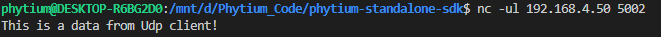

# UDP CLIENT测试

## 1. 例程介绍

> `<font size="1">`介绍例程的用途，使用场景，相关基本概念，描述用户可以使用例程完成哪些工作`</font><br />`

本例程通过对接FGMAC驱动和LWIP网络协议栈，利用raw api，实现了下述功能，

- LWIP网络协议栈初始化
- 开发板向网络主机发送udp数据包
- 网络主机在屏幕端打印收到的数据

## 2. 如何使用例程

> `<font size="1">`描述开发平台准备，使用例程配置，构建和下载镜像的过程`</font><br />`

- 本例程在E2000上测试通过，您可以参考以下方法配置本例程所需要的硬件和软件环境

### 2.1 硬件配置方法

> `<font size="1">`哪些硬件平台是支持的，需要哪些外设，例程与开发板哪些IO口相关等（建议附录开发板照片，展示哪些IO口被引出）`</font><br />`

本例程支持以下硬件平台

- FT2000/4
- D2000开发板
- E2000 系列开发板

D2000开发板图片示例如下：


DEMO开发板图片示例如下所示


### 2.2 SDK配置方法

> `<font size="1">`依赖哪些驱动、库和第三方组件，如何完成配置（列出需要使能的关键配置项）`</font><br />`

本例程需要，

- 使能LWIP

对应的配置项是，

- CONFIG_USE_LWIP
- CONFIG_USE_LETTER_SHELL

- 本例子已经提供好具体的编译指令，以下进行介绍：

  - make 将目录下的工程进行编译
  - make clean  将目录下的工程进行清理
  - make image   将目录下的工程进行编译，并将生成的elf 复制到目标地址
  - make list_kconfig  将支持的配置文件罗列出来
  - make load_kconfig LOAD_CONFIG_NAME=e2000d_aarch32_demo_baremetal 预设32bit e2000d demo板下的配置加载至工程中
  - make load_kconfig LOAD_CONFIG_NAME=e2000d_aarch64_demo_baremetal 预设64bit e2000d demo板下的配置加载至工程中
  - make menuconfig   配置目录下的参数变量
  - make backup_kconfig 将目录下的sdkconfig 备份到./configs下
- 具体使用方法为：

  - 在当前目录下
  - 执行以上指令

### 2.3 构建和下载

> `<font size="1">`描述构建、烧录下载镜像的过程，列出相关的命令`</font><br />`

#### 2.3.1 构建过程

本文档将以E2000demo开发板为例，对于其它平台，使用对应的默认配置

- 在host端完成配置
- 选择目标平台

```
make load_kconfig LOAD_CONFIG_NAME=e2000d_aarch64_demo_baremetal
```

- 选择例程需要的配置

```
make menuconfig
```

- 进行编译

```
make
```

- 将编译出的镜像放置到tftp目录下

```
make image
```

#### 2.3.2 下载过程

- host侧设置重启host侧tftp服务器

```
sudo service tftpd-hpa start
```

- 开发板侧使用bootelf命令跳转

```
setenv ipaddr 192.168.4.20
setenv serverip 192.168.4.50 
setenv gatewayip 192.168.4.1 
tftpboot 0x90100000 baremetal.elf
bootelf -p 0x90100000
```

### 2.4 输出与实验现象

> `<font size="1">`描述输入输出情况，列出存在哪些输出，对应的输出是什么（建议附录相关现象图片）`</font><br />`

- 启动进入后，根据连接的网口，输入指令完成网口初始化

#### 2.4.1 初始化LWIP网络协议栈

- 输入以下命令，初始化LWIP网络协议栈, 依次设置网卡和dhcp使能，配置ip地址，子网掩码，网关地址，运行完成退出后LWIP协议栈会持续运行
- lwip probe 指令介绍

```
lwip probe <driver id> <device id> <interface id> <dhcp_en> <ipaddr> <gateway> <netmask>
```

- 其中driver id 为驱动类型 ， 0为xmac ，1为gmac
- device id 为控制器id
- interface id ,0 为rgmii ,1 为sgmii
- dhcp en，0 表示关闭dhcp功能，1表示开启dhcp功能，网卡将根据dhcp协议获得ip地址（当协议栈支持dhcp时，该参数才具有实际作用）
- 输入以下命令，初始化LWIP网络协议栈, 依次设置网卡和dhcp使能，配置ip地址，子网掩码，网关地址，运行完成退出后LWIP协议栈会持续运行

```
$ lwip probe 0 0 1 0 192.168.4.10 192.168.4.1 255.255.255.0
```

#### 2.4.2 开启udpclient

- 首先在host端开启udp端口监听，输入以下命令

```
nc -ul 192.168.4.50 5002
```

- 接着在开发板终端输入以下命令，开始udp client 测试

```
$ udpclient
```

- 开发板发送UDP数据到主机的端口，主机打印收到的数据
- 开发板实验输出结果


- 主机端实验输出结果



## 3. 如何解决问题

> `<font size="1">`主要记录使用例程中可能会遇到的问题，给出相应的解决方案`</font><br />`

- Q: 为什么ping包的延时会在2ms左右？
- A: 因为mac ping指令中，读取外部网络包的执行周期为2ms，可以在LwipEchoPing函数中自行修改；
- Q: 如何指定开发板的ip地址？
- A: ipv4下在LwipEchoInit函数中修改如下变量即可：

```
    IP4_ADDR(&ipaddr,  192, 168,   4, 10);
    IP4_ADDR(&netmask, 255, 255, 255,  0);
    IP4_ADDR(&gw,      192, 168,   4,  1);
```

- A: 从ipv6的probe和ping包的ip地址来看，ipv6的地址是根据其mac地址来设置的，在LwipEchoInit函数中修改如下变量即可：

```
    unsigned char mac_ethernet_address[] =
	{0x00, 0x04, 0x66, 0x00, 0x11, 0x22};
```

## 4. 修改历史记录

> `<font size="1">`记录例程的重大修改记录，标明修改发生的版本号 `</font><br />`

v0.1.11 2021/11/15 首次合入

v0.1.14 2021/12/10 解决ping初始化多次导致内存泄漏的问题

v0.1.18 2022/4/20 重构gmac驱动，适配lwip

v0.2.1  2022/7/28 增加e2000 上 xmac 驱动支持，目前只支持sgmii 与 rgmii interface
