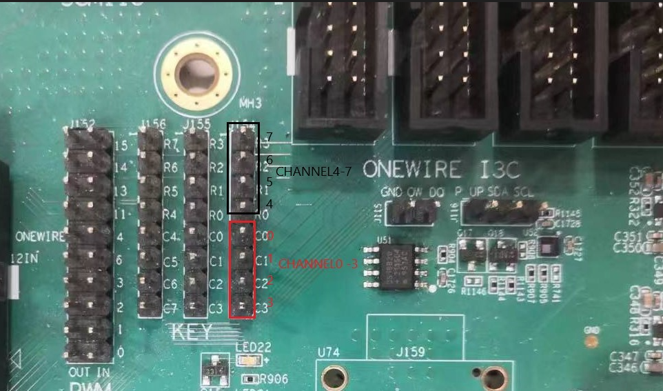
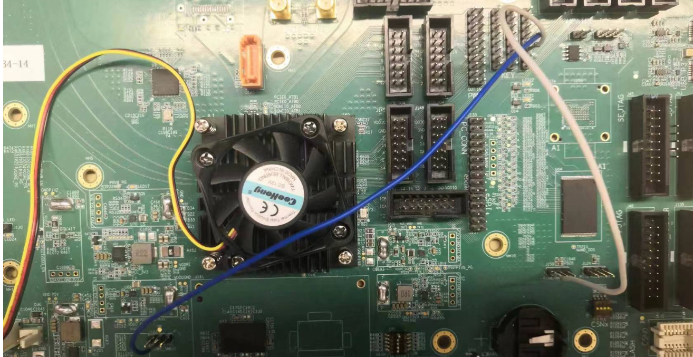
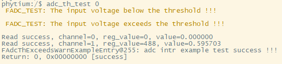

# ADC Example

## 1. 例程介绍

><font size="1">介绍例程的用途，使用场景，相关基本概念，描述用户可以使用例程完成哪些工作</font><br />

ADC中断模式获取电压值测试例程(adc_intr_get_voltage_example.c)
- 输入电压从J154对应管脚输入后，若该输入电压在adc设定的阈值范围内，adc将进行采样并计算出其具体的电压值(value)后作为输出显示
- 完成adc基本配置初始化和中断配置初始化，打开所有中断，开启转换功能，进入adc转换完成中断处理函数，标志对应channel位转换完成,并关闭该channel的转换完成中断,依次打印channel 0-7获取的电压值，关闭转换功能，关闭所有中断，去初始化配置

ADC阈值报警测试例程(adc_intr_get_voltage_example.c)
- 该测试只使用channel 0与channel 1
- 将阈值上限配置为1000，为1.25V；将阈值下限配置为100，约为0.12V
- 输入电压从J154对应管脚输入，其中channel 0接地(J184 2)，电压为0V，低于adc阈值下限；channel 1接1.8v输入电压(J158 1)，超出adc阈值上限，触发超出阈值上下限报警中断，并打印channel 0/1 获取电压的值
- 完成adc基本配置初始化和中断配置初始化，打开所有中断，开启转换功能，触发超出阈值上下限报警中断，依次打印channel 0-1获取的电压值，关闭转换功能，关闭所有中断，去初始化配置

## 2. 如何使用例程

><font size="1">描述开发平台准备，使用例程配置，构建和下载镜像的过程</font><br />

本例程需要以下硬件，

- E2000D TEST C板
- 串口线和串口上位机

### 2.1 硬件配置方法

><font size="1">哪些硬件平台是支持的，需要哪些外设，例程与开发板哪些IO口相关等（建议附录开发板照片，展示哪些IO口被引出）</font><br />
- 使用E2000D TEST C板进行测试 ADC0控制器的通道0-3，对应板上J154的引脚5-8 ; 通道4-7，对应板上J154的引脚4-1
- 注意参考电压为1.25V，的外接电压不建议超越该值，防止对硬件造成破坏



- 下图为具体接线方法，图示为ADC阈值报警测试例程channel 0接地(J184 2),channel 1接1.8v输入电压(J158 1)



### 2.2 SDK配置方法

><font size="1">依赖哪些驱动、库和第三方组件，如何完成配置（列出需要使能的关键配置项）</font><br />

本例程需要，

- 使能ADC `CONFIG_USE_ADC`， 然后选择FADC驱动 `CONFIG_USE_FADC`

- 使能Letter Shell `CONFIG_USE_LETTER_SHELL`, 然后选择UART驱动 `CONFIG_LS_PL011_UART`

对应的配置项是，

- Use FADC
- Use Letter Shell

本例子已经提供好具体的编译指令，以下进行介绍:

- make menuconfig   配置目录下的参数变量
- make 将目录下的工程进行编译
- make clean  将目录下的工程进行清理
- make image   将目录下的工程进行编译，并将生成的elf 复制到目标地址
- make load_kconfig LOAD_CONFIG_NAME=e2000d_aarch64_E2000D_demo_baremetal  将预设64bit e2000d 下的配置加载至工程中
- make load_kconfig LOAD_CONFIG_NAME=e2000d_aarch32_E2000D_demo_baremetal  将预设32bit e2000d 下的配置加载至工程中
- make backup_kconfig 将目录下的sdkconfig 备份到./configs下

具体使用方法为：
- 在当前目录下
- 执行以上指令

### 2.3 构建和下载

><font size="1">描述构建、烧录下载镜像的过程，列出相关的命令</font><br />

- 在host侧完成配置

>配置成E2000D，对于其它平台，使用对应的默认配置，如E2000d 32位:
```
$ make load_kconfig LOAD_CONFIG_NAME=e2000d_aarch32_demo_baremetal
```

- 在host侧完成构建

```
$ make clean image
```

- host侧设置重启host侧tftp服务器

```
sudo service tftpd-hpa restart
```

- 开发板侧使用bootelf命令跳转

```
setenv ipaddr 192.168.4.20  
setenv serverip 192.168.4.50 
setenv gatewayip 192.168.4.1 
tftpboot 0x90100000 baremetal.elf
bootelf -p 0x90100000
```

### 2.4 输出与实验现象

><font size="1">描述输入输出情况，列出存在哪些输出，对应的输出是什么（建议附录相关现象图片）</font><br />

依次执行2.4.1,2.4.2命令

### 2.4.1 进行中断模式读取电压值测试

```
$ adc intr_read 0 (channel 0 接地)
```


### 2.4.2 进行超出阈值报警测试

```
$ adc th_test 0   (channel 0 接地，channel 1 接1.8v)
```


## 3. 如何解决问题

><font size="1">主要记录使用例程中可能会遇到的问题，给出相应的解决方案</font><br />

## 4. 修改历史记录

><font size="1">记录例程的重大修改记录，标明修改发生的版本号 </font><br />

v0.1.0  adc_example 增加

