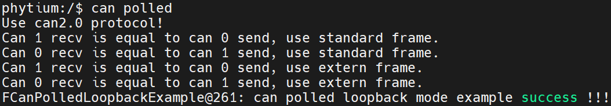
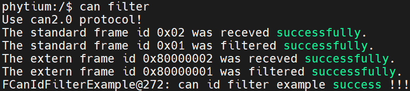

# CAN 测试

## 1. 例程介绍

> `<font size="1">`介绍例程的用途，使用场景，相关基本概念，描述用户可以使用例程完成哪些工作 `</font><br />`

CAN中断模式回环测试例程 (can_intr_loopback_mode_example.c)

- 初始化CAN0，CAN1基本配置并开启所有中断，仲裁域波特率和数据域波特率均配置为 500K/S
- CAN0向CAN1发送30次标准帧数据，触发CAN1接收中断，在接收中断服务函数中完成对CAN0已发送帧的接收，并比对发送帧和接收帧是否相同
- CAN1向CAN0发送30次标准帧数据，触发CAN0接收中断，在接收中断服务函数中完成对CAN1已发送帧的接收，并比对发送帧和接收帧是否相同
- CAN0向CAN1发送30次扩展帧数据，触发CAN1接收中断，在接收中断服务函数中完成对CAN0已发送帧的接收，并比对发送帧和接收帧是否相同
- CAN1向CAN0发送30次扩展帧数据，触发CAN0接收中断，在接收中断服务函数中完成对CAN1已发送帧的接收，并比对发送帧和接收帧是否相同
- 以上收发测试完成后，关闭中断，去初始化CAN0,CAN1

CAN轮询模式回环测试例程 (can_polled_loopback_mode_example.c)

- 初始化CAN0，CAN1基本配置,仲裁域波特率和数据域波特率均配置为 500K/S
- CAN0发送，CAN1接收，循环收发30次标准帧。并比对发送帧和接收帧是否相同
- CAN1发送，CAN0接收，循环收发30次标准帧。并比对发送帧和接收帧是否相同
- CAN0发送，CAN1接收，循环收发30次扩展帧。并比对发送帧和接收帧是否相同
- CAN1发送，CAN0接收，循环收发30次扩展帧。并比对发送帧和接收帧是否相同
- 以上收发测试完成后，去初始化CAN0,CAN1

CAN过滤功能测试例程 (can_id_filter_example.c)

- 初始化CAN0,CAN1基本配置,仲裁域波特率和数据域波特率均配置为 500K/S，过滤模式配置为只可接收id为0x02的帧
- CAN0向CAN1发送id=0x02的标准帧，CAN1接收成功，然后发送id=0x01的标准帧，CAN1接收失败，表示id=0x01成功被过滤
- CAN0向CAN1发送id=0x02的扩展帧，CAN1接收成功，然后发送id=0x01的扩展帧，CAN1接收失败，表示id=0x01成功被过滤
- 以上收发测试完成后，去初始化CAN0,CAN1

## 2. 如何使用例程

> `<font size="1">`描述开发平台准备，使用例程配置，构建和下载镜像的过程 `</font><br />`

本例程需要以下硬件

- E2000D Demo，FT2000/4，D2000
- 串口线和串口上位机
- CAN连接头
- 杜邦线

### 2.1 硬件配置方法

> `<font size="1">`哪些硬件平台是支持的，需要哪些外设，例程与开发板哪些IO口相关等（建议附录开发板照片，展示哪些IO口被引出）`</font><br />`

- 使用杜邦线连接CAN0_H和CAN1_H，CAN0_L和CAN1_L，CAN0_GND和CAN1_GND
- 将CAN回环接头，接入开发板CAN接口即可
- 如下图所示


### 2.2 SDK配置方法

> `<font size="1">`依赖哪些驱动、库和第三方组件，如何完成配置（列出需要使能的关键配置项）`</font><br />`

使能例程所需的配置

- Letter Shell组件，依赖 USE_LETTER_SHELL
- CAN组件，依赖CONFIG_USE_FCAN

对应的配置项是，

- Use FCAN
- Use FIOMUX
- 本例子已经提供好具体的编译指令，以下进行介绍：

  1. make all 将目录下的工程进行编译
  2. make clean  将目录下的工程进行清理
  3. make image   将目录下的工程进行编译，并将生成的elf 复制到目标地址
  4. make list_kconfig 当前工程支持哪些配置文件
  5. make load_kconfig LOAD_CONFIG_NAME=`<kconfig configuration files>`  将预设配置加载至工程中
  6. make menuconfig   配置目录下的参数变量
  7. make backup_kconfig 将目录下的sdkconfig 备份到./configs下
- 具体使用方法为：

  - 在当前目录下
  - 执行以上指令

### 2.3 构建和下载

> `<font size="1">`描述构建、烧录下载镜像的过程，列出相关的命令 `</font><br />`

- 在host侧完成配置

> 配置成E2000D，对于其它平台，使用对应的默认配置，如E2000d 32位:

```
$ make load_kconfig LOAD_CONFIG_NAME=e2000d_aarch32_demo_can
```

- 在host侧完成构建

```
$ make image
```

- host侧设置重启host侧tftp服务器

```
sudo service tftpd-hpa restart
```

- 开发板侧使用bootelf命令跳转

```
setenv ipaddr 192.168.4.20  
setenv serverip 192.168.4.50 
setenv gatewayip 192.168.4.1 
tftpboot 0x90100000 baremetal.elf
bootelf -p 0x90100000
```

### 2.4 输出与实验现象

> `<font size="1">`描述输入输出情况，列出存在哪些输出，对应的输出是什么（建议附录相关现象图片）`</font><br />`

#### 2.4.1 CAN中断模式回环测试例程

```
$ can intr
```

can2.0协议下测试


#### 2.4.2 CAN轮询模式回环测试例程

```
$ can polled
```

can2.0协议下测试


#### 2.4.3 CAN过滤功能测试例程

```
$ can filter
```

can2.0协议下测试


## 3. 如何解决问题

> `<font size="1">`主要记录使用例程中可能会遇到的问题，给出相应的解决方案 `</font><br />`

## 4. 修改历史记录

> `<font size="1">`记录例程的重大修改记录，标明修改发生的版本号 `</font><br />`
