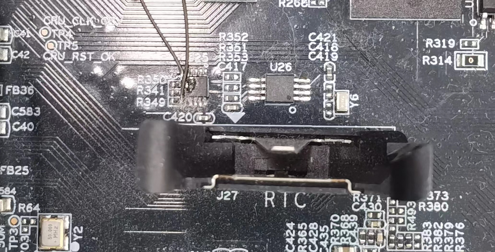
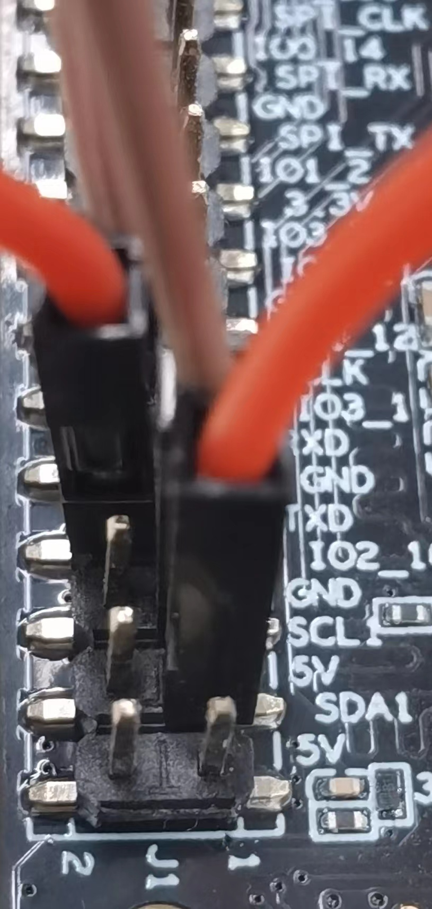
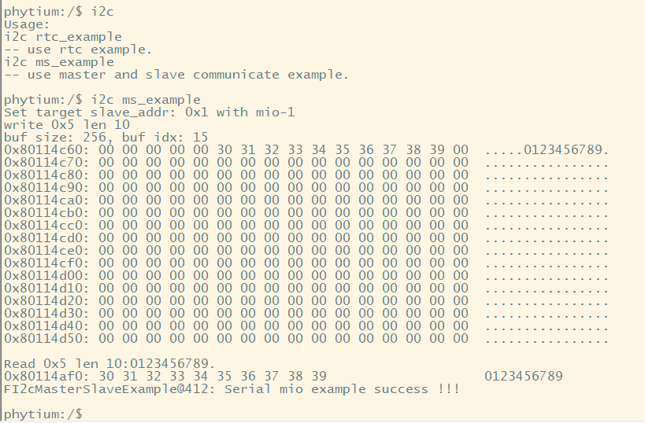

# RTC Tick 测试

## 1. 例程介绍

><font size="1">介绍例程的用途，使用场景，相关基本概念，描述用户可以使用例程完成哪些工作</font><br />

(支持E2000Demo板、firefly开发板)本例程示范了baremetal环境中的RTC功能使用,目前支持的demo包括使用时间设置函数设置RTC初始时间，读取RTC时间的操作。MIO_A = SCL | MIO_B = SDA。

(支持firefly开发板)本例程实现了I2C主从（Master-Slave）通信，主机侧是开发板的MIO1，负责发起I2C数据读写,此例程中我们master端仅采用poll模式去读写操作，从机侧是开发板的MIO2模拟eeprom，负责响应I2C数据读写，采用中断响应方式，从机侧实现了一个虚拟的EEPROM缓冲区，模拟主机侧写入和读取数据的过程。

例程移植也可以参考此处，只需要更改MIO端口号。

## 2. 如何使用例程

><font size="1">描述开发平台准备，使用例程配置，构建和下载镜像的过程</font><br />

### 2.1本例程需要用到

- Phytium demo开发板（E2000系列）
- firefly开发板（PHYTIUMPI系列）

### 2.1 硬件配置方法

><font size="1">哪些硬件平台是支持的，需要哪些外设，例程与开发板哪些IO口相关等（建议附录开发板照片，展示哪些IO口被引出）</font><br />


本例程支持的硬件平台包括

- E2000 demo板测试 ds1339_rtc.c #define DS_1339_MIO FMIO9_ID 方可使用



- firefly开发板进行主从机测试，J1接线图



E2000D对应的配置项是：

- CONFIG_TARGET_E2000D

E2000Q对应的配置项是：

- CONFIG_TARGET_E2000Q

PHYTIUMPI对应的配置项是：

- CONFIG_TARGET_PHYTIUMPI

### 2.2 SDK配置方法

><font size="1">依赖哪些驱动、库和第三方组件，如何完成配置（列出需要使能的关键配置项）</font><br />

本例程需要，

- 使能FI2C
- 使能Letter Shell
- 使能FMIO

对应的配置项是，

- Use FI2C
- Use FMIO
- Use Letter Shell

- 本例子已经提供好具体的编译指令，以下进行介绍：
    1. make 将目录下的工程进行编译
    2. make clean  将目录下的工程进行清理
    3. make image   将目录下的工程进行编译，并将生成的elf 复制到目标地址
    4. make list_kconfig 当前工程支持哪些配置文件
    5. make load_kconfig LOAD_CONFIG_NAME=<kconfig configuration files>  将预设配置加载至工程中
    6. make menuconfig   配置目录下的参数变量
    7. make backup_kconfig 将目录下的sdkconfig 备份到./configs下

- 具体使用方法为：
    - 在当前目录下
    - 执行以上指令

### 2.3 构建和下载

><font size="1">描述构建、烧录下载镜像的过程，列出相关的命令</font><br />

- 在host侧完成配置

>配置成E2000D，对于其它平台，使用对应的默认配置，如E2000d 32位:
```
$ make load_kconfig LOAD_CONFIG_NAME=e2000d_aarch32_demo_i2c
```

- 在host侧完成构建

```
$ make clean image
```

- host侧设置重启host侧tftp服务器

```
sudo service tftpd-hpa restart
```

- 开发板侧使用bootelf命令跳转

```
setenv ipaddr 192.168.4.20  
setenv serverip 192.168.4.50 
setenv gatewayip 192.168.4.1 
tftpboot 0x90100000 baremetal.elf
bootelf -p 0x90100000
```

### 2.4 输出与实验现象

><font size="1">描述输入输出情况，列出存在哪些输出，对应的输出是什么（建议附录相关现象图片）</font><br />

- 使用E2000 demo板测试时，使用命令：

```
i2c rtc_example
```


- 当使用firefly开发板时，可以使用mio——i2c主从模式

```
i2c ms_example
```



## 3. 如何解决问题

><font size="1">主要记录使用例程中可能会遇到的问题，给出相应的解决方案</font><br />

## 4. 修改历史记录

><font size="1">记录例程的重大修改记录，标明修改发生的版本号 </font><br />

v0.1.0  初次合入i2cexample
v0.1.1  io复用接口变更
v0.1.2  增加对firefly开发板的支持，新编译框架的支持
