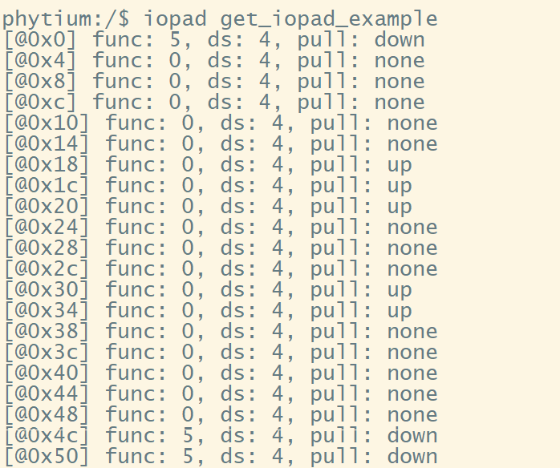

# IOPAD 测试

## 1. 例程介绍

><font size="1">介绍例程的用途，使用场景，相关基本概念，描述用户可以使用例程完成哪些工作</font><br />

本例程示范了example中的引脚复用功能使用:

- 此例程已在E2000D Demo，E2000Q Demo，PhytiumPi开发板上完成测试

### 1.1 引脚配置获取测试例程 (iopad_get_config_example.c)
- 若开发板支持IOPAD复用，用户可以通过配置控制寄存器来完成复用、上下拉电阻、驱动能力的调整以及延迟的选择
- 开发板上的引脚配置默认由 u-boot 完成，u-boot 会根据板上资源和引脚的用途进行设置
- 有时候遇到外设引脚功能不正常的情况，会考虑排查引脚设置的问题（包括复用，上下拉、驱动能力、输入输出延时等），本测试的主要目的就是获取这些引脚配置，测试引脚控制功能

### 1.2 引脚配置修改测试例程 (iopad_set_config_example.c)
- 有时候遇到测试中需要临时修改引脚配置的情况（比如改变默认的引脚复用），本测试的主要目的就是修改这些引脚配置，测试引脚控制功能

## 2. 如何使用例程
><font size="1">描述开发平台准备，使用例程配置，构建和下载镜像的过程</font><br />

本例程需要以下硬件，

- E2000D Demo，E2000Q Demo，PhytiumPi开发板
- 串口线和串口上位机

### 2.1 硬件配置方法

><font size="1">哪些硬件平台是支持的，需要哪些外设，例程与开发板哪些IO口相关等（建议附录开发板照片，展示哪些IO口被引出）</font><br />

保障串口稳定传输后，不需要进行额外配置

### 2.2 SDK配置方法

><font size="1">依赖哪些驱动、库和第三方组件，如何完成配置（列出需要使能的关键配置项）</font><br />

本例程需要的配置包括，
- SHELL组件, 依赖 USE_LETTER_SHELL

- 本例子已经提供好如下的编译指令：
    1. make 将目录下的工程进行编译
    2. make clean  将目录下的工程进行清理
    3. make image   将目录下的工程进行编译，并将生成的elf 复制到目标地址
    4. make list_kconfig 当前工程支持哪些配置文件
    5. make load_kconfig LOAD_CONFIG_NAME=<kconfig configuration files>  将预设配置加载至工程中
    6. make menuconfig   配置目录下的参数变量
    7. make backup_kconfig 将目录下的sdkconfig 备份到./configs下

- 具体使用方法为：
    - 在当前目录下
    - 执行以上指令

### 2.3 构建和下载

><font size="1">描述构建、烧录下载镜像的过程，列出相关的命令</font><br />

[参考 SDK 使用说明](https://gitee.com/phytium_embedded/phytium-standalone-sdk/blob/release/doc/reference/usr/usage.md)
### 2.4 输出与实验现象

><font size="1">描述输入输出情况，列出存在哪些输出，对应的输出是什么（建议附录相关现象图片）</font><br />

#### 2.4.1 引脚配置获取测试
```
iopad get_iopad_example
```
结果出现参数说明：

[@XX]--引脚配置寄存器偏移量；func--引脚所配置的功能编号；

ds--引脚驱动能力档位；pull--引脚电平状态

delay--延时精调与延时粗调标志；



#### 2.4.2 引脚配置修改测试
```
iopad set_iopad_example
```


## 3. 如何解决问题

><font size="1">主要记录使用例程中可能会遇到的问题，给出相应的解决方案</font><br />

## 4. 修改历史记录

><font size="1">记录例程的重大修改记录，标明修改发生的版本号 </font><br />