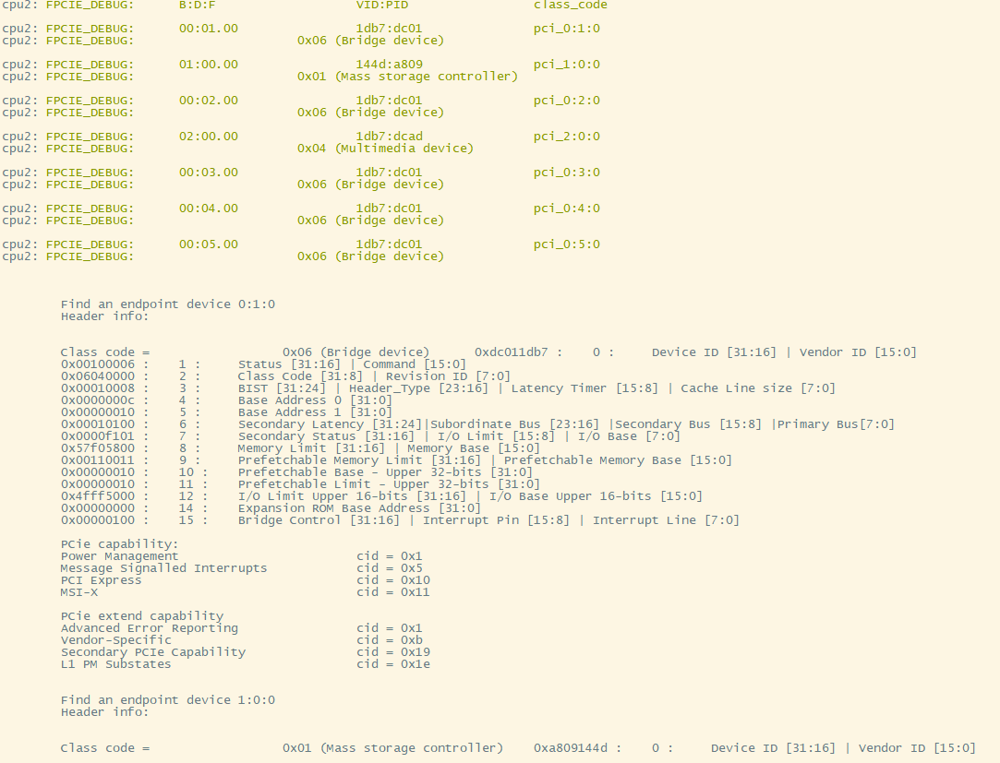

# PCIE 测试

## 1. 例程介绍

> ``介绍例程的用途，使用场景，相关基本概念，描述用户可以使用例程完成哪些工作 ` `

本例程基于fpcie_ecam 驱动模块进行设计，主要为了验证Phytium 系列芯片中pcie 中rc 相关特性，具体测试特性如下：

1. 基于 Pci Function Configuration Register Space 的枚举功能 ，主要展示Pci 设备 ---- rc_enumerate_example.c

## 2. 如何使用例程

> ``描述开发平台准备，使用例程配置，构建和下载镜像的过程 ` `
>
> - 具体的配置方案可以参考文档 doc/reference/usr/how_to_use.md

### 2.1 硬件配置方法

> ``哪些硬件平台是支持的，需要哪些外设，例程与开发板哪些IO口相关等（建议附录开发板照片，展示哪些IO口被引出）` `

1. 准备D2000/FT2004/E2000 开发板
2. 将串口连接好电脑，波特率设为 115200-8-1-N

### NOTE

    1. 其中rc_enumerate_example.c 可以由单板完成。

### 2.2 SDK配置方法

> ``依赖哪些驱动、库和第三方组件，如何完成配置（列出需要使能的关键配置项）` `

- 在项目的根目录下 ,本例子已经提供好具体的编译指令，以下进行介绍:

  1. make 将目录下的工程进行编译
  2. make clean  将目录下的工程进行清理
  3. make image   将目录下的工程进行编译，并将生成的elf 复制到目标地址
  4. make list_kconfig 当前工程支持哪些配置文件
  5. make load_kconfig LOAD_CONFIG_NAME=`<kconfig configuration files>`  将预设配置加载至工程中
  6. make menuconfig   配置目录下的参数变量
  7. make backup_kconfig 将目录下的sdkconfig 备份到./configs下
  8. 具体参考 doc/reference/usr/how_to_use.md 文档

### 2.3 构建和下载

> ``描述构建、烧录下载镜像的过程，列出相关的命令 ` `

[参考 SDK 使用说明](https://gitee.com/phytium_embedded/phytium-standalone-sdk/blob/release/doc/reference/usr/usage.md)

### 2.4 例程介绍

- 本例程，分为 rc 的测试项目，具体如下表所示

| 测试例程名称         | 测试详情             | 支持板卡              | 是否需要外接板卡 |
| -------------------- | -------------------- | --------------------- | ---------------- |
| rc_enumerate_example | 枚举bus 0 上所有设备 | E2000Q/E2000D demo 板 | 需要接PCI 设备卡 |
|                      |                      |                       |                  |

### 2.5 输出与实验现象

``描述输入输出情况，列出存在哪些输出，对应的输出是什么（建议附录相关现象图片）` `

### 2.5.1 枚举测试（rc_enumerate_example.c）

- 将需要要测试的PCIE 设备插入至PCIE slot 中
- 编译rc 目录下的镜像实例

输入 "pcie enum_test"  得到以下结果

## 3. 如何解决问题 (Q&A)

> ``主要记录使用例程中可能会遇到的问题，给出相应的解决方案 ` `

## 4. 修改历史记录

> ``记录例程的重大修改记录，标明修改发生的版本号 ` `

- 2023-08-08 ：v0.1.0 初始化项目
