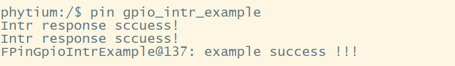
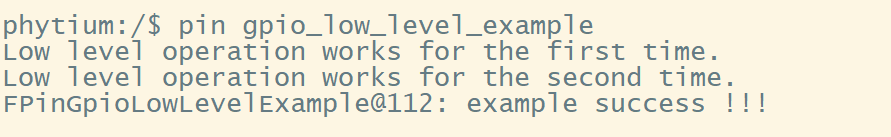
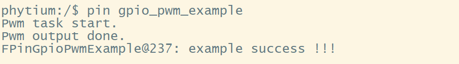
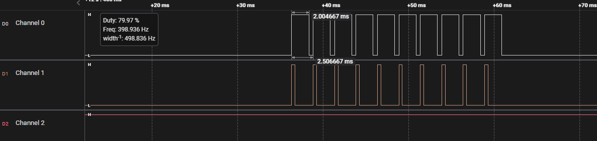

# PIN 测试

## 1. 例程介绍

><font size="1">介绍例程的用途，使用场景，相关基本概念，描述用户可以使用例程完成哪些工作</font><br />

本例程示范了example中的PIN功能使用:

- 此例程已在E2000D Demo板,PhytiumPi上完成测试
### 1.1 GPIO中断触发测试例程 (pin_gpio_intr_example.c)
- E2000 集成 6 个 GPIO 控制器，提供 96 个 GPIO 信号，支持外部中断功能，每路中断信号没有优先级区分，并产生一个统一的中断报送到全芯片的中断管理模块。在中断管理模块内可针对 GPIO0~5 两路中断设置不同的优先级。支持中断单独屏蔽和清除。GPIO0~2 的每位中断单独上报，GPIO3~5的中断由模块内和成一个中断上报
- 板上的 GPIO 引脚往往被设置了复用功能，使用前需要通过软件编程手册查阅复用设置
- 现有驱动可以完成对某个 GPIO 初始化、设置中断等操作
- 本测试中短接两个 GPIO 引脚，一个作为输出，另一个为输入，通过多次改变输出引脚的电平，在输入引脚上触发中断，进行中断处理
- 本测试的主要目的就是提供外部信号给GPIO引脚，测试引脚是否能正常上报中断以及控制器是否能正常处理中断

### 1.2 GPIO寄存器操作测试例程 (pin_gpio_low_level_example.c)
- 板上的 GPIO 引脚往往被设置了复用功能，使用前需要通过软件编程手册查阅复用设置
- 本测试中短接两个 GPIO 引脚，一个作为输出，另一个为输入，多次变化输出引脚的电平，判断输入电平是否跟随变化
- 本测试的主要目的是测试对GPIO相关寄存器直接操作是否能产生对应效果

### 1.3 GPIO脉冲宽度调制测试例程 (pin_gpio_pwm_example.c)
- 板上的 GPIO 引脚往往被设置了复用功能，使用前需要通过软件编程手册查阅复用设置
- 现有驱动可以完成对某个 GPIO 初始化、引脚上下拉、改变输出方向等操作
- GPIO时钟输出的频率与占空比可以通过用例层算法实现
- 逻辑分析仪可以实时显示与之相连的GPIO引脚的电压情况
- 本测试的主要目的是测试通过已有驱动是否能够精准控制GPIO行为，并输出具有实际意义的波形

## 2. 如何使用例程
><font size="1">描述开发平台准备，使用例程配置，构建和下载镜像的过程</font><br />

本例程需要以下硬件，

- E2000D Demo 板,PhytiumPi.
- 串口线和串口上位机
- 逻辑分析仪

### 2.1 硬件配置方法

><font size="1">哪些硬件平台是支持的，需要哪些外设，例程与开发板哪些IO口相关等（建议附录开发板照片，展示哪些IO口被引出）</font><br />


对于GPIO中断触发测试用例（pin_gpio_intr_example），利用杜邦线短接 GPIO 4-A-11与 GPIO 4-A-12 ,即将上图红色框内的第二排排从右往左数第 4 与第 5 个引脚用杜邦线短接。

对于GPIO脉冲宽度调制测试（pin_gpio_pwm_example），需要将中断测试中使用到的两个引脚与逻辑分析仪连接。注意，逻辑分析仪需要接地（见红色杜邦线）。

### 2.2 SDK配置方法

><font size="1">依赖哪些驱动、库和第三方组件，如何完成配置（列出需要使能的关键配置项）</font><br />

本例程需要的配置包括，
- FGPIO组件，用于控制 GPIO 引脚，依赖 USE_GPIO 和 ENABLE_FGPIO
- SHELL组件, 依赖 USE_LETTER_SHELL

- 本例子已经提供好如下的编译指令：
    1. make 将目录下的工程进行编译
    2. make clean  将目录下的工程进行清理
    3. make image   将目录下的工程进行编译，并将生成的elf 复制到目标地址
    4. make list_kconfig 当前工程支持哪些配置文件
    5. make load_kconfig LOAD_CONFIG_NAME=<kconfig configuration files>  将预设配置加载至工程中
    6. make menuconfig   配置目录下的参数变量
    7. make backup_kconfig 将目录下的sdkconfig 备份到./configs下

### 2.3 构建和下载

><font size="1">描述构建、烧录下载镜像的过程，列出相关的命令</font><br />

- 在host侧完成配置

>配置成E2000D，对于其它平台，使用对应的默认配置，如E2000d 32位:

```
$ make load_kconfig LOAD_CONFIG_NAME=e2000d_aarch32_demo_pin
```

- 在host侧完成构建

```
$ make image
```

- host侧设置重启host侧tftp服务器

```
sudo service tftpd-hpa restart
```

- 开发板侧使用bootelf命令跳转

```
setenv ipaddr 192.168.4.20  
setenv serverip 192.168.4.50 
setenv gatewayip 192.168.4.1 
tftpboot 0x90100000 baremetal.elf
bootelf -p 0x90100000
```

### 2.4 输出与实验现象

><font size="1">描述输入输出情况，列出存在哪些输出，对应的输出是什么（建议附录相关现象图片）</font><br />

#### 2.4.1 GPIO中断触发测试
```
pin gpio_intr_example
```


#### 2.4.2 GPIO寄存器操作测试
```
pin gpio_low_level_example
```


#### 2.4.3 GPIO脉冲宽度调制测试
```
pin gpio_pwm_example
```
- 打开逻辑分析仪配套的logic软件，提前观测波形
- 进入 shell 界面，输入上述指令，会显示如下内容：

- 观察逻辑分析仪结果是否出现如下波形：


## 3. 如何解决问题

><font size="1">主要记录使用例程中可能会遇到的问题，给出相应的解决方案</font><br />

## 4. 修改历史记录

><font size="1">记录例程的重大修改记录，标明修改发生的版本号 </font><br />

v1.0.0 首次合入
v1.1.1 支持 D2000

