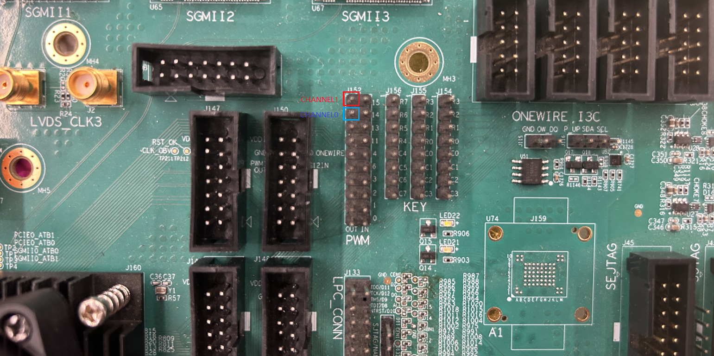
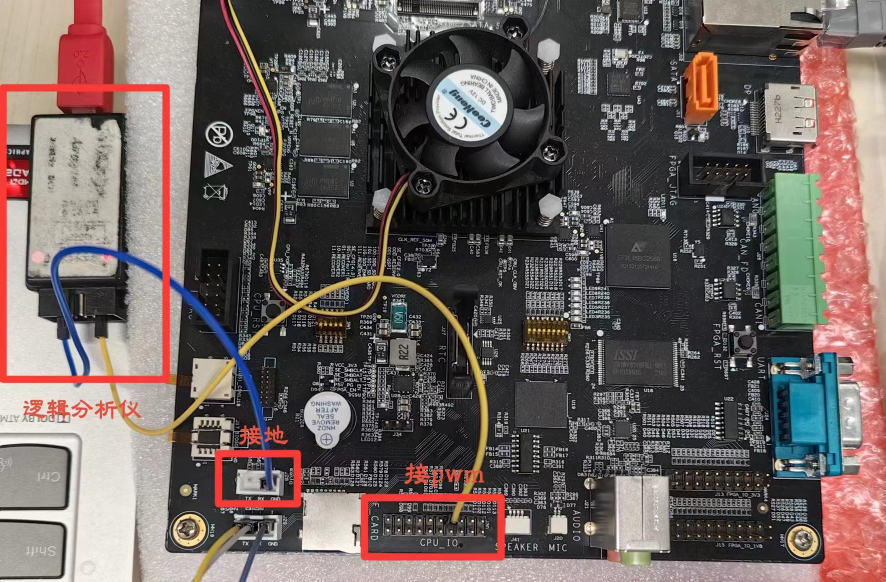
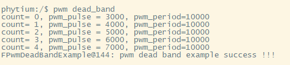
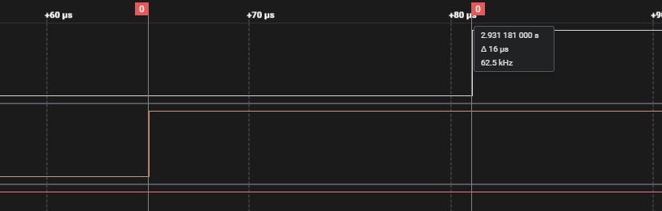
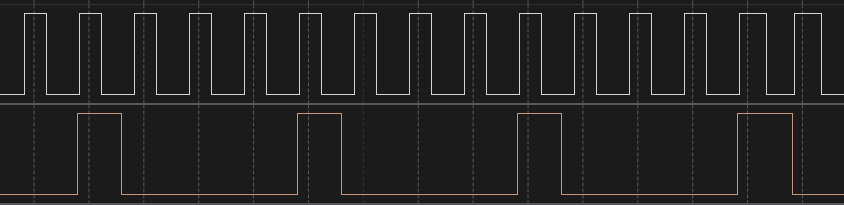

# PWM测试

## 1. 例程介绍

><font size="1">介绍例程的用途，使用场景，相关基本概念，描述用户可以使用例程完成哪些工作</font><br />

注:E2000共有8个PWM控制器(PWM0~PWM7)，每个PWM控制器对应两路pwm，默认选择PWM7进行测试，输出方式为比较模式。若使用逻辑分析仪，请在上位机下载相关驱动。

PWM死区测试例程 (pwm_dead_band_example.c)

- 初始化PWM基本配置
- 对死区进行配置，上升沿和下降沿均打开延迟，延迟配置为800，极性不进行翻转，死区输入源选择为pwm0(CHANNEL0)，pwm1(CHANNEL1)根据输入源和死区属性的配置输出相应波形
- 对CHANNEL0进行配置，设置为500分频，设置周期寄存器的值为10000(100ms)，设置初始脉冲为2000，即初始占空比为20%
- 使能CHANNEL0，脉冲值每隔2s增加1000，共进行5次变化，每次占空比增加10%，观察输出波形的变化
- CHANNEL1作为死区输出，观察死区输出波形的变化
- 关闭CHANNEL0，去初始化PWM

PWM双通道测试例程 (pwm_dual_channel_example.c)

- 初始化PWM基本配置
- 对CHANNEL0进行配置，设置为500分频，设置周期寄存器的值为10000(100ms)，设置初始脉冲为2000，即初始占空比为20%
- 对CHANNEL1进行配置，设置为1000分频，设置周期寄存器的值为20000(400ms)，设置初始脉冲为2000，即初始占空比为10%
- 打开CHANNEL0和CHANNEL1 COUNTER_OVERFLOW中断和FIFO_EMPTY中断
- 使能CHANNEL0，脉冲值每隔2s增加1000，共进行5次变化，每次占空比增加10%，观察输出波形的变化
- 使能CHANNEL1，脉冲值每隔2s增加1000，共进行5次变化，每次占空比增加5%，观察输出波形的变化
- 关闭CHANNEL0和CHANNEL1,去初始化PWM

## 2. 如何使用例程

><font size="1">描述开发平台准备，使用例程配置，构建和下载镜像的过程</font><br />

本例程需要以下硬件，

- E2000D TEST C开发板
- 串口线和串口上位机
- 逻辑分析仪/示波器
- 杜邦线

### 2.1 硬件配置方法

><font size="1">哪些硬件平台是支持的，需要哪些外设，例程与开发板哪些IO口相关等（建议附录开发板照片，展示哪些IO口被引出）</font><br />

E2000 DS TESTC板：
- 如下图所示PWM7控制器的CHANNEL0(pwm0)和CHANNEL1(pwm1)，对应E2000 TEST C开发板J152的18和20号引脚
  
- 如下图所示，将逻辑分析仪信号输入引脚与J152 18和20号引脚连接，接地引脚与J184 2号连接
  

E2000 DEMO板：
- PWM6的channel0对应J30引脚组内侧的第4个引脚，连接这个引脚与逻辑分析仪，逻辑分析仪还需要接地：

### 2.2 SDK配置方法

><font size="1">依赖哪些驱动、库和第三方组件，如何完成配置（列出需要使能的关键配置项）</font><br />

- 使能PWM `CONFIG_USE_PWM`， 然后选择FPWM驱动 `CONFIG_USE_FPWM`
- 使能Letter Shell `CONFIG_USE_LETTER_SHELL`, 然后选择UART驱动 `CONFIG_LS_PL011_UART`

对应的配置项是，

- Use FPWM
- Use Letter Shell

本例子已经提供好具体的编译指令，以下进行介绍:
    1. make 将目录下的工程进行编译
    2. make clean  将目录下的工程进行清理
    3. make image   将目录下的工程进行编译，并将生成的elf 复制到目标地址
    4. make list_kconfig 当前工程支持哪些配置文件
    5. make load_kconfig LOAD_CONFIG_NAME=`<kconfig configuration files>`  将预设配置加载至工程中
    6. make menuconfig   配置目录下的参数变量
    7. make backup_kconfig 将目录下的sdkconfig 备份到./configs下

具体使用方法为：

- 在当前目录下
- 执行以上指令

### 2.3 构建和下载

><font size="1">描述构建、烧录下载镜像的过程，列出相关的命令</font><br />

- 在host侧完成配置

配置成E2000D，对于其它平台，使用对应的默认配置，如E2000d 32位:

```
$ make load_kconfig LOAD_CONFIG_NAME=e2000d_aarch32_demo_pwm
```

- 在host侧完成构建

```
$ make image
```

- host侧设置重启host侧tftp服务器

```
sudo service tftpd-hpa restart
```

- 开发板侧使用bootelf命令跳转

```
setenv ipaddr 192.168.4.20  
setenv serverip 192.168.4.50 
setenv gatewayip 192.168.4.1 
tftpboot 0x90100000 baremetal.elf
bootelf -p 0x90100000
```

### 2.4 输出与实验现象

><font size="1">描述输入输出情况，列出存在哪些输出，对应的输出是什么（建议附录相关现象图片）`</font><br />`

#### 2.4.1 PWM死区测试例程

```
$ pwm dead_band
```



pwm死区测试对应波形,参考时钟 FPWM_CLK_FREQ_HZ = 50MHz，上升沿延迟寄存器配置为800，延迟时间为 (1/50MHz)*800 = 16μs
注意：在e2000 demo板上测试时，由于只有一个引出的PWM口，只能看到一半的图形



#### 2.4.2 PWM双通道测试例程

```
$ pwm dual_channel
```


pwm双通道测试对应波形
注意：在e2000 demo板上测试时，由于只有一个引出的PWM口，只能看到一半的图形



## 3. 如何解决问题

><font size="1">主要记录使用例程中可能会遇到的问题，给出相应的解决方案</font><br />

- E2000 DEMO V0.8板无法使用PWM4至PWM7，故无法进行本用例
## 4. 修改历史记录

><font size="1">记录例程的重大修改记录，标明修改发生的版本号</font><br />
