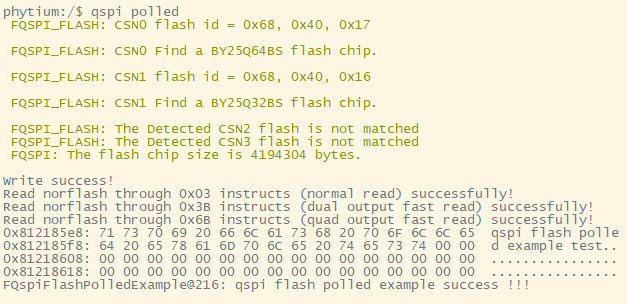
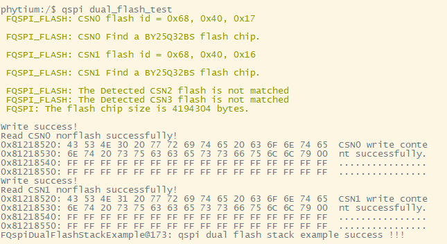

# QSPI 测试

## 1. 例程介绍

><font size="1">介绍例程的用途，使用场景，相关基本概念，描述用户可以使用例程完成哪些工作</font><br />

注:Flash芯片以博雅BY25Q32BS为例

QSPI Flash芯片检测例程 (qspi_flash_connection_check_example.c)
- 初始化QSPI基本配置
- 依次检测并读取CSN0~CSN3已安装Flash芯片基本信息
- 若Flash芯片成功被检测，并且该Flash芯片已在驱动中适配，则会打印出该Flash芯片的安装位置，型号，存储空间大小
- 若Flash芯片未被检测到或在驱动中没有进行适配，则会打印未检测到Falsh芯片信息
- 检测结束后，去初始化QSPI

QSPI Flash轮询模式读写测试例程 (qspi_dual_flash_stack_example.c)
- 初始化QSPI基本配置，并检测已安装Flash的基本信息
- 使用0xDB指令(Sector Erase)擦除Flash芯片指定地址处内容
- 使用0x32指令(Quad Page Program 1-1-4)在Flash芯片内指定地址处写入字符串
- 写入成功后，依次使用0x03(normal read 1-1-1)，0x3B(Dual Output Fast Read 1-1-2)，0x6B(Quad Output Fast Read 1-1-4)指令在指定地址处读取字符串，对读写字符串的内容进行比较，验证读写操作成功
- 打印读出字符串内容，去初始化QSPI

QSPI 多Flash芯片读写测试例程 (qspi_flash_polled_example.c)
- 该例程需要在CSN0，CSN1两个接口处安装两块型号和空间大小完全相同的Flash芯片
- 初始化QSPI基本配置，并检测已安装Flash的基本信息
- 使用0xDB指令(Sector Erase)擦除CSN0 Flash芯片指定地址处内容
- 使用0x32指令(Quad Page Program 1-1-4)在CSN0 Flash芯片内指定地址处写入字符串
- 写入成功后，使用0xEB指令(Quad Fast Read 1-4-4)指令在CSN0 Flash芯片指定地址处读取字符串，打印读出字符串内容
- 切换Flash选片至CSN1
- 使用0xDB指令(Sector Erase)擦除CSN1 Flash芯片指定地址处内容
- 使用0x32指令(Quad Page Program 1-1-4)在CSN1 Flash芯片内指定地址处写入字符串
- 写入成功后，使用0xEB指令(Quad Fast Read 1-4-4)指令在CSN1 Flash芯片指定地址处读取字符串，打印读出字符串内容
- 去初始化QSPI

## 2. 如何使用例程

><font size="1">描述开发平台准备，使用例程配置，构建和下载镜像的过程</font><br />

本例程需要以下硬件，

- E2000D/Q Demo，D2000，FT2000/4
- 已在驱动内适配的Flash芯片，如BY25Q32BS，GD25Q32C等
- 串口线和串口上位机

### 2.1 硬件配置方法

><font size="1">哪些硬件平台是支持的，需要哪些外设，例程与开发板哪些IO口相关等（建议附录开发板照片，展示哪些IO口被引出）</font><br />
- 下图所示为CSN0、CSN1，在该位置安装好Flash芯片即可


### 2.2 SDK配置方法

><font size="1">依赖哪些驱动、库和第三方组件，如何完成配置（列出需要使能的关键配置项）</font><br />

使能例程所需的配置
- Letter Shell组件，依赖 USE_LETTER_SHELL
- QSPI组件，依赖CONFIG_USE_QSPI

对应的配置项是，
- Use QSPI
- Use FIOMUX

- 本例子已经提供好具体的编译指令，以下进行介绍：
    1. make 将目录下的工程进行编译
    2. make clean  将目录下的工程进行清理
    3. make image   将目录下的工程进行编译，并将生成的elf 复制到目标地址
    4. make list_kconfig 当前工程支持哪些配置文件
    5. make load_kconfig LOAD_CONFIG_NAME=<kconfig configuration files>  将预设配置加载至工程中
    6. make menuconfig   配置目录下的参数变量
    7. make backup_kconfig 将目录下的sdkconfig 备份到./configs下

- 具体使用方法为：
    - 在当前目录下
    - 执行以上指令

### 2.3 构建和下载

><font size="1">描述构建、烧录下载镜像的过程，列出相关的命令</font><br />

- 在host侧完成配置

>配置成E2000D，对于其它平台，使用对应的默认配置，如E2000d 32位:
```
$ make load_kconfig LOAD_CONFIG_NAME=e2000d_aarch32_demo_qspi
```

- 在host侧完成构建

```
$ make clean image
```

- host侧设置重启host侧tftp服务器

```
sudo service tftpd-hpa restart
```

- 开发板侧使用bootelf命令跳转

```
setenv ipaddr 192.168.4.20  
setenv serverip 192.168.4.50 
setenv gatewayip 192.168.4.1 
tftpboot 0x90100000 baremetal.elf
bootelf -p 0x90100000
```

### 2.4 输出与实验现象

><font size="1">描述输入输出情况，列出存在哪些输出，对应的输出是什么（建议附录相关现象图片）</font><br />

#### 2.4.1 QSPI Flash芯片检测测试例程
```
$ qspi check
```


#### 2.4.2 QSPI Flash轮询模式读写测试例程
```
$ qspi polled
```


#### 2.4.3 QSPI Flash轮询模式读写测试例程
```
$ qspi dual_flash_test
```


## 3. 如何解决问题

><font size="1">主要记录使用例程中可能会遇到的问题，给出相应的解决方案</font><br />

## 4. 修改历史记录

><font size="1">记录例程的重大修改记录，标明修改发生的版本号 </font><br />


