# SD 测试

## 1. 例程介绍

><font size="1">介绍例程的用途，使用场景，相关基本概念，描述用户可以使用例程完成哪些工作</font><br />

本例程示范了example中SD功能的使用:

- 此例程已在 E2000 Demo 板上完成测试
- 此例程已在 FT2000/4 与 D2000 板上完成测试

- TF卡兼容性表格：

    | 厂商 | 图片 | 最大容量 | 容量等级 | 总线标准 | Class |初始化测试 | 块读写测试
    | :----:| :----: | :----: | :----:| :----: | :----: | :----: | :----: | :----:
    | SAMSUNG | 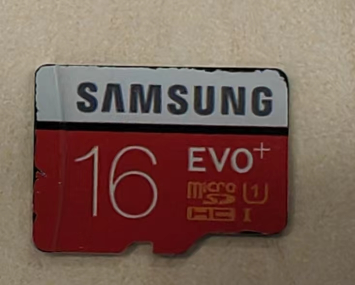 | 16GB | SDHC | USH-1 | | 通过 | 通过
    | SAMSUNG | 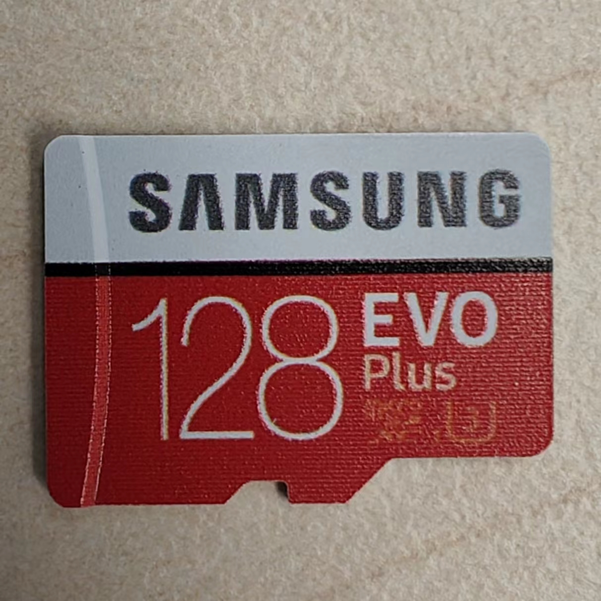 | 128GB | SDXC | | | 通过 | 通过
    | Netac | 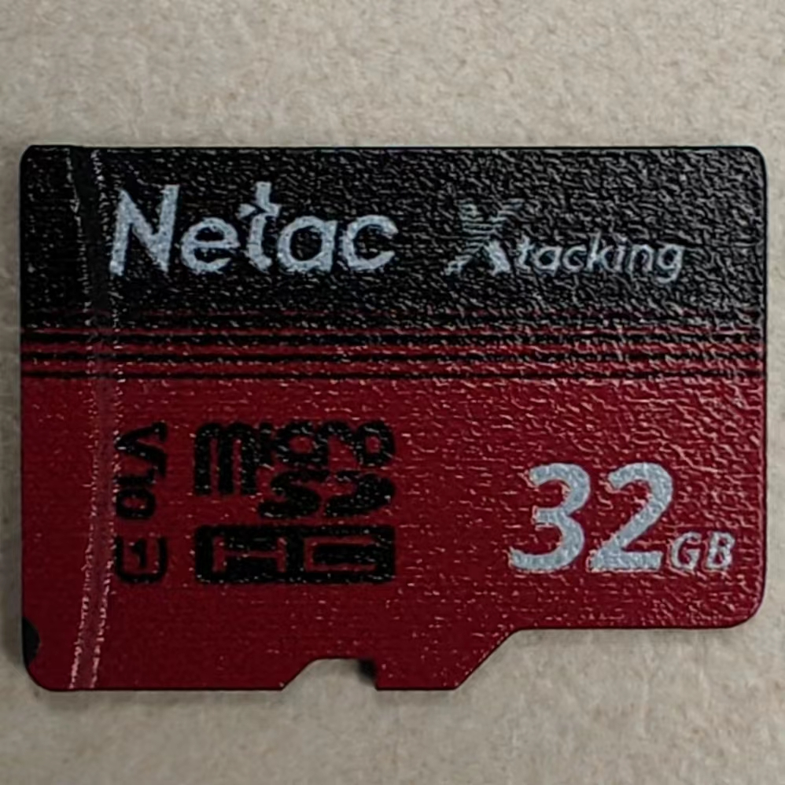 | 32GB | SDHC | | | 通过 | 通过
    | Netac | 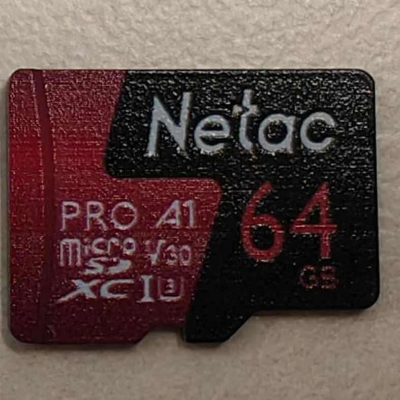 | 64GB | SDXC | USH-1 | | 不通过 | 不通过
    | Netac | 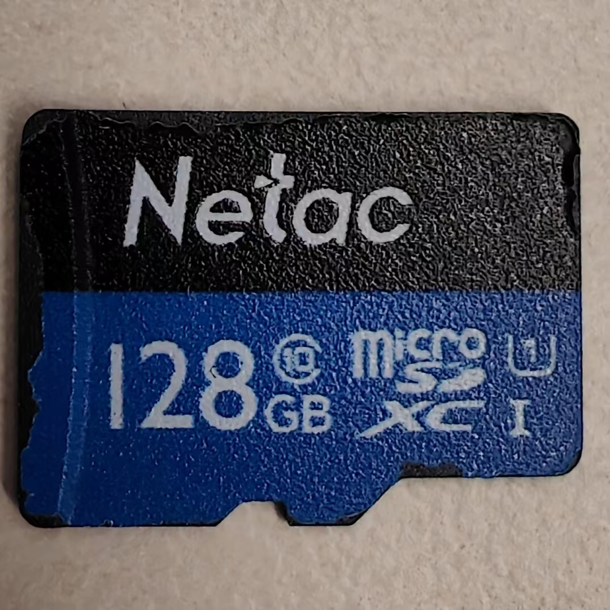 | 128GB | SDXC | USH-1 | 10 | 通过 | 通过
    | SONY |  | 16GB | SDHC | USH-1 | 10 | 通过 | 通过
    | aigo |  | 32GB | SDHC | USH-1 | | 通过 | 通过
    | SanDisk |  | 128GB | SDXC | USH-1 | | 通过 | 通过
    | Kingston | 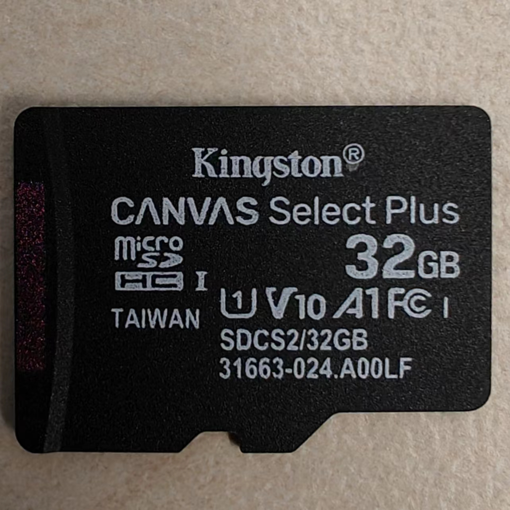 | 32GB | SDHC | USH-1 | | 通过 | 通过
    | Kingston | 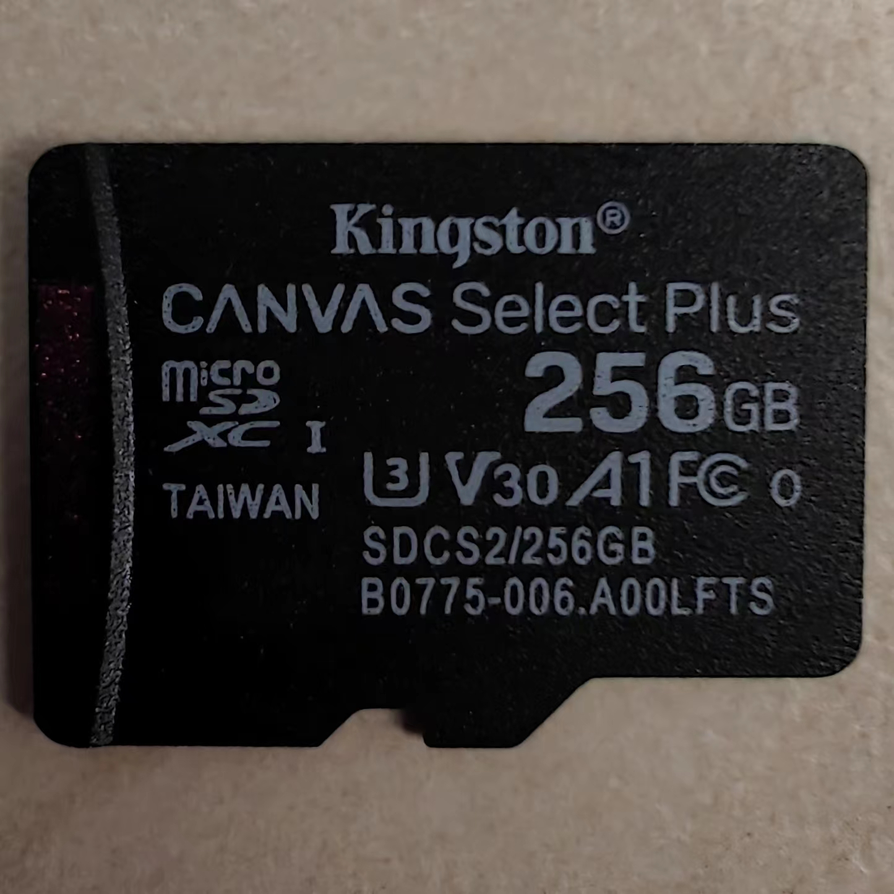 | 256GB | SDXC | USH-1 | | 通过 | 通过
    | 1.0某品牌 | 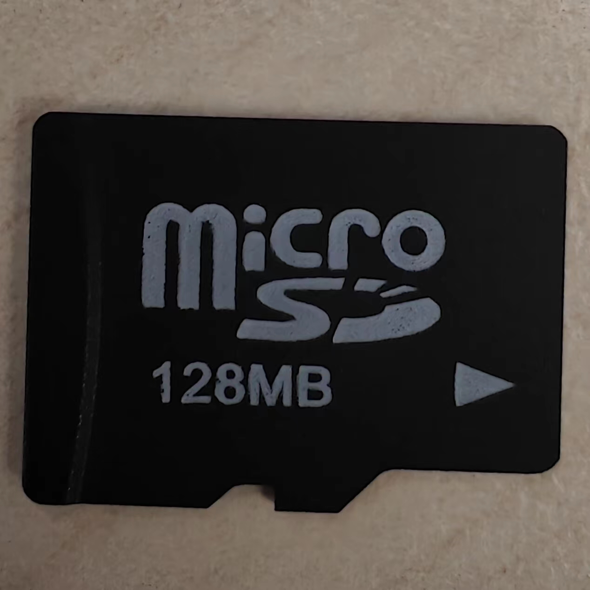 | 128MB | SDSC | | | 通过 | 不通过


- SDIO 卡支持：

1. Marvell8801 SDIO Wifi 卡 


## 2. 如何使用例程

><font size="1">描述开发平台准备，使用例程配置，构建和下载镜像的过程</font><br />

本例程需要以下硬件，

- E2000D/Q Demo 板
- FT2000/4板或D2000板
- 串口线和串口上位机
- 在 E2000 平台，测试需要一张 SDHC/SDXC 存储卡，也可以用板载的 eMMC 颗粒完成，在 E2000 Q Demo 板上，SD-0 控制器连接 eMMC 颗粒，SD-1 控制器连接 MicroSD 卡槽
- 在 FT2000/4或D2000 平台，测试需要一张 SDHC/SDXC 存储卡，SD-0 控制器连接 MicroSD 卡槽

### 2.1 硬件配置方法

><font size="1">哪些硬件平台是支持的，需要哪些外设，例程与开发板哪些IO口相关等（建议附录开发板照片，展示哪些IO口被引出）</font><br />
TF卡相关例程需要插入一张 SDHC/SDXC 存储卡

### 2.2 SDK配置方法

><font size="1">依赖哪些驱动、库和第三方组件，如何完成配置（列出需要使能的关键配置项）</font><br />

本例程需要的配置包括，
- SDMMC控制器组件与第三方移植库，用于控制SDMMC控制器，E2000平台依赖 SDMMC_USE_FSDIO，FT2000/4或D2000 平台依赖SDMMC_USE_FSDMMC
- SHELL组件, 依赖 USE_LETTER_SHELL

- 本例子已经提供好如下的编译指令：
    1. make 将目录下的工程进行编译
    2. make clean  将目录下的工程进行清理
    3. make image   将目录下的工程进行编译，并将生成的elf 复制到目标地址
    4. make list_kconfig 当前工程支持哪些配置文件
    5. make load_kconfig LOAD_CONFIG_NAME=<kconfig configuration files>  将预设配置加载至工程中
    6. make menuconfig   配置目录下的参数变量
    7. make backup_kconfig 将目录下的sdkconfig 备份到./configs下

### 2.3 构建和下载

><font size="1">描述构建、烧录下载镜像的过程，列出相关的命令</font><br />

- 在host侧完成配置

>配置成E2000D，对于其它平台，使用对应的默认配置，如E2000d 32位:
```
$ make load_kconfig LOAD_CONFIG_NAME=e2000d_aarch32_demo_sd
```

- 在host侧完成构建

```
$ make image
```

- host侧设置重启host侧tftp服务器

```
sudo service tftpd-hpa restart
```

- 开发板侧使用bootelf命令跳转

```
setenv ipaddr 192.168.4.20  
setenv serverip 192.168.4.50 
setenv gatewayip 192.168.4.1 
tftpboot 0x90100000 baremetal.elf
bootelf -p 0x90100000
```

### 2.4 输出与实验现象

><font size="1">描述输入输出情况，列出存在哪些输出，对应的输出是什么（建议附录相关现象图片）</font><br />

#### 2.4.1 E2000

- SD-1 控制器 TF 卡识别测试例程 (sdif_tf_detect_example.c)

```
sd sdif_tf_detect_example
```

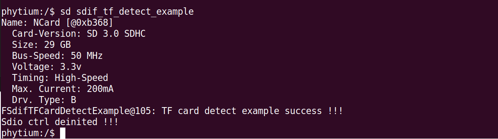

- SD-1 控制器 TF 卡读写测试例程 (sdif_tf_read_write_example.c)

```
sd sdif_tf_read_write_example
```
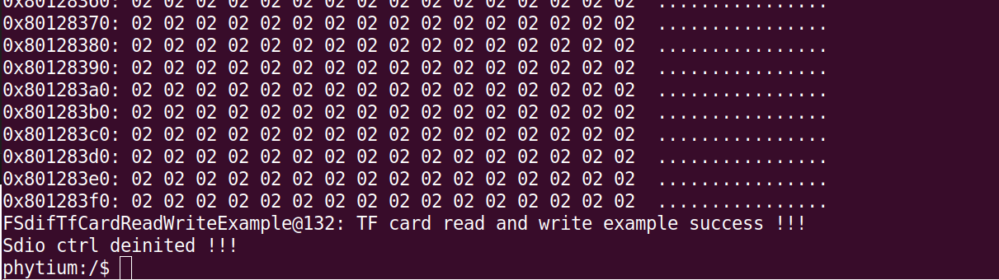

- SD-1 控制器 TF 卡读写速度测试例程 (sdif_tf_bench_example)
> 读写速度和 SD 总线时钟速度以及 TF 卡的性能有关

```
sd sdif_tf_bench_example
```

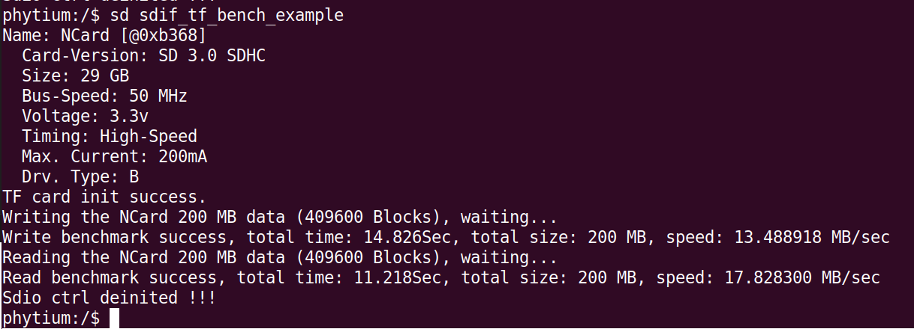

- SD-1 控制器 TF 卡分区识别测试例程 (sdif_tf_partition_example)

```
sd sdif_tf_partition_example
```
- 如下图所示，可以识别到两个分区，第一个分区从第 131072 块开始，第二个分区从第 33685504 块开始


- SD-0 控制器 eMMC 识别测试例程 (sdif_emmc_detect_example.c)

```
sd sdif_emmc_detect_example
```
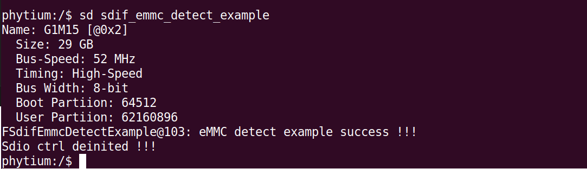

- SD-0 控制器 eMMC 读写测试例程 (emmc_read_write_example.c)

```
sd sdif_emmc_read_write_example
```
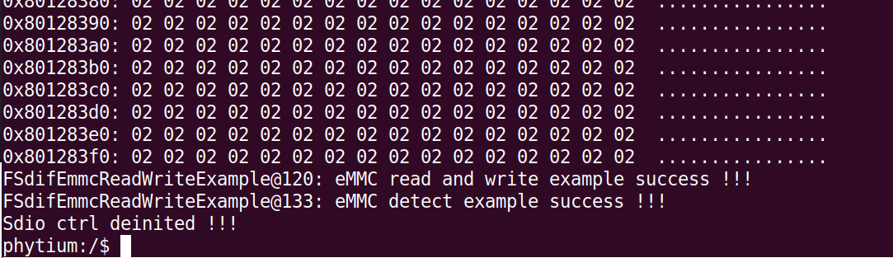

- SD-0 控制器 eMMC 读写速度测试例程 (sdif_emmc_bench_example)

```
sd sdif_emmc_bench_example
```

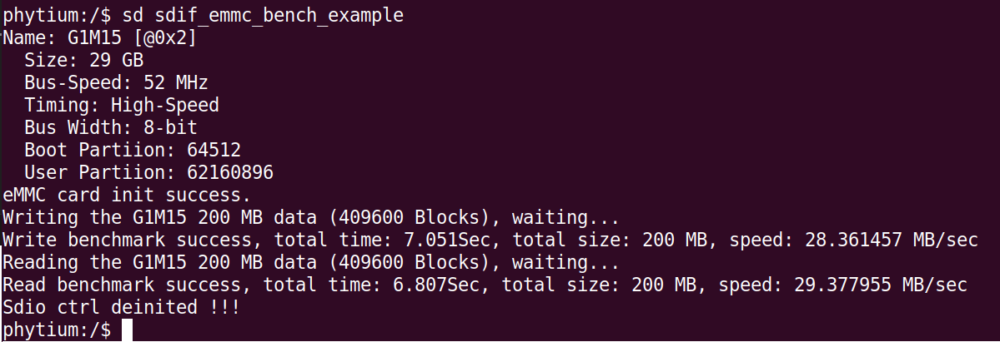


- SD-1 控制器 SDIO 卡识别例程序 (sdif_sdio_detect_example.c)

> 如下图所示，测试平台是 E2000D Demo 板，测试卡是 Marvel 88MW8801 系列 SDIO WIFI 卡，通过 TF 卡扩展卡槽引出引脚接 88MW8801，88MW8801 上的 PDN 脚接 GPIO 1-4 脚，通过 GPIO 1-4 脚的上升沿控制 88MW8801 的重置

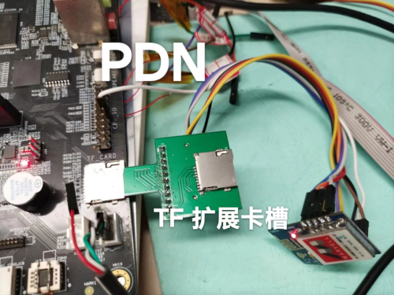

```
sd sdif_sdio_detect_example
```

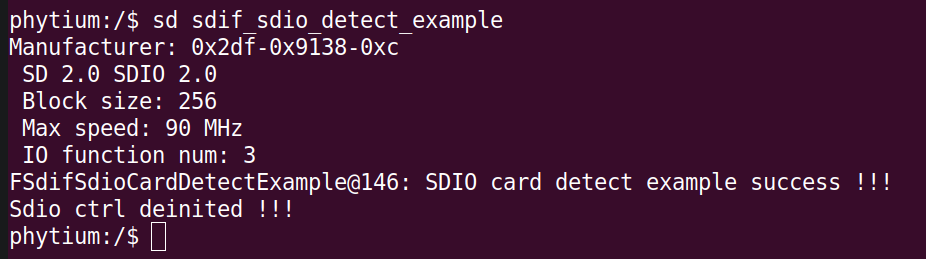

> 如上图所示，0x2df 是 Marvell 的 vendor id，0x9139/0x9139 是 Marvell 8801 的 proudct id，0xc 是 function id

#### 2.4.2 D2000/FT2000-4

- SD-0控制器TF卡识别测试例程 (sdmmc_tf_detect_example.c)

```
sd sdmmc_tf_detect_example
```

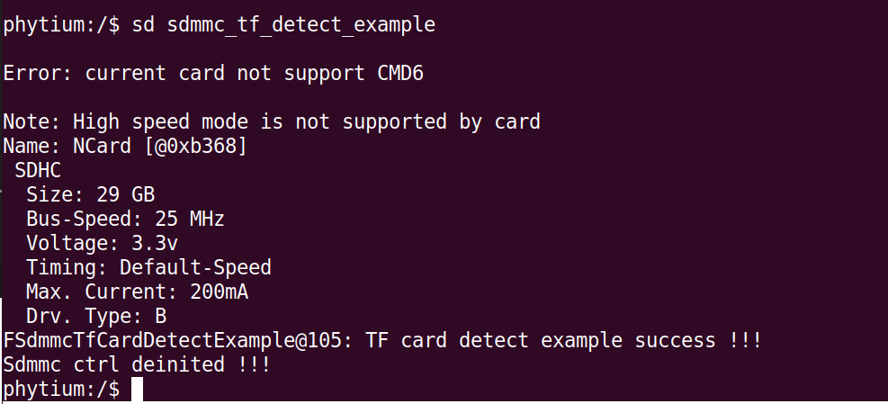

- SD-0控制器TF卡读写测试例程 (sdmmc_tf_read_write_example.c)

```
sd sdmmc_tf_read_write_example
```

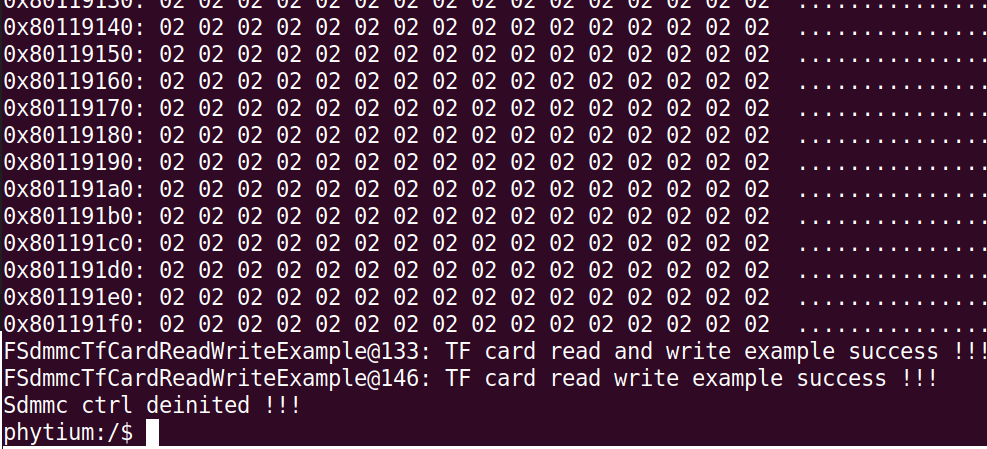


## 3. 如何解决问题

><font size="1">主要记录使用例程中可能会遇到的问题，给出相应的解决方案</font><br />

- Q: 如何在飞腾派上使用此例程
- A: 飞腾派的固件和文件系统都在 SD 卡中，不建议在飞腾派上使用此例程，可以参考 fatfs 例程，使用 SD 卡中的特定分区，避免破坏 SD 卡中的固件和文件系统

----------------------------------------------------------

- Q: SD 卡初始化失败，或者读写报错 (FSDIF)
- A: SD 卡的种类繁多，同时不同速率下对时序的要求不同，有时会发生 SD 初始化失败，或者读写报错的情况（如 CRC Error, Reponse Error）等，这种情况下可能需要调整 FSDIF 的时序相关参数，在 fsdif_timing.c 进行修改，调整方法可以参考下面的步骤
- 1. 首先降低 SD 卡的速度为 25MHz 甚至 400 kHz, 确保在低速率下 SD 卡可以工作，调整的方法是在例子中修改 s_inst_config.cardClock 设置
- 2. 寻找合适 SD 卡高速率时的时序参数，尝试在高速率下让 SD 卡工作，有条件的话可以参考 linux 系统中的时序参数，然后进行修改调试，调整的方法是修改 fsdif_timing.c 中频率对应的 FSdifTiming 结构体
- 3. 如果调整之后仍然无法工作，欢迎在仓库中提交 issue ，标明板子类型、 SD 卡类型以及运行频率


## 4. 修改历史记录

><font size="1">记录例程的重大修改记录，标明修改发生的版本号 </font><br />

- v1.2.0 支持 SDIO 卡识别

