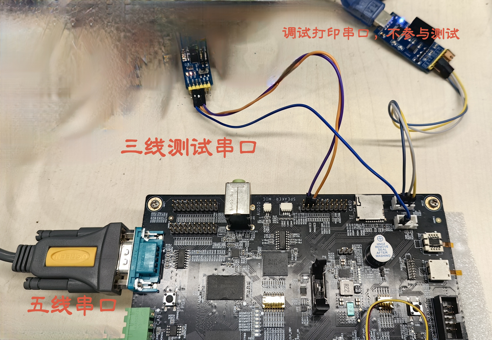
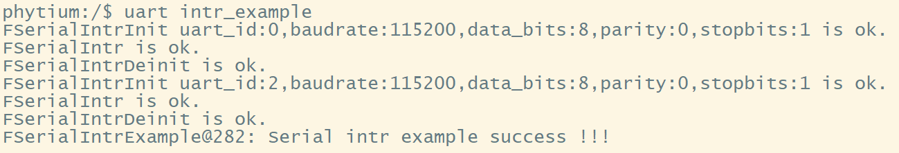
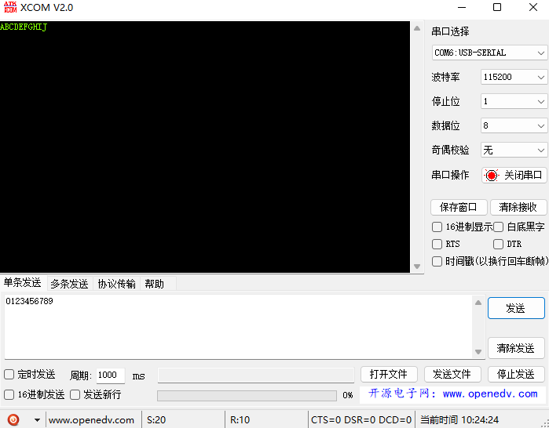
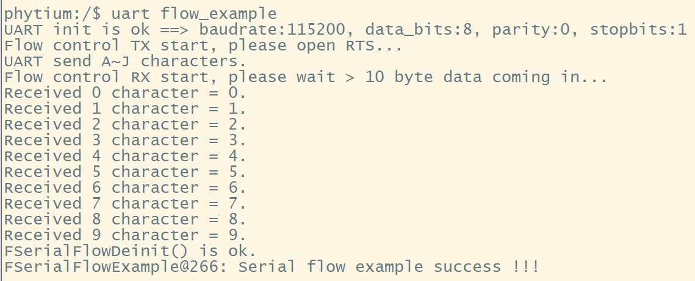
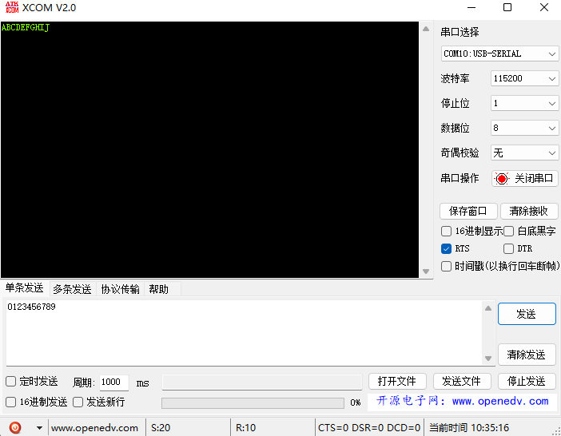
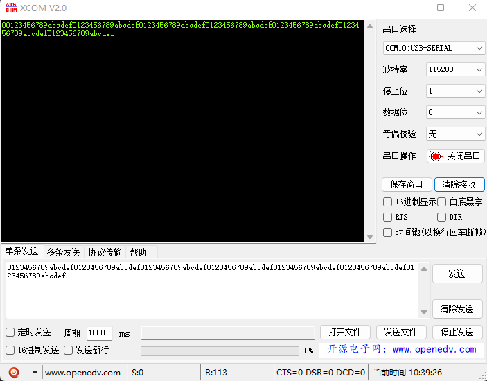
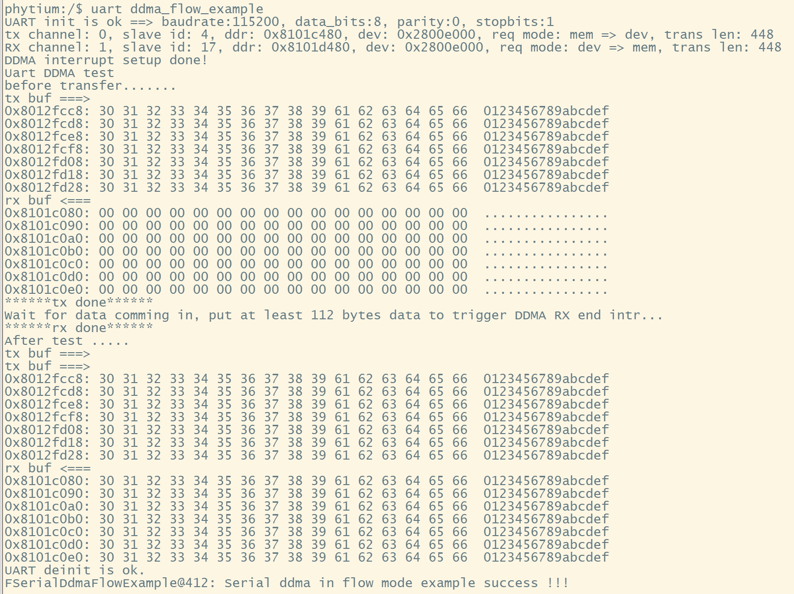
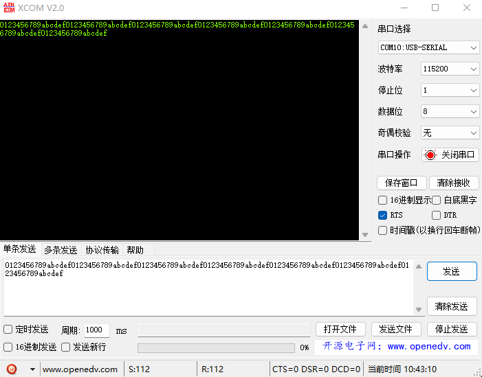
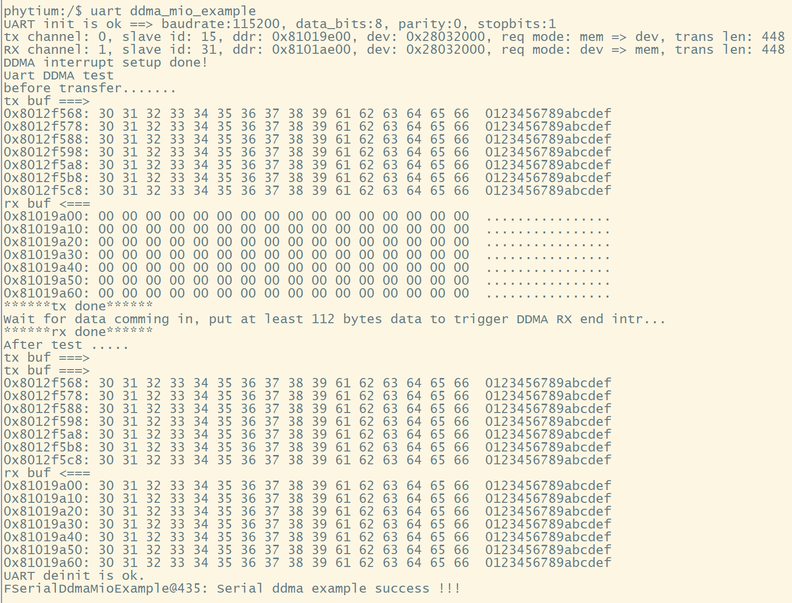

# Serial 测试

## 1. 例程介绍

> `<font size="1">`介绍例程的用途，使用场景，相关基本概念，描述用户可以使用例程完成哪些工作`</font><br />`

本例程示范了串口控制器在各种配置下的接收发送测试

### 1.1 uart中断模式回环测试例程 (serial_intr_example.c)

- 初始化Uart0,基本配置并开启所有中断,配置串口为回环模式。
- Uart0 依靠中断从Tx 口发送数据 ，并从Rx口接收数据 ，比对发送数据和接收数据是否相同
- 关闭中断，去初始化Uart0
- 初始化Uart2,基本配置并开启所有中断,配置串口为回环模式。
- Uart2 依靠中断从Tx 口发送数据 ，并从Rx口接收数据 ，比对发送数据和接收数据是否相同
- 关闭中断，去初始化Uart2

### 1.2 uart轮询模式回环测试例程 (serial_poll_example.c)

- 初始化Uart0,基本配置并开启所有中断,配置串口为回环模式。
- Uart0 依靠轮询从Tx 口发送数据 ，并从Rx口接收数据 ，比对发送数据和接收数据是否相同
- 关闭中断，去初始化Uart0
- 初始化Uart2,基本配置并开启所有中断,配置串口为回环模式。
- Uart2 依靠轮询从Tx 口发送数据 ，并从Rx口接收数据 ，比对发送数据和接收数据是否相同
- 关闭中断，去初始化Uart2

### 1.3 MIO复用测试例程 (serial_mio_example.c)

- E2000 集成了 9 线 UART 控制器、5 线 UART 控制器和 3 线 UART 控制器，其中 3 线 UART控制器均由 MIO 配置实现；
- MIO 是一个包含多种控制器功能的多路选择控制器，E2000 的每个 MIO 均可单独当做 UART/I2C；
- 端口功能的选择，可以通过配置creg_mio_func_sel 寄存器来实现，配置为 00 选择 I2C，配置为 01 选择 UART；
- MIO 控制器主时钟为 50MHz，UART/I2C 模式下主时钟都为该频率；

### 1.4 SERIAL流控测试例程 (serial_flow_example.c)

- E2000支持UART硬件流控制（RTS /CTS），在数据通信中，流控制是管理两个节点之间数据传输速率的过程，以防止出现接收端的数据缓冲区已满，而发送端依然继续发送数据，所导致数据丢失；
- RTS flow control：向 0x30（UARTCR）地址的 bit[14]写 1，使能 RTS flow control；
- CTS flow control：向 0x30（UARTCR）地址的 bit[15]写 1，使能 CTS flow control；

### 1.5 DDMA传输测试例程 (serial_ddma_example.c)

- 由于我们的串口收发寄存器是8位，单字节，存在着位宽不匹配的情况，所以我们需要在数据发送开始之前或者数据接收完成后进行数据转换；
- 控制器是一种在系统内部转移数据的独特外设，可以将其视为一种能够通过一组专用总线将内部和外部存储器与每个具有DMA能力的外设连接起来的控制器；
- DMA传输方式无需CPU直接控制传输，也没有中断处理方式那样保留现场和恢复现场过程，通过硬件为RAM和IO设备开辟一条直接传输数据的通道，使得CPU的效率大大提高；
- E2000具有DDMA控制器；

### 1.6 DDMA传输流控测试例程 (serial_ddma_flow_example.c)

### 1.7 DDMA与MIO复用配合传输测试例程 (serial_ddma_mio_example.c)

## 2. 如何使用例程

> `<font size="1">`描述开发平台准备，使用例程配置，构建和下载镜像的过程`</font><br />`

本例程需要以下硬件，

- E2000D/Q Demo板，FT2000/4开发板，D2000开发板，PhytiumPi
- 串口线和串口上位机

### 2.1 硬件配置方法

> `<font size="1">`哪些硬件平台是支持的，需要哪些外设，例程与开发板哪些IO口相关等（建议附录开发板照片，展示哪些IO口被引出）`</font><br />`

图示为E2000D DEMO板，需要上位机连接三个串口，（一个5线、两个3线），5线串口可以完成流控、DDMA、MIO测试，3线串口可以完成DDMA、MIO测试。
测试所用mio_15引脚为J30引脚组外侧从上到下的第2和第3引脚


### 2.2 SDK配置方法

> `<font size="1">`依赖哪些驱动、库和第三方组件，如何完成配置（列出需要使能的关键配置项）`</font><br />`
> 使能例程所需的配置

- Letter Shell组件，依赖 USE_LETTER_SHELL
- MIO组件，依赖CONFIG_ENABLE_MIO
- DDMA组件，依赖CONFIG_ENABLE_FDDMA

对应的配置项是，

- Use Letter Shell
- Use Mio
- Use FDDMA
- 本例子已经提供好具体的编译指令，以下进行介绍：

  1. make 将目录下的工程进行编译
  2. make clean  将目录下的工程进行清理
  3. make image   将目录下的工程进行编译，并将生成的elf 复制到目标地址
  4. make list_kconfig 当前工程支持哪些配置文件
  5. make load_kconfig LOAD_CONFIG_NAME=`<kconfig configuration files>`  将预设配置加载至工程中
  6. make menuconfig   配置目录下的参数变量
  7. make backup_kconfig 将目录下的sdkconfig 备份到./configs下
- 具体使用方法为：

  - 在当前目录下
  - 执行以上指令

### 2.3 构建和下载

> `<font size="1">`描述构建、烧录下载镜像的过程，列出相关的命令`</font><br />`

- 在host侧完成配置

> 配置成E2000D，对于其它平台，使用对应的默认配置，如E2000d 32位:

```
$ make load_kconfig LOAD_CONFIG_NAME=e2000d_aarch32_demo_serial
```

- 在host侧完成构建

```
$ make image
```

- host侧设置重启host侧tftp服务器

```
sudo service tftpd-hpa restart
```

- 开发板侧使用bootelf命令跳转

```
setenv ipaddr 192.168.4.20  
setenv serverip 192.168.4.50 
setenv gatewayip 192.168.4.1 
tftpboot 0x90100000 baremetal.elf
bootelf -p 0x90100000
```

### 2.4 输出与实验现象

> `<font size="1">`描述输入输出情况，列出存在哪些输出，对应的输出是什么（建议附录相关现象图片）`</font><br />`

#### 2.4.1 UART中断模式测试例程 (serial_intr_example.c)

```
uart intr_example
```



#### 2.4.2 UART轮询模式测试例程 (serial_poll_example.c)

```
uart poll_example
```


#### 2.4.3 MIO复用测试例程 (serial_mio_example.c)

需要配合使用XCOM软件，查看串口接收，点击发送

```
uart mio_example
```

SHELL界面显示

XCOM界面显示


#### 2.4.4 SERIAL流控测试例程 (serial_flow_example.c)

需要配合使用XCOM软件，查看串口接收，点击发送

```
uart flow_example
```

SHELL界面显示

XCOM界面显示


#### 2.4.5 DDMA传输测试例程 (serial_ddma_example.c)

需要配合使用XCOM软件，查看串口接收，点击发送

```
uart ddma_example
```

SHELL界面显示

XCOM界面显示


#### 2.4.6 DDMA传输流控测试例程 (serial_ddma_flow_example.c)

需要配合使用XCOM软件，查看串口接收，点击发送

```
uart ddma_flow_example
```

SHELL界面显示

XCOM界面显示


#### 2.4.4 DDMA与MIO复用配合传输测试例程 (serial_ddma_mio_example.c)

需要配合使用XCOM软件，查看串口接收，点击发送

```
uart ddma_mio_example
```

SHELL界面显示

XCOM界面显示


## 3. 如何解决问题

> `<font size="1">`主要记录使用例程中可能会遇到的问题，给出相应的解决方案`</font><br />`

- DDMA与MIO配合测试用例，对固件版本有要求；以下固件可以正常运行：
  

## 4. 修改历史记录

> `<font size="1">`记录例程的重大修改记录，标明修改发生的版本号 `</font><br />`
