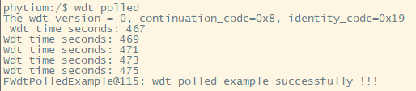
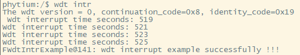

# WDT 测试

## 1. 例程介绍

> `<font size="1">`介绍例程的用途，使用场景，相关基本概念，描述用户可以使用例程完成哪些工作`</font><br />`

WDT 轮询模式测试例程 (wdt_polled_example.c)

- 初始化WDT,超时时间设定为2s，开启WDT计时
- 每间隔两秒，进行一次喂狗，并打印计时信息，该操作循环进行五次
- 在该过程中不触发开发板的重启，则证明喂狗有效
- 关闭WDT计时，去初始化WDT

WDT 中断模式测试例程 (wdt_intr_example.c)

- 初始化WDT，开启WDT中断，超时时间设定为2s，开启WDT计时
- 进行8s等待，在等待过程中，每间隔两秒，触发wdt中断，在中断服务函数中进行喂狗，并打印计时信息
- 在该过程中不触发开发板的重启，则证明喂狗有效
- 关闭WDT计时，关闭WDT中断，去初始化WDT

## 2. 如何使用例程

> `<font size="1">`描述开发平台准备，使用例程配置，构建和下载镜像的过程`</font><br />`

本例程需要以下硬件，

- E2000D/Q ，D2000，FT2000/4，PhytiumPi开发板
- 串口线和串口上位机

### 2.1 硬件配置方法

> `<font size="1">`哪些硬件平台是支持的，需要哪些外设，例程与开发板哪些IO口相关等（建议附录开发板照片，展示哪些IO口被引出）`</font><br />`
> 该例程无其他硬件需求

### 2.2 SDK配置方法

> `<font size="1">`依赖哪些驱动、库和第三方组件，如何完成配置（列出需要使能的关键配置项）`</font><br />`

使能例程所需的配置

- Letter Shell组件，依赖 USE_LETTER_SHELL
- WDT组件，依赖CONFIG_USE_WDT

对应的配置项是，

- Use FWDT
- 本例子已经提供好具体的编译指令，以下进行介绍：
  1. make 将目录下的工程进行编译
  2. make clean  将目录下的工程进行清理
  3. make image   将目录下的工程进行编译，并将生成的elf 复制到目标地址
  4. make list_kconfig 当前工程支持哪些配置文件
  5. make load_kconfig LOAD_CONFIG_NAME=`<kconfig configuration files>`  将预设配置加载至工程中
  6. make menuconfig   配置目录下的参数变量
  7. make backup_kconfig 将目录下的sdkconfig 备份到./configs下
  
- 具体使用方法为：

  - 在当前目录下
  - 执行以上指令

### 2.3 构建和下载

> `<font size="1">`描述构建、烧录下载镜像的过程，列出相关的命令`</font><br />`

- 在host侧完成配置

> 配置成E2000D，对于其它平台，使用对应的默认配置，如E2000d 32位:

```
$ make load_kconfig LOAD_CONFIG_NAME=e2000d_aarch32_demo_wdt
```

- 在host侧完成构建

```
$ make image
```

- host侧设置重启host侧tftp服务器

```
sudo service tftpd-hpa restart
```

- 开发板侧使用bootelf命令跳转

```
setenv ipaddr 192.168.4.20  
setenv serverip 192.168.4.50 
setenv gatewayip 192.168.4.1 
tftpboot 0x90100000 baremetal.elf
bootelf -p 0x90100000
```

### 2.4 输出与实验现象

> `<font size="1">`描述输入输出情况，列出存在哪些输出，对应的输出是什么（建议附录相关现象图片）`</font><br />`

#### 2.4.1 WDT轮询模式测试例程

```
$ wdt polled
```



#### 2.4.2 WDT中断模式测试例程

```
$ wdt intr
```



## 3. 如何解决问题

> `<font size="1">`主要记录使用例程中可能会遇到的问题，给出相应的解决方案`</font><br />`

## 4. 修改历史记录

> `<font size="1">`记录例程的重大修改记录，标明修改发生的版本号 `</font><br />`
