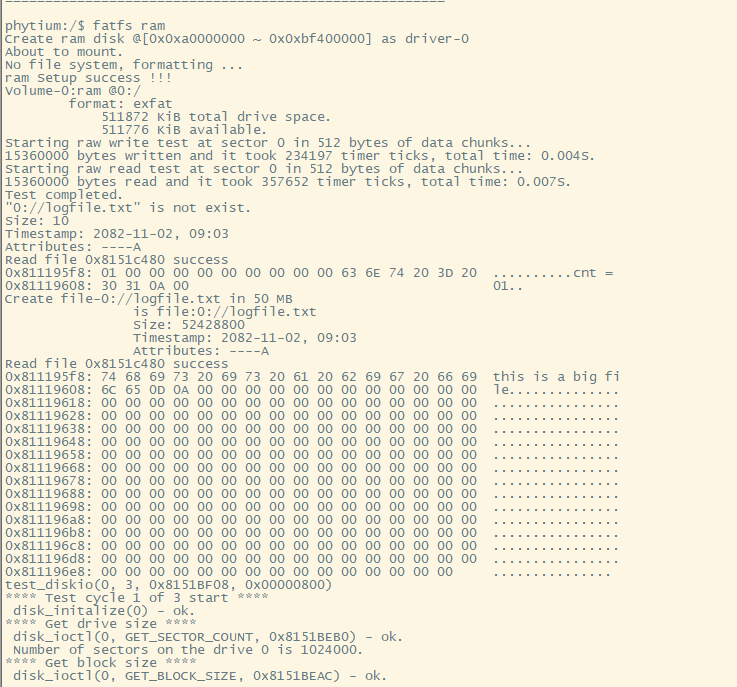
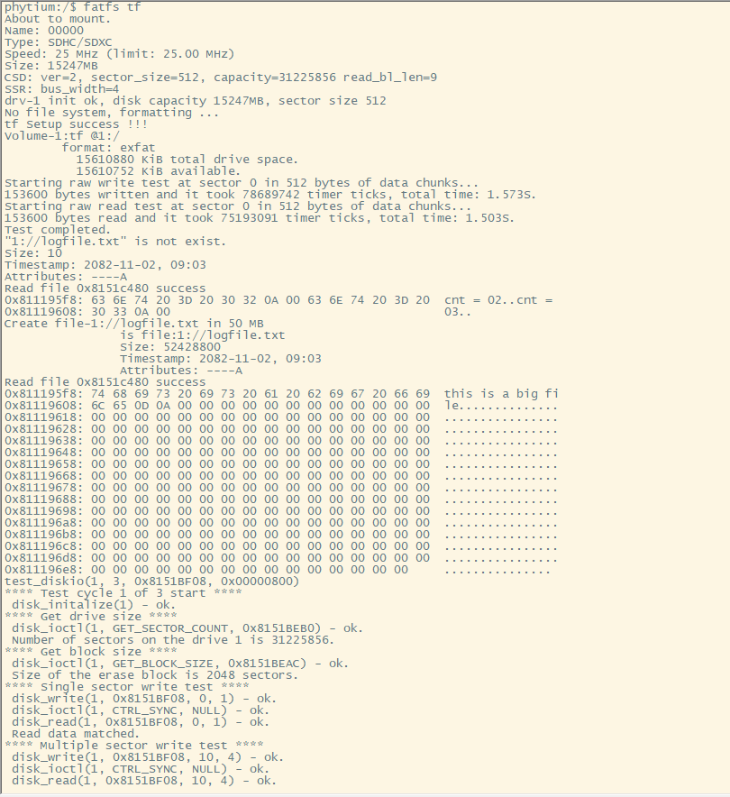
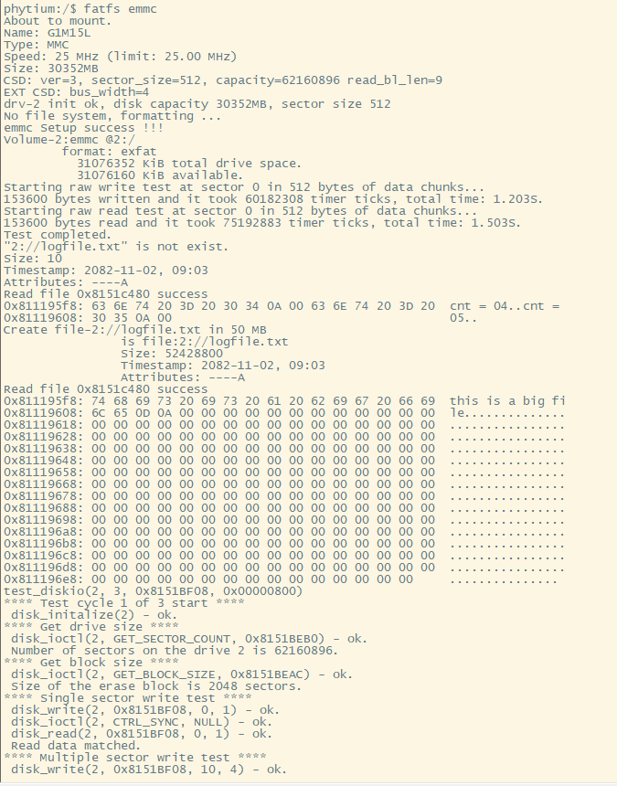

# Fatfs Example

## 1. 例程介绍

><font size="1">介绍例程的用途，使用场景，相关基本概念，描述用户可以使用例程完成哪些工作</font><br />

FatFs是用于小型嵌入式系统的通用FAT/exFAT文件系统模块，本例程使用不同的存储介质，对FatFs的基本功能进行测试。目前支持的存储介质有TF卡，EMMC，RAM，SATA，SATA_PCIE。测试过程如下
- 1.对存储介质进行格式化后将FatFs文件系统挂载到根目录下
- 2.打印文件系统，存储空间大小
- 3.进行速度测试，通过循环将数据写入指定位置，并记录耗时信息，评估文件系统的读写性能，并打印相关信息
- 4.进行基本功能测试，分别有，创建txt文件，对该文件进行读写；创建一个大文件，对目录进行list，并对该文件进行读写
- 5.进行磁盘IO循环测试，循环次数默认为3，可自行调整
- 6.完成测试，可根据打印信息判断是否成功


## 2. 如何使用例程

><font size="1">描述开发平台准备，使用例程配置，构建和下载镜像的过程</font><br />

本例程需要以下硬件，

- E2000D/Q Demo板，FT2000/4，D2000，PhytiumPi开发板
- 串口线和串口上位机
- TF卡，EMMC，电源，SATA硬盘，SATA硬盘数据线，PCIE转接SATA扩展卡等

### 2.1 硬件配置方法

><font size="1">哪些硬件平台是支持的，需要哪些外设，例程与开发板哪些IO口相关等（建议附录开发板照片，展示哪些IO口被引出）</font><br />
- SD_TF卡插入卡槽
- SATA硬盘连接电源后，使用数据线将SATA硬盘与转接卡相连，将转接卡插入PCIE接口
- 如下图所示，SATA硬盘连接电源后，使用数据线将SATA硬盘与E2000D/Q Demo相连，开发板橙色接口为SATA接口
- EMMC已经焊接在开发板上
### 2.2 SDK配置方法

><font size="1">依赖哪些驱动、库和第三方组件，如何完成配置（列出需要使能的关键配置项）</font><br />
使能例程所需的配置
- Letter Shell组件，依赖 USE_LETTER_SHELL
- FATFS组件
- FSL_SDMMC组件
- FSATA组件
- FPCIE组件

- 本例子已经提供好具体的编译指令，以下进行介绍：
    1. make 将目录下的工程进行编译
    2. make clean  将目录下的工程进行清理
    3. make image   将目录下的工程进行编译，并将生成的elf 复制到目标地址
    4. make list_kconfig 当前工程支持哪些配置文件
    5. make load_kconfig LOAD_CONFIG_NAME=<kconfig configuration files>  将预设配置加载至工程中
    6. make menuconfig   配置目录下的参数变量
    7. make backup_kconfig 将目录下的sdkconfig 备份到./configs下

- 具体使用方法为：
    - 在当前目录下
    - 执行以上指令

在以下配置中选择开启不同存储介质的测试

### 2.3 构建和下载

><font size="1">描述构建、烧录下载镜像的过程，列出相关的命令</font><br />

[参考 SDK 使用说明](https://gitee.com/phytium_embedded/phytium-standalone-sdk/blob/release/doc/reference/usr/usage.md)

### 2.4 输出与实验现象

><font size="1">描述输入输出情况，列出存在哪些输出，对应的输出是什么（建议附录相关现象图片）</font><br />

#### 2.4.1 FatFs测试例程

- 对 RAMDISK 中的 FATFS 进行读写测试
```
$ fatfs ram
```


- 对 TF 卡中的 FATFS 进行读写测试
```
$ fatfs tf
```


- 对 TF 卡中的 FATFS 进行只读测试，不会进行写入
> 需要预先在 TF 卡中制作一个文件系统，否则测试不会成功
```
$ fatfs tf-ro
```

- 如下所示，在飞腾派中完成，识别到飞腾派中的第2个分区，分区文件系统格式为 FAT32，文件列表如下


- 对 eMMC 中的 FATFS 进行读写测试
```
$ fatfs emmc
```


## 3. 如何解决问题

><font size="1">主要记录使用例程中可能会遇到的问题，给出相应的解决方案</font><br />

Q： 飞腾派中如何使用 TF 卡中的文件系统
A： 飞腾派启动前需要参考[飞腾派中使用裸机](../../../doc/reference/usr/use_in_phytium_pi.md)先烧入镜像到 TF 卡，然后使用 `fatfs tf-ro`进行文件系统测试，注意不要使用`fatfs tf`格式化 TF 卡，否则可能会造成无法启动

## 4. 修改历史记录

><font size="1">记录例程的重大修改记录，标明修改发生的版本号 </font><br />

- v1.2.0 支持飞腾派使用 TF 卡分区
