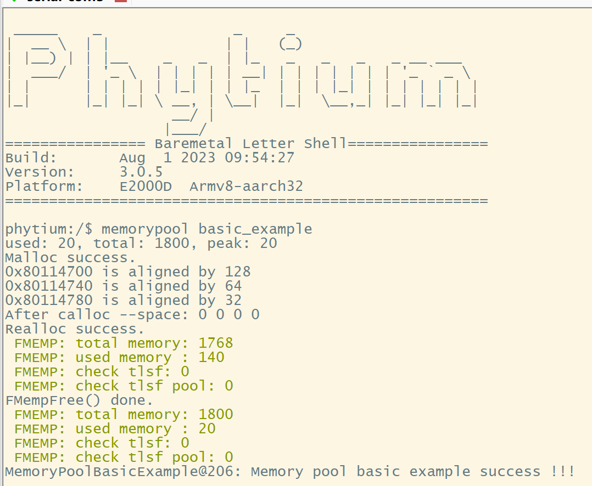

# Memory Pool 测试

## 1. 例程介绍

><font size="1">介绍例程的用途，使用场景，相关基本概念，描述用户可以使用例程完成哪些工作</font><br />

本例程示范了有关 Memory Pool 各 API 接口测试

### 1.1 Memory Pool 基础测试例程 (memory_pool_basic_example.c)
- 内存池（Memory Pool）是一种内存分配方式，是为了减少频繁使用 malloc/free new/delete 等系统调用而造成的性能损耗而设计的，具有效率高、内存碎片少和防止内存泄漏等特性。内存池根据实际需要，在初始状态获取一大块内存（堆区或者静态内存），然后划分成若干内存页，进行管理，将内存页中的块传递给申请者使用；
- FT-SDK 第三方库提供了基于 tlsf 算法的 memory pool 基础功能 API ；
- 本例程中使用用TLSF内存分配器管理，测试基于内存池的内存管理操作，支持的操作包括分配一段内存，分配一段数组内存清零，分配一段指定对齐方式的内存，内存释放，以及观察内存池当前的使用情况等。

## 2. 如何使用例程

><font size="1">描述开发平台准备，使用例程配置，构建和下载镜像的过程</font><br />

本例程需要以下硬件，

- E2000D Demo 板
- 串口线和串口上位机

### 2.1 硬件配置方法

><font size="1">哪些硬件平台是支持的，需要哪些外设，例程与开发板哪些IO口相关等（建议附录开发板照片，展示哪些IO口被引出）</font><br />
不需要额外配置

### 2.2 SDK配置方法

><font size="1">依赖哪些驱动、库和第三方组件，如何完成配置（列出需要使能的关键配置项）</font><br />
使能例程所需的配置
- Letter Shell组件，依赖 USE_LETTER_SHELL

对应的配置项是，
- Use Letter Shell

- 本例子已经提供好具体的编译指令，以下进行介绍：
    1. make 将目录下的工程进行编译
    2. make clean 将目录下的工程进行清理
    3. make image 将目录下的工程进行编译，并将生成的elf 复制到目标地址
    4. make load_kconfig LOAD_CONFIG_NAME=e2000d_aarch64_E2000D_demo_baremetal 将预设64bit e2000d demo 下的配置加载至工程中
    5. make load_kconfig LOAD_CONFIG_NAME=e2000d_aarch32_E2000D_demo_baremetal 将预设32bit e2000d demo 下的配置加载至工程中
    6. make load_kconfig LOAD_CONFIG_NAME=e2000q_aarch64_E2000Q_demo_baremetal 将预设64bit e2000q demo 下的配置加载至工程中
    7. make load_kconfig LOAD_CONFIG_NAME=e2000q_aarch32_E2000Q_demo_baremetal 将预设32bit e2000q demo 下的配置加载至工程中
    8. make menuconfig 配置目录下的参数变量
    9. make backup_kconfig 将目录下的sdkconfig 备份到./configs下

- 具体使用方法为：
    - 在当前目录下
    - 执行以上指令

### 2.3 构建和下载

><font size="1">描述构建、烧录下载镜像的过程，列出相关的命令</font><br />

[参考 SDK 使用说明](https://gitee.com/phytium_embedded/phytium-standalone-sdk/blob/release/doc/reference/usr/usage.md)

### 2.4 输出与实验现象

><font size="1">描述输入输出情况，列出存在哪些输出，对应的输出是什么（建议附录相关现象图片）</font><br />

#### 2.4.1 Memory Pool 基础测试例程 (memory_pool_basic_example.c)
```
memorypool basic_example
```


## 3. 如何解决问题

><font size="1">主要记录使用例程中可能会遇到的问题，给出相应的解决方案</font><br />

## 4. 修改历史记录

><font size="1">记录例程的重大修改记录，标明修改发生的版本号 </font><br />


