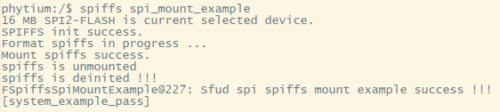
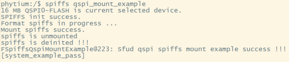
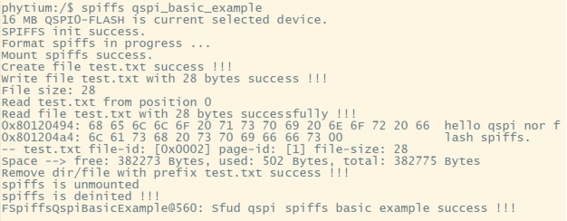

# SPIFFS Example

## 1. 例程介绍

><font size="1">介绍例程的用途，使用场景，相关基本概念，描述用户可以使用例程完成哪些工作</font><br />

SPIFFS（Serial Peripheral Interface Flash File System）是一个适用于嵌入式系统的轻量级文件系统，特别设计用于在闪存存储器上进行数据存储和管理。它是专门为低功耗、小容量闪存设备（如SPI Flash）提供的文件系统。

spiffs spi文件系统挂载例程 (spiffs_spi_mount_example.c)
- 对SPI0或SPI2（可根据开发板修改）连接的Flash芯片进行初始化
- 对指定区域进行格式化，格式化成功后，在该区域挂载spiffs文件系统
- 根据打印内容判断是否挂载成功
  
spiffs qspi文件系统挂载例程 (spiffs_qspi_mount_example.c)
- 对QSPI0（可根据开发板修改）连接的Flash芯片进行初始化
- 对指定区域进行格式化，格式化成功后，在该区域挂载spiffs文件系统
- 根据打印内容判断是否挂载成功

spiffs spi文件系统基本功能测试例程 (spiffs_spi_basic_example.c)
- 对SPI0或SPI2（可根据开发板修改）连接的Flash芯片进行初始化
- 对指定区域进行格式化，格式化成功后，在该区域挂载spiffs文件系统
- 进行文件系统基础功能测试；测试项分别为，创建test.txt文件，对该文件进行写入，对该文件进行读取，列举当前目录下的文件，获取 当前文件系统信息，移除test.txt文件，取消挂载，去初始化文件系统。

spiffs qspi文件系统基本功能测试例程 (spiffs_qspi_basic_example.c)
- 对QSPI0（可根据开发板修改）连接的Flash芯片进行初始化
- 对指定区域进行格式化，格式化成功后，在该区域挂载spiffs文件系统
- 进行文件系统基础功能测试；测试项分别为，创建test.txt文件，对该文件进行写入，对该文件进行读取，列举当前目录下的文件，获取 当前文件系统信息，移除test.txt文件，取消挂载，去初始化文件系统。

## 2. 如何使用例程

><font size="1">描述开发平台准备，使用例程配置，构建和下载镜像的过程</font><br />

本例程需要以下硬件，

- E2000D/Q Demo 板,PhytiumPi开发板，FT2000/4开发板，D2000开发板
- 已适配的flash芯片
- 串口线和串口上位机

### 2.1 硬件配置方法

><font size="1">哪些硬件平台是支持的，需要哪些外设，例程与开发板哪些IO口相关等（建议附录开发板照片，展示哪些IO口被引出）</font><br />

E2000 demo spi2外接flash示例，VCC接P1V8或P3V3，建议从P1V8开始尝试，使用用例测试后，flash没有反应再连接P3V3，J30引脚组内侧第3号到第6号引脚分别为：SPI2_RXD、SPI2_CSN0、SPI2_TXD、SPI2_SCLK


### 2.2 SDK配置方法

><font size="1">依赖哪些驱动、库和第三方组件，如何完成配置（列出需要使能的关键配置项）</font><br />
- Letter Shell组件，依赖 USE_LETTER_SHELL
- SFUD组件，CONFIG_USE_SFUD, CONFIG_SFUD_CTRL_FSPIM, CONFIG_SFUD_CTRL_FQSPI
- SPIFFS组件，CONFIG_SPIFFS_ON_FSPIM_SFUD 与 CONFIG_SPIFFS_ON_FQSPI_SFUD
- FQSPI组件
- FSPI组件

- 本例子已经提供好具体的编译指令，以下进行介绍：
    1. make 将目录下的工程进行编译
    2. make clean  将目录下的工程进行清理
    3. make image   将目录下的工程进行编译，并将生成的elf 复制到目标地址
    4. make list_kconfig 当前工程支持哪些配置文件
    5. make load_kconfig LOAD_CONFIG_NAME=<kconfig configuration files>  将预设配置加载至工程中
    6. make menuconfig   配置目录下的参数变量
    7. make backup_kconfig 将目录下的sdkconfig 备份到./configs下

- 具体使用方法为：
    - 在当前目录下
    - 执行以上指令

### 2.3 构建和下载

><font size="1">描述构建、烧录下载镜像的过程，列出相关的命令</font><br />

[参考 SDK 使用说明](https://gitee.com/phytium_embedded/phytium-standalone-sdk/blob/release/doc/reference/usr/usage.md)

### 2.4 输出与实验现象

><font size="1">描述输入输出情况，列出存在哪些输出，对应的输出是什么（建议附录相关现象图片）</font><br />

#### 2.4.1 sfud_spiffs spi文件系统挂载例程
```
$ spiffs spi_mount_example
```


#### 2.4.2 sfud_spiffs文件系统挂载例程
```
$ spiffs qspi_mount_example
```


#### 2.4.3 sfud_spiffs spi文件系统基本功能测试例程
```
$ spiffs spi_basic_example
```


#### 2.4.4 sfud_spiffs qspi文件系统基本功能测试例程
```
$ spiffs qspi_basic_example
```


## 3. 如何解决问题

><font size="1">主要记录使用例程中可能会遇到的问题，给出相应的解决方案</font><br />

## 4. 修改历史记录

><font size="1">记录例程的重大修改记录，标明修改发生的版本号 </font><br />


