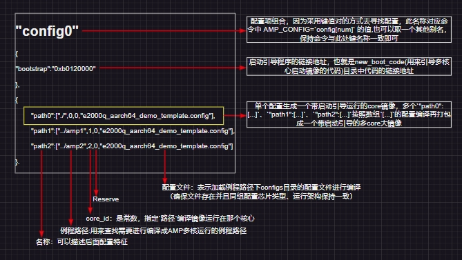
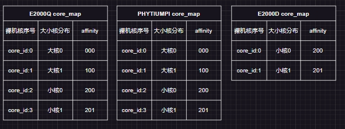
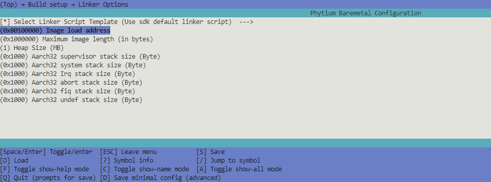
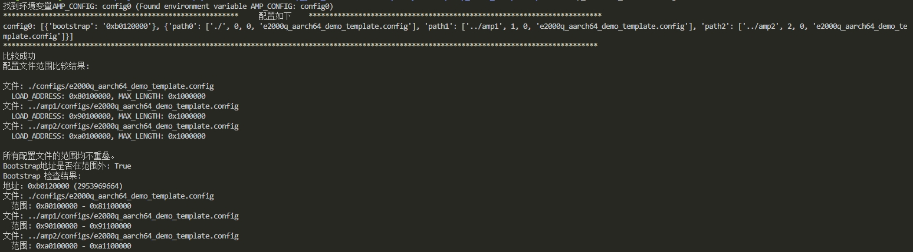

# 多元异构系统部署

## 1. 例程介绍

> `<font size="1">`介绍例程的用途，使用场景，相关基本概念，描述用户可以使用例程完成哪些工作 `</font><br />`

1. 随着硬件技术的快速发展，嵌入式芯片的硬件能力越来越强大，从单核到多核、从多核到异构多核，为在一个片上系统（SoC）中部署多个OS提供了坚实的物理基础。多元异构系统部署是为了在多核片上实现多个操作系统镜像打包并同时运行，包含了裸机、freertos等多种实现形态。不同的形态有各自的特点，例如裸机可以得到最佳的性能、嵌入式系统具有更好的易用性与灵活性等等。实践中也往往需要将不同形态根据用户的需求构建选项（芯片类型，功能特性等等），创建出定制化的镜像文件。
2. 本例程仅仅演示纯裸机多元异构系统部署原理，暂不涉及openamp库的调用，以及核间通信
3. 部署方案可以在飞腾E2000Q/D系列，PHYTIUMPI，D2000上进行部署操作，但例程实际是否可运行需要具体到芯片是否支持，可以查阅例程目录的 ./configs 配置项
4. 部署方案可以指定程序运行在那个核心，所以也支持单例程任务镜像运行在设定核心(特别是E2000Q、PHYTIUMPI这类大小核心配置，boot启动运行默认在小核心，但是需要程序运行在大核的需求)。

## 2. 结构介绍

```
.
├── amp                     --> 主配置目录，也是测试例程0，本例程配置用于核心0启动运行。存放多核配置文件，混合编译文件（可由其他普通例程改造）
│    └── amp_config.json    --> 配置文件，可以根据需要修改新增配置项目，后面第三点会解释如何进行配置
│
├── amp1                    --> 测试例程1，本例程配置用于核心1启动运行
└── amp2                    --> 测试例程2，本例程配置用于核心2启动运行

$(SDK_DIR)/tools/build/
.
├── new_boot_code
│   └── main.c              --> 解析镜像，启动处理器多核镜像
├── py_tools
│   └── amp_parse_config.py --> 解析json配置文件，并进行编译打包
└── makeall.mk              --> amp_make: 脚本命令
```

## 3. 如何构建

### 3.1 以本例程文件结构为例，在amp文件夹中,新建amp_config.json文件，如下所示:

- 以下为E2000Q、E2000D的配置示例，

```
[    
    {
        "举例":{
            "configs":{
                "_config[num]_":"镜像配置,每一个镜像配置由多个例程路径的配置组合构成,是需要保证芯片型号以及aarch架构一致性",
                "config[num]":[
                    {
                        "bootstrap":"boot_code文件启动引导的链接地址,由此代码启动多核镜像"
                    },
                    {
                        "_path[num]_":"AMP关联路径配置,每个路径指定一个核心的镜像工程所需指定的配置",
                        "path[num]":["amp例程路径(字符串):相对于project_directory的工程路径","core_num(常量):指定此镜像运行在指定CPU_ID号的core上","reserve(常量):保留","配置文件名称(字符串):第一个参数工程路径下configs目录中配置文件名,用来加载配置编译选项"],
                        "...":"..."
                    }
                ]
            }
        }
    },
    {
        "configs":
        {
            "config0":[
                {
                    "bootstrap":"0xb0120000"
                },
                {
                    "path0":["./",0,0,"e2000q_aarch64_demo_template.config"],
                    "path1":["../amp1",1,0,"e2000q_aarch64_demo_template.config"],
                    "path2":["../amp2",2,0,"e2000q_aarch64_demo_template.config"]
                }
            ],
            "config1":[
                {
                    "bootstrap":"0xb0120000"
                },
                {
                    "path0":["./",0,0,"e2000q_aarch32_demo_template.config"],
                    "path1":["../amp1",1,0,"e2000q_aarch32_demo_template.config"],
                    "path2":["../amp2",2,0,"e2000q_aarch32_demo_template.config"]
                }
            ],
            "config2":[
                {
                    "bootstrap":"0xb0120000"
                },
                {
                    "path0":["./",0,0,"e2000d_aarch64_demo_template.config"],
                    "path1":["../amp1",1,0,"e2000d_aarch64_demo_template.config"]
                }
            ],
            "config3":[
                {
                    "bootstrap":"0xb0120000"
                },
                {
                    "path0":["./",0,0,"e2000d_aarch32_demo_template.config"],
                    "path1":["../amp1",1,0,"e2000d_aarch32_demo_template.config"]
                }
            ]
        }    
    }
]
```

1. 在json文件中，因为无法添加注释，所以创建两个对象，第一个对象{...}是配置举例，第二个对象{...}才是配置实例,其中`ep`以`_`开头和`_`结尾表示对键的解释，实例对象并不需要配置。

2. `bootstrap`启动引导程序的链接地址，也就是new_boot_code(用来引导多核心启动镜像的代码)目录中代码的链接地址。（bootstrap名称不可更改）

3. `configs`配置项集合，对象值可以只添加一个配置组合，也可以添加多个，如E2000D aarch32组成一种配置组合，E2000D aarch64组成另外一种配置组合。（configs名称不可更改）

- 具体配置说明如下所示：



> 注意区分配置文件的名字，本例程作为测试保持了一致，具体名字查阅`路径`例程中configs目录下的名称，以运行e2000q AArch64到核心1为例，`"path1":["../amp1",1,0,"e2000q_aarch64_demo_template.config"]`，则是使用`e2000q_aarch64_demo_template.config`，因为在`../amp1`。你可以在`../amp1/configs`目录下找到e2000q_aarch64_demo_template.config文件，我们会以此配置编译此目录的代码。

### 3.2 如果不采用amp1或者amp2例程配置您的多核镜像，请 分别 在例程中进行以下操作

1. 确定好多核加载的例程后，需要配置不同例程镜像加载地址保持区分,脚本会进行边界检查

> 注：E2000Q采用的4核心，core0与core1为大核，core2与core3是小核，E2000D则是双小核心，core0与core1均为小核心
> 注：PHYTIUMPI采用的4核心，core0与core1为大核，core2与core3是小核

> 

- 在配置组合config[num]:`path<num>`的`路径`下 分别 输入：

```
make menuconfig
```

- 进入 ` Build setup → Linker Options ` 配置好镜像链接地址，推荐名称`path<num>`中例程路径镜像链接地址 ` Image load address `: 0x80100000、0x90100000、0xa0100000等位置



- 完成配置后，输入：

```
make backup_kconfig
```

- 将配置保存，方便编译脚本将配置文件正确的调用，用来编译出多核镜像，多个`path[num]`的配置项就需要进行多次保存配置，配置好后务必 ` make backup_kconfig `保存好配置到` ./configs/ `目录下，方便 ` amp_config.json `文件使用。每个配置项只需要首次配置保存即可（除非修改例程功能，编译无法通过，则需要`make menuconfig`配置好后`make backup_kconfig`保存配置,注意修改项目名称会造成 配置文件名 的更改，则需要重新在json文件中修改对应配置），当前例程为配置好的配置项，可以作为参考。

### 3.3 tools\build\makeall.mk文件中，添加多镜像打包操作以及多核唤醒boot_code的编译过程，如下所示:

- 完成好`config<num>`的配置项后，在`amp_config.json`文件所在例程文件夹的路径下(本例程在 ./amp/ ),输入：

```
make amp_make
```

- 可以列出配置项：


- 使用config1，E2000Q平台，aarch64模式，输入：

```
make amp_make AMP_CONFIG=config0
```



- 此编译编译启动框架利用Python脚本来进行自动化操作：

```
amp_make:
# 基于当前目录下current_config.config 进行amp 操作
	@$(PYTHON) $(SDK_PYTHON_TOOLS_DIR)/amp_parse_config.py
	$(MAKE) -C  $(SDK_DIR)/tools/build/new_boot_code all -j AMP_IMG_EXPORT_IMG=$(PROJECT_DIR)/packed.bin BUILD_OUT_PATH=$(PROJECT_DIR)/build/boot_build IMAGE_OUT_NAME=packed_image IMAGE_OUTPUT=$(PROJECT_DIR)/
	cp ./packed_image.elf $(USR_BOOT_DIR)/baremetal.elf
```

1. 通过 ` tools/build/py_tools/amp_parse_config.py `文件，对amp_path[*]指向的目录进行自动化编译

2. 将编译好的多个例程可执行文件与启动引导程序` tools/build/new_boot_code `进行编译打包整合


## 4. 如何解决问题

> `<font size="1">`主要记录使用例程中可能会遇到的问题，给出相应的解决方案 `</font><br />`

1. 如果直接使用其他例程进行amp编译，出现如下错误：


- 链接地址冲突，这种状况需要修改各个例程路径` Build setup → Linker Options `的链接地址以及镜像大小，调整提示的参数，完成后使用` make backup_kconfig `保存配置到./configs目录下
- 注意soc、架构和名称与json文件的config[num]数组中的配置文件名一直

