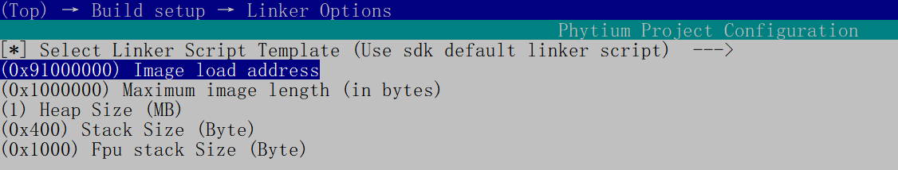
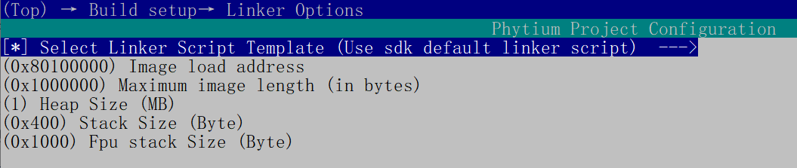
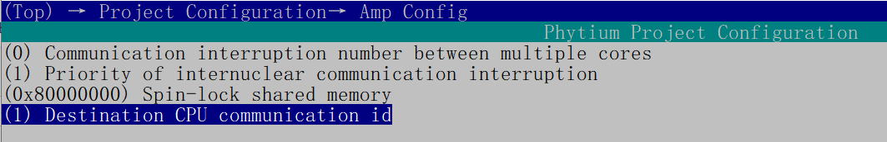
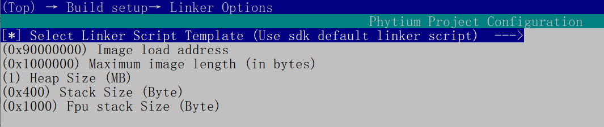
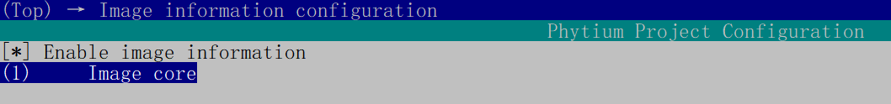

# LIBMETAL 测试

## 1. 例程介绍

> `<font size="1">`介绍例程的用途，使用场景，相关基本概念，描述用户可以使用例程完成哪些工作 `</font><br />`

1. 基于 开源libmetal项目

[libmetal](https://github.com/OpenAMP/libmetal)

2. 应用于本裸机sdk，多核共用内存的一种方式，了解更多可以参阅doc文档

[libmetal_doc](../../../../doc/reference/cpu/libmetal.md)

1. 提供无锁内存共享 、内存原子操作、ipi 内存共享 、ipi中断通信时间、共享内存操作时间、吞吐量等6个示例（具体操作流程可在例程代码顶部说明获得）（ipi_waking_up_demo仅仅作为主核唤醒从核同步使用）

## 2. 如何使用例程

> `<font size="1">`描述开发平台准备，使用例程配置，构建和下载镜像的过程 `</font><br />`
>
> - 具体的配置方案可以参考文档 doc/reference/usr/how_to_use.md

### 2.1 硬件配置方法

> `<font size="1">`哪些硬件平台是支持的，需要哪些外设，例程与开发板哪些IO口相关等（建议附录开发板照片，展示哪些IO口被引出）`</font><br />`

1. 准备一块E2000Q/D开发板
2. 将串口连接好电脑，波特率设为 115200-8-1-N

### 2.2 SDK配置方法

> `<font size="1">`依赖哪些驱动、库和第三方组件，如何完成配置（列出需要使能的关键配置项）`</font><br />`

- 本例子已经提供好具体的编译指令，以下进行介绍:

  1. make menuconfig_apu      配置./apu_running 目录下的配置变量
  2. make menuconfig_rpu      配置./rpu_running 目录下的配置变量
  3. make all                 编译./apu_running ./rpu_running 下的项目工程
  4. make clean               清理./apu_running ./rpu_running 下的编译结果
  5. make image               清理./apu_running ./rpu_running 下的编译结果，重新编译打包并复制到目标路径下
  6. make list_kconfig	当前工程支持哪些配置文件，对于apu_running、rpu_running这两个工程需要在各自的根路径下使用此指令，在此根目录下查看的是boot程序的配置文件
  7. make load_kconfig LOAD_CONFIG_NAME=`<kconfig configuration files>` 基于“make list_kconfig”列举的配置文件进行加载。对于apu_running、rpu_running这两个工程需要在各自的根路径下使用此指令，在此文档同目录下使用此指令，加载的是boot程序的配置文件
- 具体使用方法为：
  8. 为了方便快速配置测试，增加 load_e2000d_aarch32 load_e2000d_aarch64 load_e2000q_aarch32 load_e2000q_aarch64 load_phytiumpi_aarch32 load_phytiumpi_aarch64 6个默认配置项目，会同时加载apu、rpu以及boot的默认配置，然后使用make image命令进行编译
  - 在SDK\example\amp\libmetal_test 目录下
  - make + 以上指令

### 2.3 构建和下载

> `<font size="1">`描述构建、烧录下载镜像的过程，列出相关的命令 `</font><br />`

- 以E2000D为例：

！！！配置时，请务必保持三个构建配置的arch**、以及芯片型号一致，推荐使用如下一键配置：

```
make load_e2000d_aarch32
```

然后进行编译,在目标目录下生成 boot.elf 文件

```
make image
```

#### boot 构建配置

在SDK\example\amp\libmetal_test目录下，当出现boot与amp镜像冲突时可以更改

```
make menuconfig
```

当使用0x81000000时：


变更为available space range - start: 0x91000000, end: 0xffffffff:



#### APU 构建配置

在SDK\example\amp\libmetal_test目录下，注意与RPU的镜像启动core id匹配

```
make menuconfig_apu
```



- Share memory address set : 用于项目中共享内存
- Communication interruption number between multiple cores : 主核与从核使用的ipi中断号
- Priority of internuclear commucation interruption : ipi中断优先级
- Destination CPU communication id : ipi 通信 目标核id



- Image core 表示，确定apu 工程工作在那个核心处，下图显示工作在核0位置
  

#### RPU 构建配置

在SDK\example\amp\libmetal_test目录下，注意与APU的镜像启动core id匹配

```
make menuconfig_rpu
```



- Share memory address set : 用于项目中共享内存
- Communication interruption number between multiple cores : 主核与从核使用的ipi中断号
- Priority of internuclear commucation interruption : ipi中断优先级
- Destination CPU communication id : ipi 通信 目标核id


- Image core 表示，确定apu 工程工作在那个核心处，下图显示工作在核1位置
  

### 2.4 输出与实验现象

> `<font size="1">`描述输入输出情况，列出存在哪些输入，对应的输出是什么（建议附录相关现象图片）`</font><br />`

#### 操作步骤

1. 按照SDK根目录操作指引搭建好 tftp 环境，简单测试可直接跳到第5点完成配置
2. 分别在./apu_running ./rpu_running 目录下修改好需要放置的路径,默认放置本子目录
3. 在./ 目录下 执行 `make clean`
4. 根据需要编译的cpu 位数、芯片型号，在主目录./或者./apu_running ./rpu_running 目录下执行
   make load_kconfig LOAD_CONFIG_NAME=`<kconfig configuration files>`加载已经备份好configs目录的配置项
5. 当第4步配置出现问题，造成编译报错（不同目录soc、地址、架构 不匹配时），建议采用makefile中的一键配置命令 以 phytiumpi_aarch64 为例` make load_phytiumpi_aarch64 `
   其他芯片架构具体可以查阅makefile文件，或者 `make load_` 后使用tab键索引命令条目
   配置完成后再进入子目录对条目如外设、第三方库的配置
6. 执行 `make all` 对所有工程进行编译
7. 执行 `make image` 将目标elf 放置到设置路径下/mnt/d/tftboot/boot.elf（boot.elf为打包后的三个镜像集合）
8. 以下是调试命令窗口中载入代码的命令

```
    setenv ipaddr 192.168.4.20              
    setenv serverip 192.168.4.50            
    setenv gatewayip 192.168.4.1            
    tftpboot f0000000 baremetal_package.elf; 
    bootelf -p f0000000                     
```


8. 程序内交互命令：

```
    libmetalapu                           /* 执行例子  */
```


## 3. 如何解决问题 (Q&A)

> `<font size="1">`主要记录使用例程中可能会遇到的问题，给出相应的解决方案 `</font><br />`

## 4. 修改历史记录

> `<font size="1">`记录例程的重大修改记录，标明修改发生的版本号 `</font><br />`

- 2021-09-06 ：v0.1.0 初始化项目
- 2021-10-13 : v0.1.1 增加config 配置中heap 大小
- 2021-11-26 : 修改预加载方式
- 2023-03-22 ：新增E2000支持，修改部分bug，新增例程测试
- 2023-06-07 ：支持新框架启动运行
- 2023-08-07 : 更新新编译框架、新增默认配置项、一键配置soc