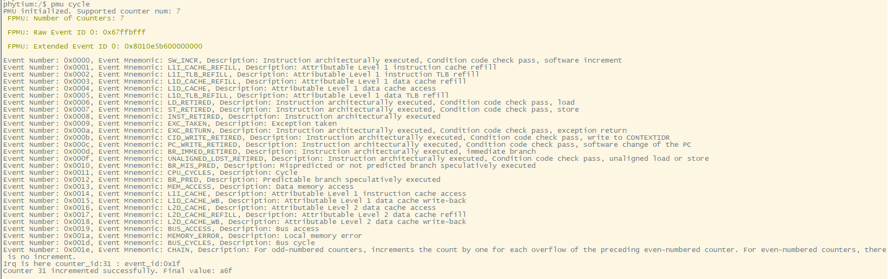
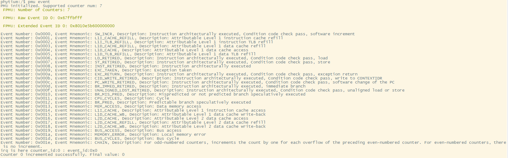

# PMU测试

## 1. 例程介绍

> `<font size="1">`介绍例程的用途，使用场景，相关基本概念，描述用户可以使用例程完成哪些工作 `</font><br />`
>
> 本例程介绍PMU（performance monitor unit）中计数溢出中断的特性，并且介绍API 具体使用方法 。程主要演示了PMU 中循环计数器与 software increment event id 定时器的功能 。

## 2. 如何使用例程

`<font size="1">`描述开发平台准备，使用例程配置，构建和下载镜像的过程 `</font><br />`

- 具体的配置方案可以参考文档 doc/reference/usr/how_to_use.md

### 2.1 硬件配置方法

> `<font size="1">`哪些硬件平台是支持的，需要哪些外设，例程与开发板哪些IO口相关等（建议附录开发板照片，展示哪些IO口被引出）`</font><br />`

1. 准备一块E2000/D2000/FT2004开发板
2. 将串口连接好电脑，波特率设为 115200-8-1-N

### 2.2 SDK配置方法

`<font size="1">`依赖哪些驱动、库和第三方组件，如何完成配置（列出需要使能的关键配置项）`</font><br />`

- 本例子已经提供好具体的编译指令，以下进行介绍:
  1. make all                 编译当前目录下的项目工程
  2. make clean             清理当前目录下的编译结果
  3. make image            将当前目录下的目标elf 打包并复制到目标路径下
  4. make list_kconfig	当前工程支持哪些配置文件
  5. make load_kconfig LOAD_CONFIG_NAME=`<kconfig configuration files>` 基于“make list_kconfig”列举的配置文件进行加载。
- 具体使用方法为：
  - 在此文档的根目录下

### 2.3 构建和下载

> `<font size="1">`描述构建、烧录下载镜像的过程，列出相关的命令 `</font><br />`

- 在host侧完成配置

> 配置成E2000D，对于其它平台，使用对应的默认配置，如E2000d 32位:

```
$ make load_kconfig LOAD_CONFIG_NAME=e2000d_aarch32_demo_pmu
```

- 在host侧完成构建

```
$ make image
```

- host侧设置重启host侧tftp服务器

```
sudo service tftpd-hpa restart
```

- 开发板侧使用bootelf命令跳转

```
setenv ipaddr 192.168.4.20  
setenv serverip 192.168.4.50 
setenv gatewayip 192.168.4.1 
tftpboot 0x90100000 baremetal.elf
bootelf -p 0x90100000
```

### 2.4 输出与实验现象

> `<font size="1">`描述输入输出情况，列出存在哪些输出，对应的输出是什么（建议附录相关现象图片）`</font><br />`

#### 操作步骤

1. 当完成2.3 步骤之后，输入以下命令可以开始特定例程的实验
2. 查看cycle counter 特性，输入：

```
pmu cycle
```



3. 查看event id 特性，输入：

```
pmu event
```



## 3. 如何解决问题

> `<font size="1">`主要记录使用例程中可能会遇到的问题，给出相应的解决方案 `</font><br />`

## 4. 修改历史记录

> `<font size="1">`记录例程的重大修改记录，标明修改发生的版本号 `</font><br />`
