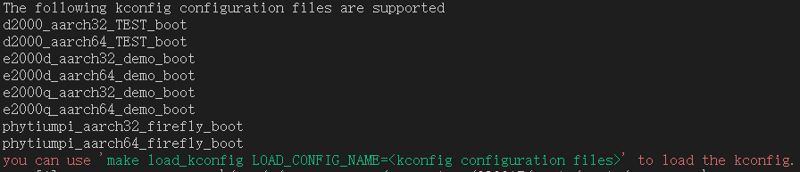
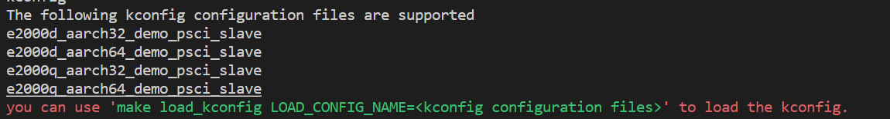
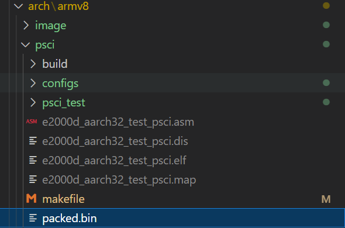
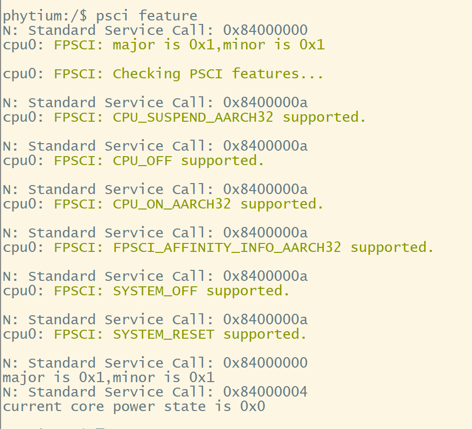

# PSCI 测试

## 1. 例程介绍

`<font size="1">`介绍例程的用途，使用场景，相关基本概念，描述用户可以使用例程完成哪些工作 `</font><br />`

本例程主要演示了PSCI 初始化特性以及CPU hotplug 的功能

本例程一共包含了两个工程目录，分别如下所示：

1. psci_test ---- 为psci特性测试与CPU hotplug 主程序源码
2. psci_slave ---- 从核程序，程序运行之后会倒数5秒之后，进入power down 模式，等待主核唤醒

## 2. 如何使用例程

> `<font size="1">`描述开发平台准备，使用例程配置，构建和下载镜像的过程 `</font><br />`
>
> - 具体的配置方案可以参考文档 doc/reference/usr/how_to_use.md

### 2.1 硬件配置方法

> `<font size="1">`哪些硬件平台是支持的，需要哪些外设，例程与开发板哪些IO口相关等（建议附录开发板照片，展示哪些IO口被引出）`</font><br />`

1. 准备一块E2000Q/D开发板
2. 将串口连接好电脑，波特率设为 115200-8-1-N

### 2.2 SDK配置方法

> `<font size="1">`依赖哪些驱动、库和第三方组件，如何完成配置（列出需要使能的关键配置项）`</font><br />`

- 本例子已经提供好具体的编译指令，以下进行介绍:

  1. make all                 编译./psci_test  ./psci_slave 下的项目工程
  2. make clean               清理./psci_test  ./psci_slave 下的编译结果
  3. make image                将 ./psci_test  ./psci_slave 下的目标elf 打包并复制到目标路径下
  4. make list_kconfig	当前工程支持哪些配置文件，对于psci_test、psci_slave这两个工程需要在各自的根路径下使用此指令，在此根目录下查看的是boot程序的配置文件
  5. make load_kconfig LOAD_CONFIG_NAME=`<kconfig configuration files>` 基于“make list_kconfig”列举的配置文件进行加载。对于psci_test、psci_slave这两个工程需要在各自的根路径下使用此指令，保持两个目录加载配置的两个工程SOC型号以及AARCHxx一致。在此文档同目录下使用此指令，加载的是boot程序的配置文件,也需要保持SOC型号以及AARCHxx一致。
- 具体使用方法为：

  - 在此文档的根目录下
  - make + 以上指令

### 2.3 构建和下载

> `<font size="1">`描述构建、烧录下载镜像的过程，列出相关的命令 `</font><br />`

- 以E2000D aarch32 为例按照以下步骤配置以及编译测试程序：

1. 在example\arch\armv8\psci 目录下输入"make list_kconfig",查看已经支持的配置项：



2. 在example\arch\armv8\psci 目录下输入"make load_kconfig LOAD_CONFIG_NAME=e2000d_aarch32_demo_boot",选择引导程序加载为e2000d aarch32 工作模式
3. 进入example\arch\armv8\psci\psci_test 目录，输入"make list_kconfig",查看已经支持的配置项：
   
4. 在example\arch\armv8\psci\psci_test 目录下，输入"make load_kconfig LOAD_CONFIG_NAME=e2000d_aarch32_demo_psci",选择主核对应的工作模式
5. 进入example\arch\armv8\psci\psci_test\psci_slave 目录,输入"make list_kconfig"",查看已经从核支持的配置项：
   
6. 在example\arch\armv8\psci\psci_test\psci_slave 目录下，输入"make load_kconfig LOAD_CONFIG_NAME=e2000d_aarch32_demo_psci_slave",选择从核对应的工作模式。
7. 返回example\arch\armv8\psci 目录，依次输入"make clean" "make all" ,则可以对整个多核工程进行编译了



### 2.4 输出与实验现象

> `<font size="1">`描述输入输出情况，列出存在哪些输入，对应的输出是什么（建议附录相关现象图片）`</font><br />`

#### 操作步骤

1. 在Ubuntu环境下搭建好tftp 环境
2. 在完成2.3 步骤之后会在example\arch\armv8\psci 的目录下生成 e2000d_aarch32_demo_boot.elf
3. 按照以下方式将elf 文件烧录至开发板内存种

```
    setenv ipaddr 192.168.4.20            
    setenv serverip 192.168.4.50          
    setenv gatewayip 192.168.4.1         
    tftpboot f0000000 boot.elf            
    bootelf -p f0000000                   
```

1. 程序内交互命令：

```c
  psci feature
```

- 此命令用于查看当前psci 例程支持的特性
  

```c
  psci amp
```

- 此命令用于主核与从核之间进行cpu hotplug 操作的特性


## 3. 如何解决问题 (Q&A)

> `<font size="1">`主要记录使用例程中可能会遇到的问题，给出相应的解决方案 `</font><br />`

## 4. 修改历史记录

> `<font size="1">`记录例程的重大修改记录，标明修改发生的版本号 `</font><br />`

- 2023-06-27 ：v1.0.0 初始化项目
