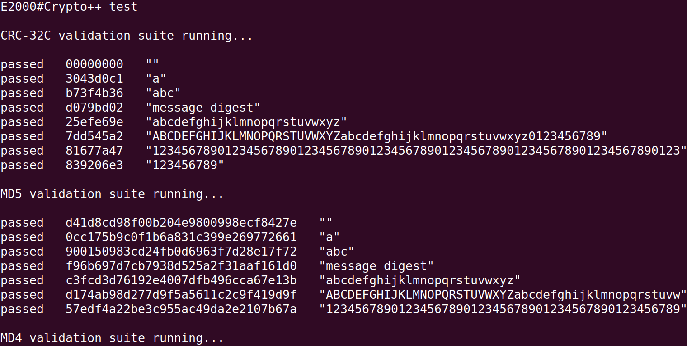

# Crypto++ 测试

## 1. 例程介绍

> `<font size="1">`介绍例程的用途，使用场景，相关基本概念，描述用户可以使用例程完成哪些工作 `</font><br />`

- Crypto++（也称为 CryptoPP）是 C++ 语言中的一种开放源代码加密库，提供了一系列加密算法和各种密码学相关的功能模块，可以用于构建各种信息安全系统。

- Crypto++ 实现了非常多的加密算法，其中包括了常见的对称加密算法如 AES, DES, 3DES, RC2, RC4, Blowfish 等，以及公钥加密算法如 RSA、ECC（椭圆曲线加密算法）等。同时，它也支持各种 hash 算法和 HMAC 算法，如 SHA1、SHA256、MD5、Whirlpool 等。除了提供各种加密和哈希算法之外，Crypto++ 还提供了各种密码学相关的工具功能，例如生成密码学随机数、派生密码学密钥、计算消息认证码等。

- Crypto++ 设计上遵循 C++ 的设计原则，提供了面向对象的程序接口，易于使用和扩展。它还提供了多种操作系统下的编译、测试和安装服务，方便了用户在不同平台下使用该库。

- 总的来说，Crypto++ 是一个功能强大、易于使用、可移植的加密库，非常适合用于构建需要使用加密算法的应用程序和系统。

- 目前本例程能够将 Crypto++ 整体编译通过，并使用 CRC，SIMD 等 ARM 指令优化算法实现，但是 Crypto++ 中的方法只有部分能使用，依赖 POSIX 操作系统、文件系统相关的方法暂不支持，C++ Runtime 异常也不能恢复

## 2. 如何使用例程

> `<font size="1">`描述开发平台准备，使用例程配置，构建和下载镜像的过程 `</font><br />`

本例程需要以下硬件，

- E2000D/Q Demo，D2000，FT2000/4，PhytiumPi

### 2.1 硬件配置方法

> `<font size="1">`哪些硬件平台是支持的，需要哪些外设，例程与开发板哪些IO口相关等（建议附录开发板照片，展示哪些IO口被引出）`</font><br />`

### 2.2 SDK配置方法

> `<font size="1">`依赖哪些驱动、库和第三方组件，如何完成配置（列出需要使能的关键配置项）`</font><br />`

使能例程所需的配置

- 本例子已经提供好具体的编译指令，以下进行介绍：
    1. make 将目录下的工程进行编译
    2. make clean  将目录下的工程进行清理
    3. make image   将目录下的工程进行编译，并将生成的elf 复制到目标地址
    4. make list_kconfig 当前工程支持哪些配置文件
    5. make load_kconfig LOAD_CONFIG_NAME=<kconfig configuration files>  将预设配置加载至工程中
    6. make menuconfig   配置目录下的参数变量
    7. make backup_kconfig 将目录下的sdkconfig 备份到./configs下

- 具体使用方法为：

  - 在当前目录下
  - 执行以上指令

### 2.3 构建和下载

> `<font size="1">`描述构建、烧录下载镜像的过程，列出相关的命令 `</font><br />`
- 在host侧完成配置

>配置成E2000D，对于其它平台，使用对应的默认配置，如E2000d 32位:
```
$ make load_kconfig LOAD_CONFIG_NAME=e2000d_aarch32_demo_cxx
```

- 在host侧完成构建

```
$ make image
```

- host侧设置重启host侧tftp服务器

```
sudo service tftpd-hpa restart
```

- 开发板侧使用bootelf命令跳转

```
setenv ipaddr 192.168.4.20  
setenv serverip 192.168.4.50 
setenv gatewayip 192.168.4.1 
tftpboot 0x90100000 baremetal.elf
bootelf -p 0x90100000
```

### 2.4 输出与实验现象

> `<font size="1">`描述输入输出情况，列出存在哪些输出，对应的输出是什么（建议附录相关现象图片）`</font><br />`

#### 2.4.1 测试 CRC32 等加密算法

- 关闭 Letter Shell 配置，编译后允许镜像



## 3. 如何解决问题

> `<font size="1">`主要记录使用例程中可能会遇到的问题，给出相应的解决方案 `</font><br />`

## 4. 修改历史记录

> `<font size="1">`记录例程的重大修改记录，标明修改发生的版本号 `</font><br />`

v1.1.1 版本首次引入