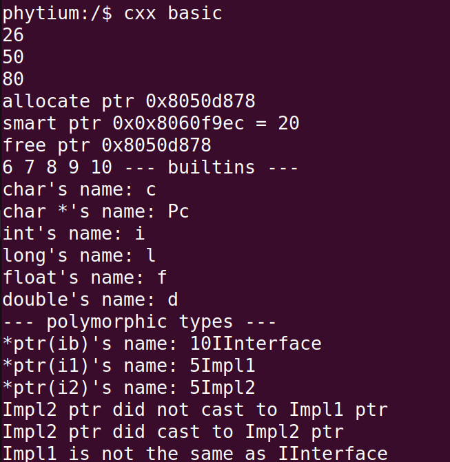
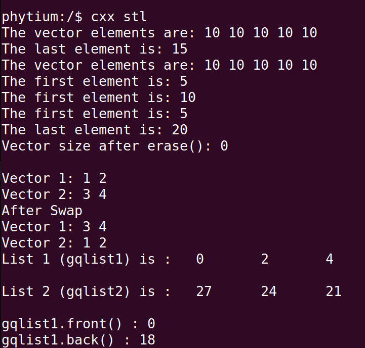

# CXX 测试

## 1. 例程介绍

> `<font size="1">`介绍例程的用途，使用场景，相关基本概念，描述用户可以使用例程完成哪些工作 `</font><br />`

- C++ 是一种静态类型的、编译式的、通用的、大小写敏感的、不规则的编程语言，支持面向过程编程、面向对象编程和泛型编程
- C++ 进一步扩充和完善了 C 语言，被认为是 C 的一个超集
- C++ 的全部特性非常多，用法非常灵活，本例程运行在裸机环境下，只实现了部分功能，因此使用到例程覆盖之外的特性前需要单独评估

- 本例程分别对常见的 C++ 特性进行了演示，包括，面向对象开发的四大特性
  - 1. 封装
  - 2. 抽象
  - 3. 继承
  - 4. 多态

- C++ 标准库的部分功能，标准库 STL
- 目前已知的不支持的功能包括
  - 1. cin 从标准 stream 中获取用户的终端输入
  - 2. throw exception 后 catch exception 并恢复执行
  - 3. singal 等操作系统相关的接口
  - 4. open，fstream 等文件系统相关的接口

- 本例程分为三个部分，分别演示了
  - 1. C++ 相比 C 增加的特性
  - 2. C++ 面向对象开发的特性
  - 3. C++ 标准模板库（STL）的使用

### 1.1 C++ 相比 C 增加的特性

- 1. FDefaultArgumentsExample
> C++默认参数, 即在定义参数的时候同时给它一个初始值。在调用函数的时候，我们可以省略含有默认值的参数。也就是说，如果用户指定了参数值，则使用用户指定的值，否则使用默认参数的值

- 2. FSmartPointerExample
> C++智能指针，在传统的C/C++中，malloc或者new的内存资源都需要手动释放，因此我们很有可能就忘记了去释放资源而导致泄露，智能指针就是帮我们C++程序员管理动态分配的内存的，在离开变量的作用域时，它会帮助我们自动释放new出来的内存

- 3. FFunctorsExample
> C++算子函数，functor通过重载()运算符，实现类似函数的东西，是 STL 实现的一个重要基础

- 4. FRttiExample
> RTTI (Runtime Type Information)，即运行时类型信息，RTTI通过运行时类型信息程序能够使用基类的指针或引用来检查这些指针或引用所指的对象的实际派生类型

- 5. FNamespaceExample
> C++ 中引入了命名空间的概念，命名空间是一个声明性区域，为其内部的标识符（类型、函数和变量等的名称）提供一个范围

- 6. FFunctionOverloadingExample
> C++ 允许在同一范围内指定多个同名函数。 这些函数称为重载函数或重载。 利用重载函数，你可以根据参数的类型和数量为函数提供不同的语义

- 7. FOperatorOverloadingExample
> C++ 也允许重载 operator x 等操作符，如 () [] << 等，new, delete 等

- 8. FPassByReferenceExample
> C++ 引用引用变量是一个别名，可以通过引用给 C++ 函数传参，达到代替指针传参的目的

- 9. FAutoTypeExample
> C++11 以来，auto 关键字的用法发生变化，声明变量时根据初始化表达式自动推断该变量的类型

- 10. FNullptrExample
> C++ 中增加了一个关键字 nullptr，代替 C 中的 NULL

### 1.2 C++ 面向对象开发（OOP）的特性

- 1. FAbstractionExample
> 封装，即隐藏对象的属性和实现细节，仅对外公开接口, 抽象包括两个方面，一是数据抽象，二是过程抽象，封装+抽象构成 OOP 的基础

- 2. FInheritanceExample
> 继承，即子类继承父类的特征和行为，使得子类具有父类的成员变量和方法

- 3. FPolymorphismExample
> 多态，即同一个行为具有多个不同表现形式或形态的能力。表现形式有覆盖和重载

- 4. FDynamicBindingExample
> 使用基类的引用（指针）调用虚函数时，就会发生动态绑定，即在运行时，虚函数会根据绑定对象的实际类型，选择调用函数的版本

- 5. FStaticObjectsExample
> 全局静态对象、局部静态对象和临时对象的构造和析构都有一定的顺序，反映了对象的生命周期

- 6. FFriendFunctionExample
> 友元（Friend function）定义在类外部，但有权访问类的所有私有（private）成员和保护（protected）成员

- 7. FStaticMember
> 静态成员，是属于一个 class 的所有对象的成员

### 1.3 C++ 标准模板库（STL）的使用

- 1. FStlVectorExample
> vector 是一个动态数组，它能在运行期间改变其元素个数。与数组不同的是，它支持快速的插入和删除元素，vector 内部实现了一个动态数组，可以自动扩展空间，以容纳新的元素。使用 vector 可以省去手动管理内存的麻烦，同时提高代码的可读性和可维护性

- 2. FStlListExample
>  list 是一个双向链表，它能在运行期间改变其元素个数。与 vector 不同，list 并没有预留额外的空间，它通过指针连接每个元素，因此可以在常数时间内插入和删除元素, list 是一个双向链表，它能在运行期间改变其元素个数。与 vector 不同，list 并没有预留额外的空间，它通过指针连接每个元素，因此可以在常数时间内插入和删除元素

- 3. FStlDequeueExample
> deque 是一个双端队列，它具有 vector 和 list 的特点。deque 类似于一个有多个缓冲区的数组，可以在常数时间内在两端添加和删除元素。和 vector 相同，deque 支持在常数时间内随机访问元素；和 list 相同，deque 支持在常数时间内在两端添加和删除元素。相比之下，deque 更为灵活，因为它既支持快速的尾部插入和删除，也支持快速的头部插入和删除。

- 4. FStlQueueExample
> queue 是一个队列容器，它可以在常数时间内添加和删除元素。队列是一种先进先出（FIFO）的数据结构，对队列进行操作的顺序和元素最先进入队列的顺序相同。queue 通常用于实现广度优先搜索（BFS）算法等问题，在这些问题中，我们需要按照某种顺序遍历图或树的节点，队列提供了一种最自然的方式实现这样的遍历。

- 5. FStlPriorityQueueExample
> priority_queue 是一个优先级队列容器，它可以在常数时间内添加和删除元素，并保证每次删除的元素都是队列中优先级最高的元素。在默认情况下，STL priority_queue 使用大根堆（max heap）实现，即优先级最高的元素是队列中的最大元素。priority_queue 可以看作是一种特殊的队列，在插入元素时，每个元素都有一个与之关联的优先级，并按照优先级排序。在每次删除元素时，priority_queue 都会删除队列中优先级最高的元素，并返回该元素。

- 6. FStlStackExample
> stack 是一个栈容器，它可以在常数时间内添加和删除元素。栈是一种后进先出（LIFO）的数据结构，对栈进行操作的顺序和元素最后进入栈的顺序相同。stack 可以看作是一种特殊的向量容器，只能在向量的末尾添加或删除元素。栈的主要操作是 push 和 pop，分别用于将元素添加到栈顶和从栈顶删除元素。除此之外，STL stack 还提供了 top、empty 等成员函数，用于获取栈顶元素并检查栈是否为空。

- 7. FStlSetExample
> set 是一个关联式容器，它由一组唯一且有序的元素组成。set 中的元素按照与集合等价的方式排序，并且每个元素在容器中都只存在一个。set 用红黑树实现，保证了插入、查找和删除元素的对数时间复杂度。set 通常用于需要快速查找、插入和删除元素的场景。例如，我们可以使用 set 存储一个账户集合，用于快速判断账户是否存在。同时，由于 set 中的元素是有序的，因此我们也可以使用 set 进行排序、去重等操作。需要注意的是，由于 set 中的元素是唯一的，因此它不能像 vector 和 deque 那样通过下标访问元素。同时，set 也没有提供访问属于某个区间内元素的方法，需要使用迭代器来遍历所有元素。

- 8. FStlMapExample
> map 是一个关联式容器，它由一组 key/value 对组成。map 中的元素按照 key 的大小进行排序，并且每个 key 在容器中都只存在一次。map 使用红黑树实现，保证了插入、查找和删除元素的对数时间复杂度。map 通常用于需要根据 key 快速查找、插入和删除 value 的场景。例如，我们可以使用 map 存储一个电话簿，同时使用人名（key）快速查找对应的电话号码（value）。同时，由于 map 中的元素是按照 key 进行排序的，因此我们可以使用 map 进行排序等操作。需要注意的是，map 中只能使用唯一的 key，因此不支持插入已经存在的 key，否则会覆盖原有的 value。如果需要允许重复的 key，可以使用 STL multimap。

- 9. FStlHeapExample
> heap 是一个算法模块，它可以把一个数组（或 vector）看作是一个完全二叉树堆，然后进行堆化（heapify）操作，即将这个堆调整成符合堆性质的状态。

```
堆是一种数据结构，它满足以下两个条件：

- 堆中每个节点的值都不大于（或不小于）其孩子节点的值
- 堆是一个完全二叉树
```

- 10. FStlStringExample
> string 是一个字符串类，它封装了一系列与字符串相关的操作，并提供了方便的接口，简化了字符串的操作。STL string 完全抽象了字符串的底层实现，因此可以轻松地完成字符串的复制、连接、查找、替换、大小写转换等一系列操作

- 11. FStlSortExample
> sort 是一个通用的排序算法，可以对数组、容器中的元素进行排序。STL sort 使用快速排序（quicksort）算法，其时间复杂度为 O(NlogN)，是一种比较高效的排序方法。STL sort 也支持使用使用 STL 支持的自定义比较函数或函数对象，可以按照自己的需求进行排序。

- 此外，例程中还演示了如何在 C 中引用 C++ 中定义的函数，在.cpp 中定义的函数要用 extern "C"修饰，头文件的声明也要在 extern "C"中完成。一般来说，C++ 中引用 C 函数是不需要特别处理的，但是许多第三方库可能没有适配 C++，建议通过前面说的方式在 C 中引用 C++ 的方法

```
extern "C" int FDefaultArgumentsExample(void)
...
```

> extern "C" 的引入主要是为了解决 C++ 和 C 语言相互调用的问题，C++ 引入了 extern “C” 语法，告诉编译器以 C 语言的规则进行编译和链接。使用 extern “C” 标识的代码和标准 C 语言的代码相似，没有名称修饰。这样，其他的语言或者没有 C++ 编译器的环境就能够调用这些函数

## 2. 如何使用例程

> `<font size="1">`描述开发平台准备，使用例程配置，构建和下载镜像的过程 `</font><br />`

本例程需要以下硬件，

- E2000D/Q Demo，D2000，FT2000/4，PhytiumPi

### 2.1 硬件配置方法

> `<font size="1">`哪些硬件平台是支持的，需要哪些外设，例程与开发板哪些IO口相关等（建议附录开发板照片，展示哪些IO口被引出）`</font><br />`

### 2.2 SDK配置方法

> `<font size="1">`依赖哪些驱动、库和第三方组件，如何完成配置（列出需要使能的关键配置项）`</font><br />`

使能例程所需的配置

- 本例子已经提供好具体的编译指令，以下进行介绍：
    1. make 将目录下的工程进行编译
    2. make clean  将目录下的工程进行清理
    3. make image   将目录下的工程进行编译，并将生成的elf 复制到目标地址
    4. make list_kconfig 当前工程支持哪些配置文件
    5. make load_kconfig LOAD_CONFIG_NAME=<kconfig configuration files>  将预设配置加载至工程中
    6. make menuconfig   配置目录下的参数变量
    7. make backup_kconfig 将目录下的sdkconfig 备份到./configs下

- 具体使用方法为：

  - 在当前目录下
  - 执行以上指令

### 2.3 构建和下载

> `<font size="1">`描述构建、烧录下载镜像的过程，列出相关的命令 `</font><br />`

- 在host侧完成配置

>配置成E2000D，对于其它平台，使用对应的默认配置，如E2000d 32位:
```
$ make load_kconfig LOAD_CONFIG_NAME=e2000d_aarch32_demo_cxx_start
```

- 在host侧完成构建

```
$ make image
```

- host侧设置重启host侧tftp服务器

```
sudo service tftpd-hpa restart
```

- 开发板侧使用bootelf命令跳转

```
setenv ipaddr 192.168.4.20  
setenv serverip 192.168.4.50 
setenv gatewayip 192.168.4.1 
tftpboot 0x90100000 baremetal.elf
bootelf -p 0x90100000
```

### 2.4 输出与实验现象

> `<font size="1">`描述输入输出情况，列出存在哪些输出，对应的输出是什么（建议附录相关现象图片）`</font><br />`

#### 2.4.1 覆盖测试一遍所有的特性

- 关闭 Letter Shell，然后加载镜像进行测试

#### 2.4.2 测试某一类特性

- 测试 C++ 相比 C 新增的特性

```
cxx basic
```



```
cxx oop
```


```
cxx stl
```



## 3. 如何解决问题

> `<font size="1">`主要记录使用例程中可能会遇到的问题，给出相应的解决方案 `</font><br />`

## 4. 修改历史记录

> `<font size="1">`记录例程的重大修改记录，标明修改发生的版本号 `</font><br />`

v1.1.1 版本首次引入