# JTAG 调试

## 1. 例程介绍

> `<font size="1">`介绍例程的用途，使用场景，相关基本概念，描述用户可以使用例程完成哪些工作 `</font><br />`

- JTAG (Joint Test Action Group) 是一种标准测试协议，主要用于芯片内部测试及对系统进行仿真、调试。作为一种嵌入式调试技术，它利用芯片内部封装的专门测试电路（TAP，Test Access Port），通过专用的 JTAG 测试工具（JTAG 适配器）实现对芯片内部的调试
- 标准的 JTAG 接口是 4 线： TMS 、TCK 、TDI 、TDO ，分别为测试模式选择、测试时钟、测试数据输入和测试数据输出，JTAG 适配器通过 JTAG 接口与芯片连接，所有的数据都会通过引脚输入或者输出，从而通过监控引脚信号达到调试的目的
- 在使用 JTAG 调试程序时，通常需要设置断点，断点也就是指令所在的位置，断点通常有两种，硬件断点和软件断点
- 1. 硬件断点：当 CPU 去某个地址取址时，硬件会自动暂停 CPU 的运行，硬件断点由 CPU 内部单元提供支持，硬件断点一般有限定的个数
- 2. 软件断点：当软件程序在某个指令上打断点时，调试代理会去取得断点的地址，然后在断点处将值替换为某个特殊值，当 CPU 取得这个特殊值时，就会暂停，去除断点后，特殊值会把替换回原有的值，软件断点的数目通常没有限制
- 通常用户不能直接使用调试功能，而需要对调试功能进行某种封装实现，OpenOCD 是一个典型的调试代理，GDB 是一个典型的调试软件，它们配合在一起可以实现某种调试功能，许多 IDE 如 Eclipse 还会对调试功能进一步封装，加上一层更方便使用的 GUI
- 本例程演示了如何在命令行环境下，使用 GDB、OpenOCD 和 JTAG 调试器对飞腾 CPU 开发板进行片上调试，整个例程分为三个部分
- 1. `jtag debug_c`，运行 c 代码，开始调试，这是最常用的功能，本例程用一段冒泡排序的实现来演示 c 代码调试
- 2. `jtag debug_cxx`，运行 cxx 代码，开始调试，本例程用一段冒泡排序的实现来演示 c++ 代码调试

> 由于 c++ 代码中有大量符号表，加载速度比较慢，因此默认没有打开，需要调试 c++ 代码时需要先使能 `CONFIG_ENABLE_CXX`

- 3. `jtag brk`，手动插入一条未作处理的软件断点，触发同步异常

## 2. 如何使用例程

> `<font size="1">`描述开发平台准备，使用例程配置，构建和下载镜像的过程 `</font><br />`

本例程需要以下硬件，

- E2000D/Q Demo 板
- JTAG 适配器 (Jlink/CMSIS Dap)
- JTAG 转接线

### 2.1 硬件配置方法

> `<font size="1">`哪些硬件平台是支持的，需要哪些外设，例程与开发板哪些IO口相关等（建议附录开发板照片，展示哪些IO口被引出）`</font><br />`

- 本例程在 E2000D Demo 板完成测试，使用固件和硬件设计开源的 [nanoDAP](https://github.com/wuxx/nanoDAP)进行测试，理论上其他兼容 CMSIS DAP 的调试器件也能使用
- 如果需要使用 Jlink 进行调试，需要修改本例程 makefile 中的 OPENOCD_CMD

```makefile
OPENOCD_CMD := $(SDK_DIR)/tools/debugging/run_openocd_jlink.sh
#OPENOCD_CMD := $(SDK_DIR)/tools/debugging/run_openocd_dap.sh

OPENOCD_CMD := $(SDK_DIR)/tools/debugging/run_openocd_jlink.bat
#OPENOCD_CMD := $(SDK_DIR)/tools/debugging/run_openocd_dap.bat
```


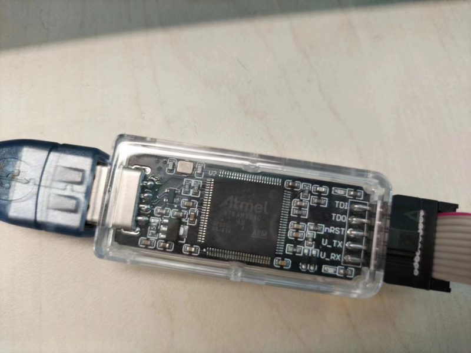

- 连接的时候注意参考开发板原理图连接 J38 所在的 FJTAG 口，如下图所示，有合适的转接线可以直接用转接线连接

```
                                J38 (E2000 D/Q Demo board)
------------                    ------------
           | TRST -- (10)       (1)VTREF       (2)TMS
Jlink/DAP  | TDI  -- (8)        (3)GND         (4)TCK
adaptor    | TDO  -- (6)        (5)GND         (6)TDO
           | TCK  -- (4)        (7)NC          (8)TDI
           | TMS  -- (2)        (9)DETECT      (10)NTRST
------------                    ------------

```

> Jlink/DAP 上一般有一个跳帽决定由开发板供电还是适配器供电，注意本例程中不接跳帽，由开发板供电

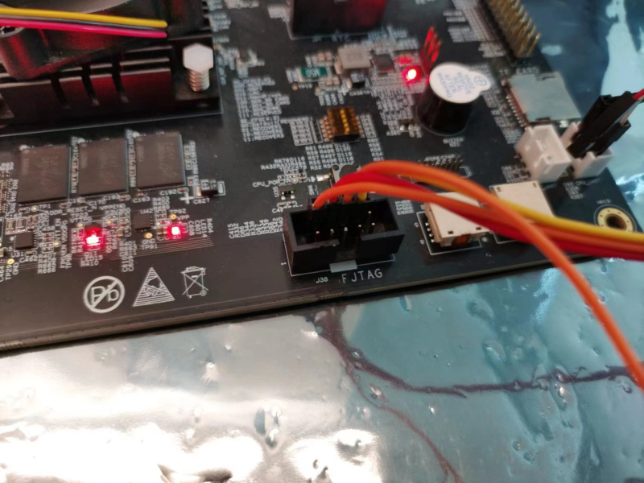


### 2.2 SDK配置方法

> `<font size="1">`依赖哪些驱动、库和第三方组件，如何完成配置（列出需要使能的关键配置项）`</font><br />`

下载安装SDK开发环境（Windows Msys2 或 Ubuntu 环境）

> 注意 WSL/WSL2 环境下使用 OpenOCD 调试需要额外配置 USB 设备驱动，具体可以[参考](https://blog.csdn.net/qq_41867145/article/details/126330935)，推荐在 Windows 环境下直接使用 env_msys64.exe 解压包

使能例程所需的配置

- 本例子已经提供好具体的编译指令，以下进行介绍：

  1. make 将目录下的工程进行编译
  2. make clean  将目录下的工程进行清理
  3. make image   将目录下的工程进行编译，并将生成的elf 复制到目标地址
  4. make list_kconfig 当前工程支持哪些配置文件
  5. make load_kconfig LOAD_CONFIG_NAME=`<kconfig configuration files>`  将预设配置加载至工程中
  6. make menuconfig   配置目录下的参数变量
  7. make backup_kconfig 将目录下的sdkconfig 备份到./configs下
- 具体使用方法为：

  - 在当前目录下
  - 执行以上指令
- 进行调试前，需要进行调整配置，具体地，
- 1. 使能 CONFIG_DEBUG_SYMBOLS，将调试符号完整地编译进入 ELF 镜像
- 2. 使能 CONFIG_OUTPUT_ASM_DIS，CONFIG_DEBUG_LINK_MAP，输出反汇编文件方便调试时查阅符号
- 3. 使能 CONFIG_BOOT_WITH_FLUSH_CACHE，通过 JTAG 下载程序跳转前刷新 cache
- 4. 关闭 CONFIG_DEBUG_NOOPT，不进行编译优化，编译优化可能会去掉一些调试符号

### 2.3 构建和下载

> `<font size="1">`描述构建、烧录下载镜像的过程，列出相关的命令 `</font><br />`

- 在host侧完成配置

> 配置成E2000D，对于其它平台，使用对应的默认配置，如E2000D 64位:

```
$ make load_kconfig LOAD_CONFIG_NAME=e2000d_aarch64_demo_jtag
```

- 在host侧完成构建

```
$ make image
```

- 在host侧启动openocd进程

```
$ make run_openocd
```

- 在host侧新开一个命令行，启动gdb进程，加载程序启动

```
$ make run_gdb
```

> gdb启动的主要流程定义在 .gdbinit 中，可以按需要进行修改

### 2.4 输出与实验现象

> `<font size="1">`描述输入输出情况，列出存在哪些输出，对应的输出是什么（建议附录相关现象图片）`</font><br />`

#### 2.4.1 启动 OpenOCD 连接开发板

- 输入下列命令，完成编译，启动 OpenOCD

```
$ make run_openocd
```


- 如上图所示 OpenOCD 启动成功，识别到目标芯片为 e2000，有 6 个硬件断点，然后在 3333 号端口等待 GDB 连接

#### 2.4.2 启动 GDB 调试器加载镜像

- 输入下列命令，新建一个控制台，启动 GDB, 连接 OpenOCD 后下载镜像

```
$ make run_gdb
```

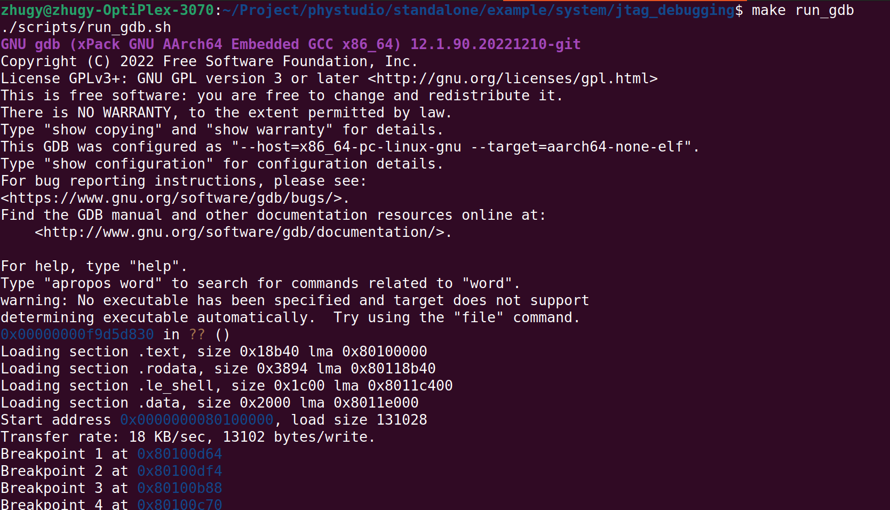

#### 2.4.3 设置断点并命中

- 如图所示，在 GDB 启动过程中添加了 4 个断点

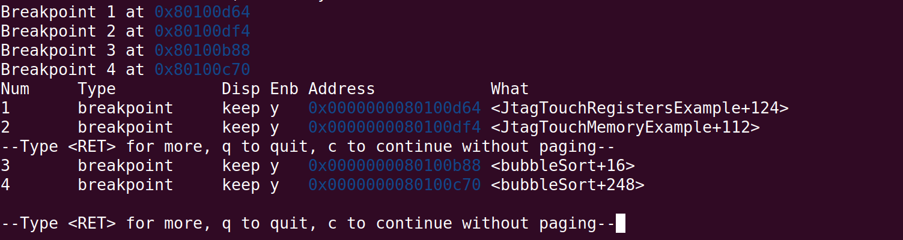

- 这里默认使用的是软件断点，如果需要添加硬件断点，可以修改 .gdbinit

```
# force to use hardware breakpoint, otherwise use software breakpoint
#   for e2000d/q, num of hardware breakpoints supposed to be 6 
monitor gdb_breakpoint_override hardware
```

- 此时开发板镜像已经开始运行，输入下列命令触发断点

```
jtag debug_c
```

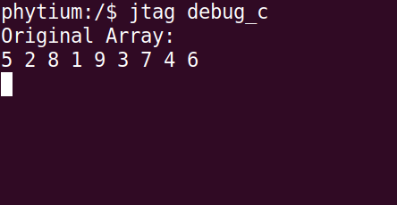
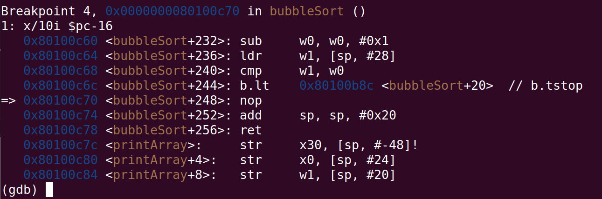

- 第一个断点命中，GDB 调试界面显示了断点上下文的指令

#### 2.4.3 单步执行代码

- 命中断点后，可能需要进一步调试执行的位置，选择单步运行

```
(gdb) step
```

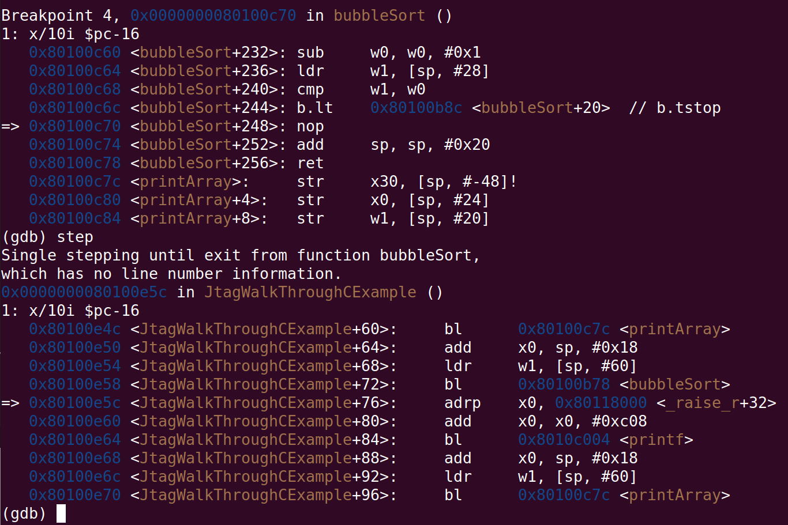

- 有些情况下，想进一步控制单步执行的粒度，一次只执行一条指令

```
(gdb) ni
```


- 可以看到，单步运行指令后 pc 指针加 4，执行到了下一条指令

#### 2.4.4 查看并设置程序变量

- 调试过程中，可能会关注变量的值，例如本例程中，做冒泡排序的数组为 array，是一个局部变量，我们想关心 array 的变化，于是命中断点后，可以打印 array 排序之前的值

```
/* array 指针的位置 */
(gdb) print array
/* array 的大小 */
(gdb) print size
/* array 的第一个元素值 */
(gdb) print *array
/* array 的所有元素值 */
(gdb) print *array@9
```

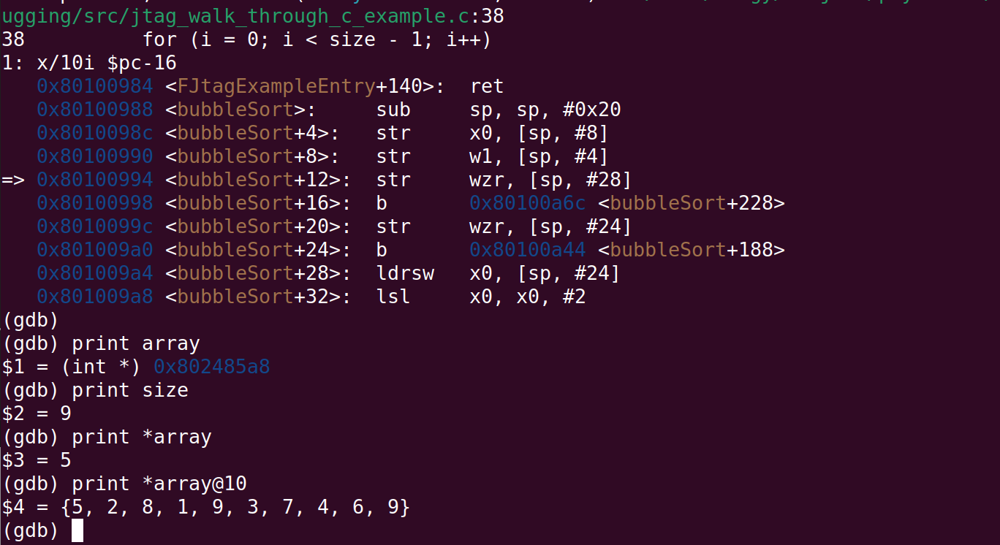

- `continue` 继续执行，完成排序后，再打印一次变量值

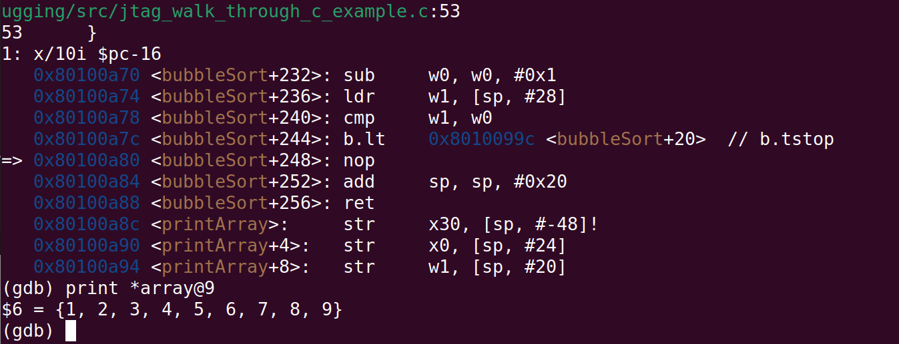

- 这时我们修改一下 array 的最后一个元素

```
set *(array+8) = 99
```

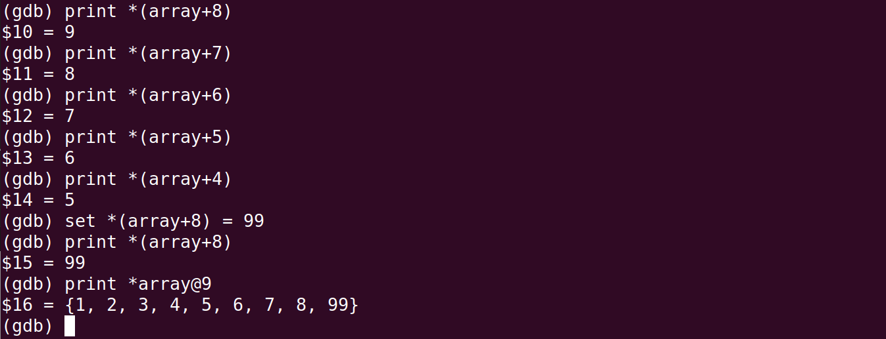

- `continue` 继续执行，最后的打印值

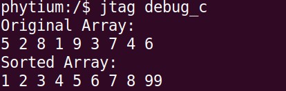

- 类似的，我们可以修改外设寄存器或者内存的值

#### 2.4.5 调试汇编代码

- 有时候可能需要调试汇编代码，查看系统寄存器的变化，下面以裸机启动流程为例，首先需要在启动的第一行代码处添加断点，可以通过地址，通过符号 `break _boot`，如下所示修改 .gdbinit

```
# we can break at the beginning of code by address or by symbol
break _boot
```

- 按 2.4.1 和 2.4.2 的流程启动镜像，断点会被立即命中

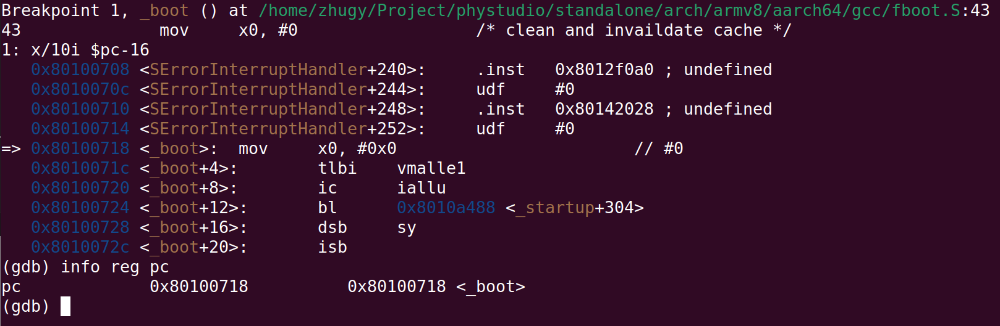

- 随后单步运行，我们追踪一下 EL2 到 EL1 的切换过程，通过 .dis 文件可以看到符号 El2Entry，在这段汇编代码的 `eret` 前一条指令添加一个断点，然后在 El1Entry 添加一个断点

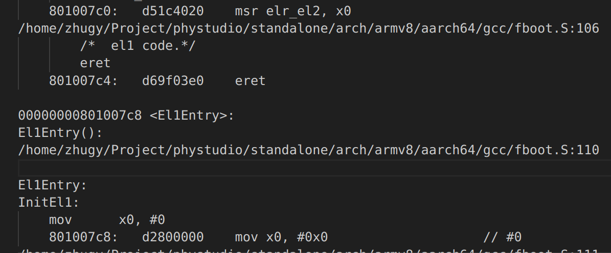

```
break *0x801007c0
break El1Entry
```

> 注意地址上打断点要按照实际情况编译出的地址

```
info reg ELR_EL2
```

- 可以看到，EL2 向 EL1 的跳转正常，EL2 的退出地址 ELR_EL2 等于 El1Entry

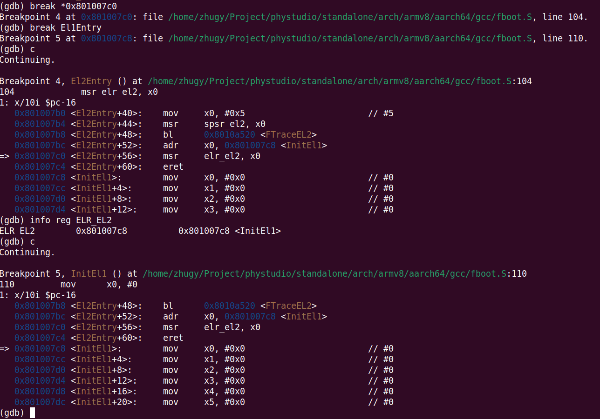

- 需要单步运行汇编指令时用 `ni` 即可

#### 2.4.6 调试C++代码

- 有时候可能需要调试 C++ 代码，C++ 的符号表规模远远大于C，可能需要额外的时间加载，首先打开配置 CONFIG_ENABLE_CXX，然后按 2.4.1 和 2.4.2 的流程启动镜像，
- 在 C++ 代码中添加断点

```
(gdb) break bubbleSortCXX
(gdb) c
```

- 然后开始运行

```
jtag debug_cxx
```


- 同样的，可以在 C++ 代码里做调试打印

```
(gdb) print array.size()
(gdb) print array[0]
```


## 3. 如何解决问题

> `<font size="1">`主要记录使用例程中可能会遇到的问题，给出相应的解决方案 `</font><br />`

- Q: 如何飞腾派上进行调试
- A: 飞腾派没有引出 FJTAG 接口，目前尚不支持本例程中的调试方法

## 4. 修改历史记录

> `<font size="1">`记录例程的重大修改记录，标明修改发生的版本号 `</font><br />`

- v1.2.1 首次合入
