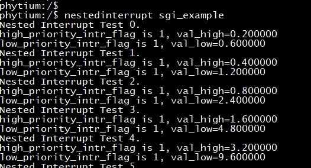

# Nested Interrupt 测试

## 1. 例程介绍

> `<font size="1">`介绍例程的用途，使用场景，相关基本概念，描述用户可以使用例程完成哪些工作 `</font><br />`

Nested Interrupt ，中断嵌套，是指高优先级的事件可以打断低优先级的事件（反过来不可以），而处理完高优先级事件后还得回来继续处理低优先级事件。本例程介绍了在AARCH32和AARCH64下，如何使用中断嵌套功能。

### 1.1 Nested Interrupt sgi测试例程 (nested_interrupt_sgi_example.c)

- 主函数中初始化sgi中断优先级和中断处理函数
- 低优先级中断处理函数使能中断嵌套，激活高优先级中断，等待高优先级中断处理函数执行
- 高优先级中断抢占触发，其处理函数完成变量置位，返回低优先级中断处理函数
- 低优先级中断处理函数中检测到变量置位完成，屏蔽中断嵌套，退出中断处理函数

### 1.2 Nested Interrupt timer测试例程 (nested_interrupt_timer_example.c)

- 主函数中初始化物理和虚拟定时器的中断优先级和中断处理函数，物理定时器为低优先级，虚拟定时器为高优先级
- 物理定时器中断处理函数使能中断嵌套，激活虚拟定时器中断
- 虚拟定时器中断抢占触发，完成数据计算和信息打印，返回物理定时器中断处理函数
- 物理定时器中断处理函数执行完成，屏蔽中断嵌套，退出中断处理函数

## 2. 如何使用例程

> `<font size="1">`描述开发平台准备，使用例程配置，构建和下载镜像的过程 `</font><br />`

本例程需要以下硬件，

- E2000D/Q Demo 板，FT2000/4开发板，PhytiumPi
- 串口线和串口上位机

### 2.1 硬件配置方法

> `<font size="1">`哪些硬件平台是支持的，需要哪些外设，例程与开发板哪些IO口相关等（建议附录开发板照片，展示哪些IO口被引出）`</font><br />`
> 不需要额外配置

### 2.2 SDK配置方法

> `<font size="1">`依赖哪些驱动、库和第三方组件，如何完成配置（列出需要使能的关键配置项）`</font><br />`
> 使能例程所需的配置

- Letter Shell组件，依赖 USE_LETTER_SHELL

对应的配置项是，

- Use Letter Shell
- 本例子已经提供好具体的编译指令，以下进行介绍：

  1. make 将目录下的工程进行编译
  2. make clean 将目录下的工程进行清理
  3. make image 将目录下的工程进行编译，并将生成的elf 复制到目标地址
  4. make load_kconfig LOAD_CONFIG_NAME=e2000d_aarch64_E2000d_demo_nest 将预设64bit e2000d demo 下的配置加载至工程中
  5. make load_kconfig LOAD_CONFIG_NAME=e2000d_aarch32_E2000d_demo_nest 将预设32bit e2000d demo 下的配置加载至工程中
  6. make load_kconfig LOAD_CONFIG_NAME=e2000q_aarch64_E2000q_demo_nest 将预设64bit e2000q demo 下的配置加载至工程中
  7. make load_kconfig LOAD_CONFIG_NAME=e2000q_aarch32_E2000q_demo_nest 将预设32bit e2000q demo 下的配置加载至工程中
  8. make menuconfig 配置目录下的参数变量
  9. make backup_kconfig 将目录下的sdkconfig 备份到./configs下
- 具体使用方法为：

  - 在当前目录下
  - 执行以上指令

### 2.3 构建和下载

> `<font size="1">`描述构建、烧录下载镜像的过程，列出相关的命令 `</font><br />`

[参考 SDK 使用说明](https://gitee.com/phytium_embedded/phytium-standalone-sdk/blob/release/doc/reference/usr/usage.md)

### 2.4 输出与实验现象

> `<font size="1">`描述输入输出情况，列出存在哪些输出，对应的输出是什么（建议附录相关现象图片）`</font><br />`

#### 2.4.1 Nested Interrupt 基础测试例程 (nested_interrupt_sgi_example.c)

两个中断中的浮点计算相互独立且结果正确，说明中断嵌套正常运行

```
nestedinterrupt sgi_example
```



#### 2.4.2 Nested Interrupt 定时器测试例程 (nested_interrupt_timer_example.c)

两个中断中的浮点计算相互独立且结果正确，说明中断嵌套正常运行

```
nestedinterrupt timer_example
```


## 3. 如何解决问题

> `<font size="1">`主要记录使用例程中可能会遇到的问题，给出相应的解决方案 `</font><br />`

## 4. 修改历史记录

> `<font size="1">`记录例程的重大修改记录，标明修改发生的版本号 `</font><br />`
