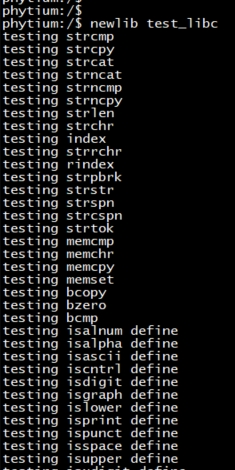
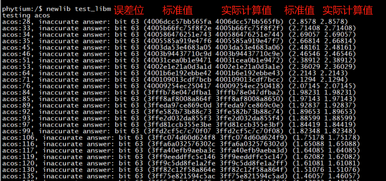
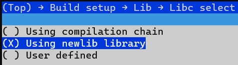

# Newlib test

## 1. 例程介绍

> `<font size="1">`介绍例程的用途，使用场景，相关基本概念，描述用户可以使用例程完成哪些工作 `</font><br />`

Newlib是一个面向嵌入式系统的c运行库。
依据Newlib的源代码，本例程旨在对Newlib的数学库和c库接口进行测试，尤其是在aarch32和aarch64下，对数学函数的准确度进行验证。

## 2. 如何使用例程

> `<font size="1">`描述开发平台准备，使用例程配置，构建和下载镜像的过程 `</font><br />`

本例程需要以下硬件，

- E2000D/Q Demo，D2000，FT2000/4，PhytiumPi

### 2.1 硬件配置方法

> `<font size="1">`哪些硬件平台是支持的，需要哪些外设，例程与开发板哪些IO口相关等（建议附录开发板照片，展示哪些IO口被引出）`</font><br />`

### 2.2 SDK配置方法

> `<font size="1">`依赖哪些驱动、库和第三方组件，如何完成配置（列出需要使能的关键配置项）`</font><br />`

使能例程所需的配置

- 本例子已经提供好具体的编译指令，以下进行介绍：

  1. make 将目录下的工程进行编译
  2. make clean  将目录下的工程进行清理
  3. make image   将目录下的工程进行编译，并将生成的elf 复制到目标地址
  4. make list_kconfig 当前工程支持哪些配置文件
  5. make load_kconfig LOAD_CONFIG_NAME=`<kconfig configuration files>`  将预设配置加载至工程中
  6. make menuconfig   配置目录下的参数变量
  7. make backup_kconfig 将目录下的sdkconfig 备份到./configs下
- 具体使用方法为：

  - 在当前目录下
  - 执行以上指令

### 2.3 构建和下载

> `<font size="1">`描述构建、烧录下载镜像的过程，列出相关的命令 `</font><br />`

- 在host侧完成配置

> 配置成E2000D，对于其它平台，使用对应的默认配置，如E2000d 32位:

```
$ make load_kconfig LOAD_CONFIG_NAME=e2000d_aarch32_demo_template
```

- 在host侧完成构建

```
$ make image
```

- host侧设置重启host侧tftp服务器

```
sudo service tftpd-hpa restart
```

- 开发板侧使用bootelf命令跳转

```
setenv ipaddr 192.168.4.20  
setenv serverip 192.168.4.50 
setenv gatewayip 192.168.4.1 
tftpboot 0x90100000 baremetal.elf
bootelf -p 0x90100000
```

### 2.4 输出与实验现象

> `<font size="1">`描述输入输出情况，列出存在哪些输出，对应的输出是什么（建议附录相关现象图片）`</font><br />`

- 启动后串口可以查看测试命令，分为libm和libc的测试


- 分别执行 `newlib test_libc`和 `newlib test_libm`指令





需要注意的是，libm的测试，是以标准值和实际计算值进行对比来判断数学函数准确度的。以上图中的第一行计算结果为例：
acos:28 表示进行的是acos_vec.c文件第28行的计算
inaccurate answer 表示acos_vec.c文件中的标准值和实际计算结果存在一定偏差
bit 63 表示误差位，即两者的误差在第63 bit出现，误差为0x0000000000000001，也就是5e-324
标准值和实际计算值，分别以二进制和浮点数的方式进行输出

## 3. 如何解决问题

> `<font size="1">`主要记录使用例程中可能会遇到的问题，给出相应的解决方案 `</font><br />`

1. 某些数学函数的计算值和结果值可能偏差会稍大一些，需要自行判断准确度是否符合应用的计算要求。

2. 本例程默认使用的是gcc编译环境中的libc.a和libm.a，裸机中也包含了使用libc/newlib目录预编译的库，具体路径为 [Newlib库](../../../lib/newlib) 的aarch目录。如果需要使用裸机中预编译的库，只需在menuconfig的lib库选择`Using newlib library`


3. 如果需要重新编译裸机中的Newlib库，可以参考[update Newlib库](../../../doc/reference/libc/usage.md)。

## 4. 修改历史记录

> `<font size="1">`记录例程的重大修改记录，标明修改发生的版本号 `</font><br />`
