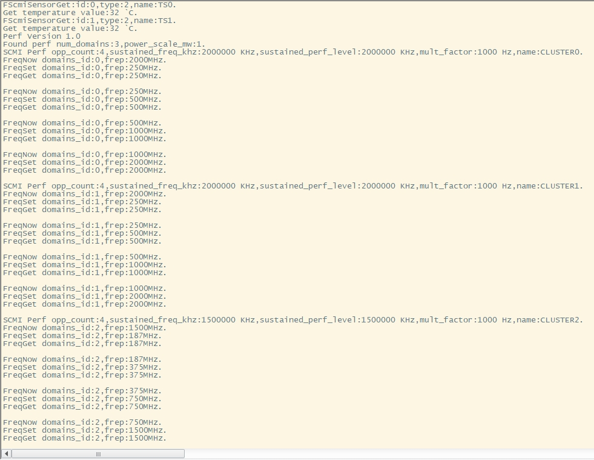

# SCMI-MHU 测试

## 1. 例程介绍

><font size="1">介绍例程的用途，使用场景，相关基本概念，描述用户可以使用例程完成哪些工作</font><br />

本例程示范了example中的SCMI-MHU功能使用:

- 此例程已在E2000D Demo 板上完成测试
### 1.1 获取SE状态例程 (scmi_mhu_search_example.c)
- SCMI是用于系统管理的一组独立于操作系统的软件接口，包括电源域管理、时钟管理、性能管理等几个方面;
- MHU（Message Handling Unit）是一段用于AP与SE交互的共享内存,属性是寄存器类型，不支持memcpy；

## 2. 如何使用例程
><font size="1">描述开发平台准备，使用例程配置，构建和下载镜像的过程</font><br />

本例程需要以下硬件，

- E2000D Demo 板
- 串口线和串口上位机

### 2.1 硬件配置方法

><font size="1">哪些硬件平台是支持的，需要哪些外设，例程与开发板哪些IO口相关等（建议附录开发板照片，展示哪些IO口被引出）</font><br />
不需要额外配置

### 2.2 SDK配置方法

><font size="1">依赖哪些驱动、库和第三方组件，如何完成配置（列出需要使能的关键配置项）</font><br />

本例程需要的配置包括，
- CONFIG_USE_SCMI_MHU，使能SCMI_MHU驱动组件
- CONFIG_USE_LETTER_SHELL，选择串口shell测试

- 本例子已经提供好如下的编译指令：
    1. make 将目录下的工程进行编译
    2. make clean  将目录下的工程进行清理
    3. make image   将目录下的工程进行编译，并将生成的elf 复制到目标地址
    4. make list_kconfig 当前工程支持哪些配置文件
    5. make load_kconfig LOAD_CONFIG_NAME=<kconfig configuration files>  将预设配置加载至工程中
    6. make menuconfig   配置目录下的参数变量
    7. make backup_kconfig 将目录下的sdkconfig 备份到./configs下

### 2.3 构建和下载

><font size="1">描述构建、烧录下载镜像的过程，列出相关的命令</font><br />

- 在host侧完成配置

>配置成E2000D，对于其它平台，使用对应的默认配置，如E2000d 32位:
```
$ make load_kconfig LOAD_CONFIG_NAME=e2000d_aarch32_demo_scmi
```
>配置成E2000D，对于其它平台，使用对应的默认配置，如E2000d 64位:
```
$ make load_kconfig LOAD_CONFIG_NAME=e2000d_aarch64_demo_scmi
```

- 在host侧完成构建

```
$ make image
```

- host侧设置重启host侧tftp服务器

```
sudo service tftpd-hpa restart
```

- 开发板侧使用bootelf命令跳转

```
setenv ipaddr 192.168.4.20  
setenv serverip 192.168.4.50 
setenv gatewayip 192.168.4.1 
tftpboot 0x90100000 baremetal.elf
bootelf -p 0x90100000
```

### 2.4 输出与实验现象

><font size="1">描述输入输出情况，列出存在哪些输出，对应的输出是什么（建议附录相关现象图片）</font><br/>

#### 2.4.1 获取SE状态测试

1.运行编译出32位执行模式镜像

- 在开发板串口shell输入命令：

```
scmi mhu_auto
```

- 因为E2000Q与D SE的一致性，我们在E2000D中也可以看到两个大核性能域支持的4个频率分别是250M/500M/1000M/2000MHz
- 在E2000D中，只有两个小核心，我们可以看到两个小核心不支持分开调频，使用同一性能域，支持的频率分别是187M/375M/750M/1500MHz



## 3. 如何解决问题

><font size="1">主要记录使用例程中可能会遇到的问题，给出相应的解决方案</font><br />

## 4. 修改历史记录

><font size="1">记录例程的重大修改记录，标明修改发生的版本号 </font><br />

v0.1.0  新增性能域打印，新增频率的调整
